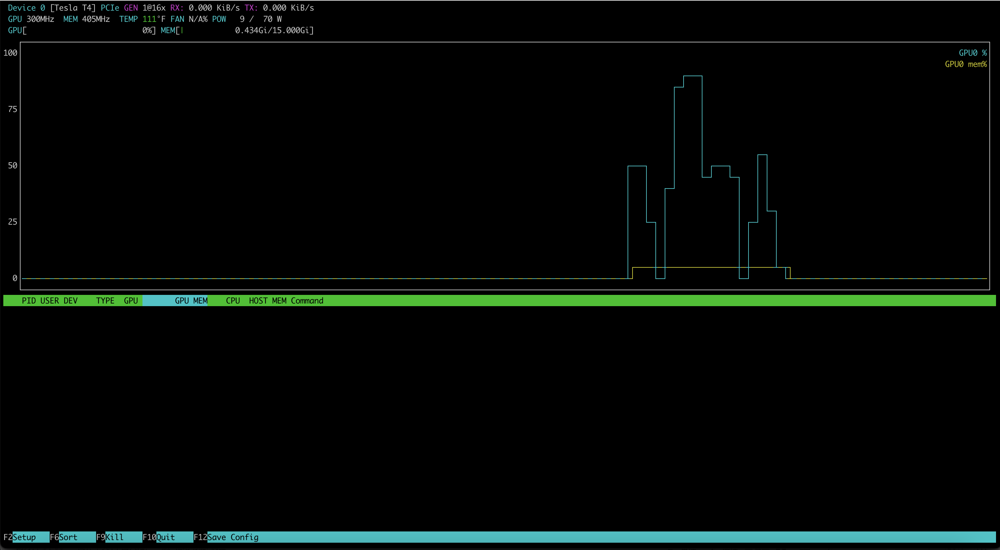
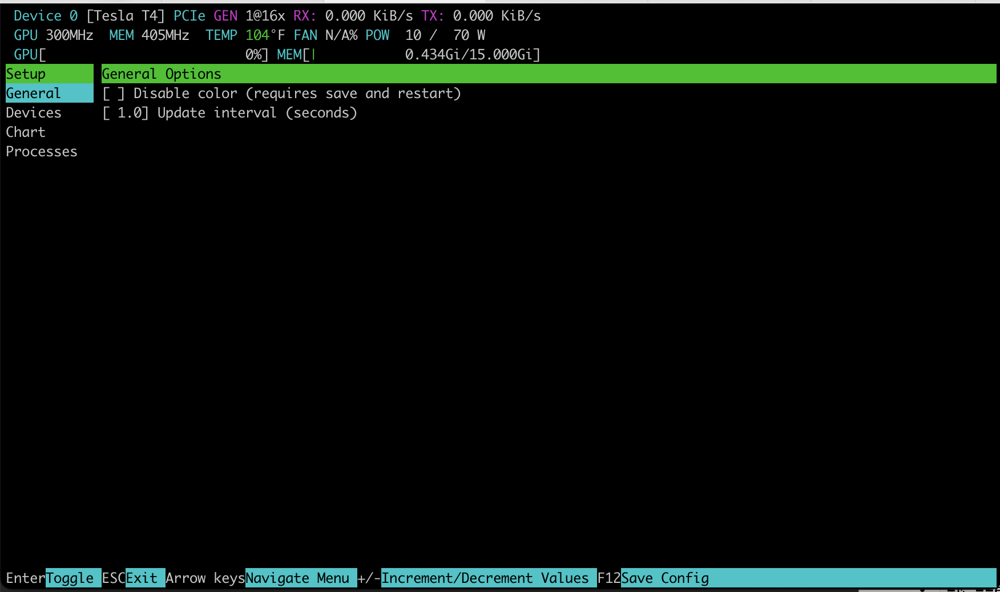

# nvtop 快速入门

## 1. 什么是 nvtop

nvtop 是一款类似于 `htop` 的命令行工具，可用于监控 NVIDIA、AMD、Intel 等多种 GPU。它提供了一个直观的界面，可以实时查看和管理 GPU 状态和进程信息。nvtop 支持多 GPU 监控，并且能够显示详细的指标，例如内存使用情况、GPU 利用率、温度等。

本文以 A100-SXM4-80GB 多 GPU 环境为例进行说明。

项目地址：[Github 地址](https://github.com/Syllo/nvtop)。

## 2. 如何安装 nvtop

### 2.1 在不同操作系统上的安装方法

具体参考项目 [README](https://github.com/Syllo/nvtop/blob/master/README.markdown)。

- **Ubuntu 19.04 / Debian Buster (stable)**:

  ```bash
  sudo apt install nvtop
  ```

- **旧版本系统（如 Ubuntu 16.04）**: 首先安装依赖库，然后编译源码安装：

  ```bash
   git clone https://github.com/Syllo/nvtop.git
   mkdir -p nvtop/build && cd nvtop/build
   cmake .. -DNVIDIA_SUPPORT=ON -DAMDGPU_SUPPORT=ON -DINTEL_SUPPORT=ON
   make

   # Install globally on the system
   sudo make install

   # Alternatively, install without privileges at a location of your choosing
   # make DESTDIR="/your/install/path" install
  ```

- **Arch Linux**:

  ```bash
  sudo pacman -Syu nvtop
  ```

- **Gentoo Linux**:

  ```bash
  sudo layman -a guru
  sudo emerge -av nvtop
  ```

- **Fedora 39 及更高版本**:

  ```bash
  sudo dnf install nvtop
  ```

- **CentOS Stream、Rocky Linux 和 AlmaLinux**:

  ```bash
  sudo dnf install -y epel-release
  sudo dnf install nvtop
  ```

- **其他 Linux 发行版**: 可以通过 Snap 安装：

  ```bash
  snap search nvtop
  sudo snap install nvtop
  ```

### 2.2 容器化安装

对于需要在容器中使用 nvtop 的情况，可以使用以下命令：

```bash
git clone https://github.com/Syllo/nvtop.git
cd nvtop
sudo docker build --tag nvtop .
sudo docker run -it --rm --runtime=nvidia --gpus=all --pid=host nvtop
```

## 3. 常用使用方式

安装完成后，运行 `nvtop` 即可启动监控界面。

### 3.1 nvtop

```bash
nvtop
```



常用的 `nvtop` 命令行选项如下：

- `-d --delay`: 设置刷新间隔，1 表示 0.1 秒。
- `-v --version`: 打印版本信息并退出。
- `-s --gpu-select`: 监控指定 GPU，多个 GPU ID 以冒号分隔。
- `-i --gpu-ignore`: 忽略指定 GPU，多个 GPU ID 以冒号分隔。
- `-p --no-plot`: 禁用条形图显示。
- `-C --no-color`: 禁用颜色显示。
- `-N --no-cache`: 始终从系统中查询用户名和命令行信息。
- `-f --freedom-unit`: 使用华氏度显示温度。
- `-E --encode-hide`: 设置编码/解码信息自动隐藏的时间（默认 30 秒，负值表示始终显示）。
- `-h --help`: 显示帮助信息并退出。

`nvtop` 界面快捷键：

| **快捷键**      | **描述**                                                   |
| --------------- | ---------------------------------------------------------- |
| **上箭头**      | 选择（高亮）上一个进程。                                   |
| **下箭头**      | 选择（高亮）下一个进程。                                   |
| **左/右箭头**   | 在进程行中左右滚动。                                       |
| **+**           | 按升序排序。                                               |
| **-**           | 按降序排序。                                               |
| **F2**          | 进入设置界面，修改界面选项。                               |
| **F12**         | 将当前界面选项保存到持久存储中。                           |
| **F9**          | "终止"进程：选择要发送给高亮进程的信号。                   |
| **F6**          | 排序：选择用于排序的字段。当前排序字段在标题栏内高亮显示。 |
| **F10, q, Esc** | 退出 nvtop 命令。                                          |

### 3.2 设置

按下 `F2` 可以打开设置页面：



可以通过上下左右键来选择并调整配置项。按 F12 保存在设置窗口中设置的首选项。下次运行 nvtop 时将加载这些首选项。

## 4. A100 多 GPU 环境实操

以下基于 8 × A100-SXM4-80GB 服务器实测。

### 4.1 界面布局解读

运行 `nvtop` 后，终端被分为上下两个区域：

**上半区 — GPU 概览条**：每个 GPU 一行，显示以下指标：

| 指标       | A100 空闲示例 | A100 满载示例 | 解读                                                                                                                              |
| ---------- | ------------- | ------------- | --------------------------------------------------------------------------------------------------------------------------------- |
| GPU 利用率 | 0%            | 85-100%       | **与 nvidia-smi 的 GPU-Util 同源**，表示"有 kernel 在执行"，不等于算力用满。低利用率可能意味着 kernel 太短或 launch overhead 主导 |
| 显存使用   | 4 MiB / 80 GB | 75 GB / 80 GB | vLLM 大模型推理会接近满载，sglang TP=2 约 10 GB/GPU                                                                               |
| 温度       | 25-30°C       | 40-60°C       | A100 空闲约 25-30°C；满载 40-60°C。超过 80°C 触发降频，需检查散热                                                                 |
| 功耗       | 48-65W        | 250-400W      | A100 空闲 45-70W；满载可达 400W。功耗 < 250W 但 GPU-Util 100% → 可能被功率限制或 P-State 限制了时钟                               |
| 风扇       | N/A           | N/A           | A100-SXM4 无风扇，依赖服务器风道散热                                                                                              |

**下半区 — 进程列表**：每行一个 GPU 进程，显示 PID、用户名、显存占用、GPU 利用率。按 `F6` 可按显存或利用率排序。

### 4.2 只监控特定 GPU

```bash
# 只看空闲的 GPU 3,4,5
nvtop -s 3:4:5

# 排除正在跑训练的 GPU 0,1,2,6,7
nvtop -i 0:1:2:6:7
```

这在共享集群中尤其有用——只看"自己的"GPU，排除他人的生产负载。

### 4.3 真实多 GPU 场景识别

基于本环境的 8 GPU，运行 `nvtop` 时可观察到的典型模式：

**混合负载集群**（当前状态）：

```text
GPU 0: 利用率 0%, 显存 9752 MiB, 功耗 63W   ← sglang TP=1, 核空闲但显存占用
GPU 1: 利用率 0%, 显存 9752 MiB, 功耗 62W   ← sglang TP=0
GPU 2: 利用率 0%, 显存 75 GB, 功耗 62W      ← vLLM 大模型，显存近满
GPU 3: 利用率 0%, 显存 130 MiB, 功耗 57W    ← 空闲（稍高因之前测试残留）
GPU 4: 利用率 0%, 显存 4 MiB, 功耗 56W      ← 完全空闲
GPU 5: 利用率 0%, 显存 4 MiB, 功耗 56W      ← 完全空闲
GPU 6: 利用率 0%, 显存 75 GB + 4.7 GB, 功耗 62W ← vLLM + ada_be
GPU 7: 利用率 N/A, 显存 0 MiB, 功耗 48W     ← MIG Enabled, 无实例
```

**一眼能看出的异常**：

- GPU 3 显存 130 MiB → 之前跑过任务但 `nvidia-smi` 无进程 → 残留 context，可忽略
- GPU 7 利用率 N/A → MIG Enabled 但无 GI/CI，等同于不可用
- GPU 0,1 利用率 0% 但显存占用 10 GB → 推理服务空闲等待请求

### 4.4 与 nvidia-smi / DCGM 的关系

| 工具         | 场景                 | 优势                               | 劣势                            |
| ------------ | -------------------- | ---------------------------------- | ------------------------------- |
| **nvtop**    | 日常登录扫一眼       | 交互式，进程关联度高，色彩编码直观 | 无历史数据，GPU-Util 不可靠     |
| `nvidia-smi` | 脚本化查询、精确数值 | 可查询 100+ 属性，机器可读         | 输出冗长，无交互性              |
| `dcgmi dmon` | 性能分析、瓶颈定位   | SM Active / DRAM Active 是正确指标 | 命令行无图形化，需记忆 field ID |

> **使用建议**：日常扫一眼用 `nvtop`，发现问题后用 `nvidia-smi` 深入查询，性能异常时切到 `dcgmi dmon` 看真正的 SM 利用率。三者的正确分工见 [DCGM 监控实操](05_dcgm_monitoring.md)。

---
