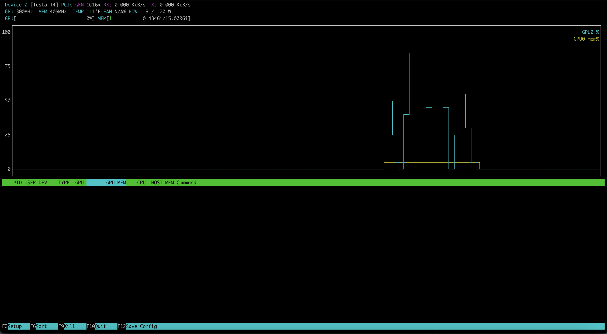

# nvtop 快速入门

SSH 进一台 8 卡服务器，你想 3 秒内看清三件事：哪些 GPU 闲着、谁在占显存、温度功耗是否正常。`nvidia-smi` 能做到但输出冗长，`dcgmi dmon` 精确但不直观。`nvtop` 是 `htop` 的 GPU 版本——一个交互式 TUI，登录后敲三个字母就能得到所有答案。

本文以 A100-SXM4-80GB 8 GPU 环境为例。项目地址：[Syllo/nvtop](https://github.com/Syllo/nvtop)。

## 1. 安装

```bash
# Ubuntu / Debian
sudo apt install nvtop

# Fedora / RHEL
sudo dnf install nvtop

# Arch
sudo pacman -Syu nvtop
```

其他发行版及容器化安装见 [项目 README](https://github.com/Syllo/nvtop/blob/master/README.markdown)。

## 2. 基本使用

```bash
nvtop                    # 启动，显示全部 GPU
nvtop -s 0:1:2           # 只看 GPU 0,1,2
nvtop -i 6:7             # 排除 GPU 6,7
nvtop -d 5               # 刷新间隔 0.5 秒（默认 1 = 0.1 秒）
```



常用 CLI 选项：

| 选项                | 作用                       |
| ------------------- | -------------------------- |
| `-s / --gpu-select` | 只监控指定 GPU（冒号分隔） |
| `-i / --gpu-ignore` | 排除指定 GPU               |
| `-d / --delay`      | 刷新间隔（1 = 0.1 秒）     |
| `-p / --no-plot`    | 隐藏条形图                 |
| `-C / --no-color`   | 无颜色模式                 |

常用快捷键：

| 键              | 功能                          |
| --------------- | ----------------------------- |
| `F6`            | 排序（按显存 / 利用率 / PID） |
| `F9`            | Kill 高亮进程                 |
| `F2`            | 设置界面                      |
| `F10 / q / Esc` | 退出                          |

## 3. A100 多 GPU 环境实操

以下基于 8 × A100-SXM4-80GB 服务器实测。

### 3.1 界面布局解读

运行 `nvtop` 后，终端被分为上下两个区域：

**上半区 — GPU 概览条**：每个 GPU 一行，显示以下指标：

| 指标       | A100 空闲示例 | A100 满载示例 | 解读                                                                                                                              |
| ---------- | ------------- | ------------- | --------------------------------------------------------------------------------------------------------------------------------- |
| GPU 利用率 | 0%            | 85-100%       | **与 nvidia-smi 的 GPU-Util 同源**，表示"有 kernel 在执行"，不等于算力用满。低利用率可能意味着 kernel 太短或 launch overhead 主导 |
| 显存使用   | 4 MiB / 80 GB | 75 GB / 80 GB | vLLM 大模型推理会接近满载，sglang TP=2 约 10 GB/GPU                                                                               |
| 温度       | 25-30°C       | 40-60°C       | A100 空闲约 25-30°C；满载 40-60°C。超过 80°C 触发降频，需检查散热                                                                 |
| 功耗       | 48-65W        | 250-400W      | A100 空闲 45-70W；满载可达 400W。功耗 < 250W 但 GPU-Util 100% → 可能被功率限制或 P-State 限制了时钟                               |
| 风扇       | N/A           | N/A           | A100-SXM4 无风扇，依赖服务器风道散热                                                                                              |

**下半区 — 进程列表**：每行一个 GPU 进程，显示 PID、用户名、显存占用、GPU 利用率。按 `F6` 可按显存或利用率排序。

### 3.2 只监控特定 GPU

```bash
# 只看空闲的 GPU 3,4,5
nvtop -s 3:4:5

# 排除正在跑训练的 GPU 0,1,2,6,7
nvtop -i 0:1:2:6:7
```

这在共享集群中尤其有用——只看"自己的"GPU，排除他人的生产负载。

### 3.3 真实多 GPU 场景识别

基于本环境的 8 GPU，运行 `nvtop` 时可观察到的典型模式：

**混合负载集群**（当前状态）：

```text
GPU 0: 利用率 0%, 显存 9752 MiB, 功耗 63W   ← sglang TP=1, 核空闲但显存占用
GPU 1: 利用率 0%, 显存 9752 MiB, 功耗 62W   ← sglang TP=0
GPU 2: 利用率 0%, 显存 75 GB, 功耗 62W      ← vLLM 大模型，显存近满
GPU 3: 利用率 0%, 显存 130 MiB, 功耗 57W    ← 空闲（稍高因之前测试残留）
GPU 4: 利用率 0%, 显存 4 MiB, 功耗 56W      ← 完全空闲
GPU 5: 利用率 0%, 显存 4 MiB, 功耗 56W      ← 完全空闲
GPU 6: 利用率 0%, 显存 75 GB + 4.7 GB, 功耗 62W ← vLLM + ada_be
GPU 7: 利用率 N/A, 显存 0 MiB, 功耗 48W     ← MIG Enabled, 无实例
```

**一眼能看出的异常**：

- GPU 3 显存 130 MiB → 之前跑过任务但 `nvidia-smi` 无进程 → 残留 context，可忽略
- GPU 7 利用率 N/A → MIG Enabled 但无 GI/CI，等同于不可用
- GPU 0,1 利用率 0% 但显存占用 10 GB → 推理服务空闲等待请求

### 3.4 与 nvidia-smi / DCGM 的关系

| 工具         | 场景                 | 优势                               | 劣势                            |
| ------------ | -------------------- | ---------------------------------- | ------------------------------- |
| **nvtop**    | 日常登录扫一眼       | 交互式，进程关联度高，色彩编码直观 | 无历史数据，GPU-Util 不可靠     |
| `nvidia-smi` | 脚本化查询、精确数值 | 可查询 100+ 属性，机器可读         | 输出冗长，无交互性              |
| `dcgmi dmon` | 性能分析、瓶颈定位   | SM Active / DRAM Active 是正确指标 | 命令行无图形化，需记忆 field ID |

> **使用建议**：日常扫一眼用 `nvtop`，发现问题后用 `nvidia-smi` 深入查询，性能异常时切到 `dcgmi dmon` 看真正的 SM 利用率。三者的正确分工见 [DCGM 监控实操](05_dcgm_monitoring.md)。

---
