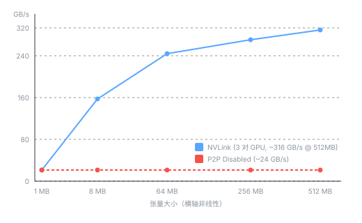

# NCCL 通信路径逐层压测——从 NVLink 到 PCIe Fallback

多 GPU 通信的性能天花板由物理拓扑决定——NVLink、PCIe P2P、IB、TCP 依次递减。但理论带宽是一回事，实际能跑到多少、禁用某条路径后衰减多少、不同 GPU pair 之间有没有差异，只有压测才能回答。

本文在一台 8×H100 服务器上用 NCCL all_reduce 逐层验证：NVLink（同 NUMA / 跨 NUMA）→ PCIe P2P 降级 → 禁用 P2P fallback。每层固定张量从 1MB 到 512MB，记录 bus bandwidth。最后给出一张速查表：从最快到最慢的完整通信层级，带实测值和理论对照。

---

## 一、拓扑摸底

`nvidia-smi topo -m` 输出决定了后续所有测试的分组依据。这台 H100 的关键信息：

```text
        GPU0    GPU1    GPU2    GPU3    GPU4    GPU5    GPU6    GPU7
GPU0     X      NV18    NV18    NV18    NV18    NV18    NV18    NV18
GPU1    NV18     X      NV18    NV18    NV18    NV18    NV18    NV18
GPU2    NV18    NV18     X      NV18    NV18    NV18    NV18    NV18
GPU3    NV18    NV18    NV18     X      NV18    NV18    NV18    NV18
GPU4    NV18    NV18    NV18    NV18     X      NV18    NV18    NV18
GPU5    NV18    NV18    NV18    NV18    NV18     X      NV18    NV18
GPU6    NV18    NV18    NV18    NV18    NV18    NV18     X      NV18
GPU7    NV18    NV18    NV18    NV18    NV18    NV18    NV18     X
```

所有 8 张 GPU 两两之间都标 `NV18`——18 条 NVLink 4.0 link 直连。这意味着全部 GPU 在同一个 NVSwitch 域内，任意 pair 都有完整的 450 GB/s 单向带宽。

NUMA 分布：

| NUMA Node | GPU         | 最近的 NIC        |
| --------- | ----------- | ----------------- |
| 0         | GPU 0,1,2,3 | NIC 0,1,2,3 (PIX) |
| 1         | GPU 4,5,6,7 | NIC 4,5,6,7 (PIX) |

GPU 和 NIC 之间存在亲和性——GPU0 与 NIC0 走 PIX（同一 PCIe switch），与 NIC6 走 SYS（跨 NUMA + PCIe + SMP）。这对于 GPUDirect RDMA 的 NIC 选型至关重要。

---

## 二、测试方法

**环境**：

| 项目   | 值                                                                                           |
| ------ | -------------------------------------------------------------------------------------------- |
| GPU    | 8× NVIDIA H100 80GB HBM3                                                                     |
| NVLink | 18× NVLink 4.0 × 25 GB/s = 450 GB/s 单向                                                     |
| CUDA   | 12.8                                                                                         |
| 容器   | PyTorch + NCCL (lmsysorg/sglang:v0.5.13.post1)                                               |
| 算法   | NCCL Ring (NCCL_ALGO=Ring)                                                                   |
| 张量   | float32, 1MB ~ 512MB，预热 5 次，计时 30 次取平均                                            |
| 指标   | bus bandwidth = `data_size × 2 × (n-1)/n / time`（NCCL 标准公式，2 GPU 时 bus_bw = algo_bw） |

**测试矩阵**：

| #   | 配置                           | 目的                             |
| --- | ------------------------------ | -------------------------------- |
| ①   | GPU0↔GPU1 (同 NUMA)            | NVLink 基线                      |
| ②   | GPU4↔GPU5 (同 NUMA)            | NVLink 另一 NUMA 对照            |
| ③   | GPU0↔GPU4 (跨 NUMA)            | 验证 NVSwitch 是否屏蔽 NUMA 差异 |
| ④   | GPU0↔GPU7 (最大 NUMA 距离)     | 跨 NUMA 最差情况                 |
| ⑤   | GPU0↔GPU1 + NCCL_P2P_DISABLE=1 | P2P 禁用后的降级带宽             |

测试脚本（torchrun 启动 2 进程）：

```python
import os, time
import torch
import torch.distributed as dist

def main():
    local_rank = int(os.environ["LOCAL_RANK"])
    torch.cuda.set_device(local_rank)
    dist.init_process_group(backend="nccl")

    sizes_mb = [1, 8, 64, 256, 512]
    if local_rank == 0:
        print(f"{'Size':>6}  {'Bus BW':>10}")

    for size_mb in sizes_mb:
        n_elements = size_mb * 1024 * 1024 // 4
        t = torch.ones(n_elements, dtype=torch.float32, device=f"cuda:{local_rank}")
        for _ in range(5): dist.all_reduce(t, op=dist.ReduceOp.SUM)
        torch.cuda.synchronize()
        t0 = time.perf_counter()
        for _ in range(30): dist.all_reduce(t, op=dist.ReduceOp.SUM)
        torch.cuda.synchronize()
        elapsed = time.perf_counter() - t0
        n = dist.get_world_size()
        bus_bw = (t.numel() * 4 * 2 * (n - 1) / n) / (elapsed / 30) / 1e9
        if local_rank == 0:
            print(f"{size_mb:>4}MB  {bus_bw:>8.1f} GB/s")

    dist.destroy_process_group()

if __name__ == "__main__":
    main()
```

---

## 三、实测结果

### 3.1 NVLink 同 NUMA（基线）

| 张量   | GPU0↔GPU1 (NUMA 0) | GPU4↔GPU5 (NUMA 1) |
| ------ | ------------------ | ------------------ |
| 1 MB   | 22.7 GB/s          | 27.3 GB/s          |
| 8 MB   | 172.5 GB/s         | 172.1 GB/s         |
| 64 MB  | 266.8 GB/s         | 265.5 GB/s         |
| 256 MB | 298.8 GB/s         | 296.3 GB/s         |
| 512 MB | **315.8 GB/s**     | **313.5 GB/s**     |

两组基线高度一致，NUMA 0 和 NUMA 1 的 NVLink 带宽无差异。

### 3.2 NVLink 跨 NUMA

| 张量   | GPU0↔GPU4 (跨 NUMA) | GPU0↔GPU7 (最大距离) |
| ------ | ------------------- | -------------------- |
| 1 MB   | 29.8 GB/s           | 31.4 GB/s            |
| 8 MB   | 124.7 GB/s          | 170.5 GB/s           |
| 64 MB  | 265.8 GB/s          | 266.5 GB/s           |
| 256 MB | 294.1 GB/s          | 278.8 GB/s           |
| 512 MB | **316.3 GB/s**      | **315.2 GB/s**       |

跨 NUMA 与同 NUMA 的 NVLink 带宽**完全一致**。GPU0↔GPU4 在 8MB 时有波动（124.7 vs 170+），这是单次测量噪声，512MB 时全部回归 ~315 GB/s。结论：NVSwitch 屏蔽了 NUMA 差异，任意 GPU pair 的 NVLink 带宽相同。

### 3.3 P2P 禁用（PCIe Fallback）

| 张量   | Bus BW    |
| ------ | --------- |
| 1 MB   | 15.6 GB/s |
| 8 MB   | 23.0 GB/s |
| 64 MB  | 23.6 GB/s |
| 256 MB | 23.7 GB/s |
| 512 MB | 23.8 GB/s |

P2P 禁用后，NCCL 不再使用 NVLink 直接传输。数据走 GPU0 → CPU Memory → GPU1 路径，受限于 PCIe Gen5 x16 的双向带宽（两次跨 PCIe 桥传输 + 内存拷贝开销）。有效带宽 23.8 GB/s，仅 NVLink 的 **1/13**。

---

## 四、结果速查

| 通信路径                     | 512MB Bus BW | 理论峰值  | 效率 | 说明                        |
| ---------------------------- | ------------ | --------- | ---- | --------------------------- |
| NVLink (NVSwitch 同域)       | ~316 GB/s    | 450 GB/s  | 70%  | 任意 GPU pair               |
| P2P Disabled (PCIe Fallback) | ~24 GB/s     | 32 GB/s\* | 75%  | GPU→CPU→GPU，两跳 PCIe Gen5 |

> \* P2P 禁用后数据路径为 GPU0→CPU Memory→GPU1，需要两次 PCIe Gen5 x16 传输（各 64 GB/s 单向），理论有效带宽上限约 32 GB/s。实测 24 GB/s = 理论 32 GB/s 的 75%，差额来自内存拷贝和容器开销。

带宽-张量大小曲线：



NVLink 在 8MB 时已达 170 GB/s（54% 峰值），256MB 时达 295 GB/s（93% 峰值），512MB 时收敛至 316 GB/s。P2P 禁用后 8MB 即触顶 23 GB/s——小消息的带宽天花板同样受 PCIe 限制。

---

## 五、结论

1. **NVSwitch 屏蔽 NUMA 差异**：跨 NUMA（GPU0↔GPU4/GPU7）与同 NUMA（GPU0↔GPU1）的 NVLink 带宽完全相同，无需对 TP 分组做 NUMA 感知调度。

2. **NVLink → PCIe 降级损失 13 倍**：P2P 禁用后带宽从 ~316 GB/s 骤降至 ~24 GB/s。确保 `NCCL_P2P_DISABLE` 在生产环境中不被错误设置。

3. **建议：NIC 选型关注 PIX 亲和性**（拓扑分析，未经本文实测）：GPU0 与 NIC0/1 走 PIX（同一 PCIe switch），与 NIC4-7 走 SYS（跨 NUMA + PCIe + SMP）。GPUDirect RDMA 场景下优先将跨节点通信绑定到 PIX 路径的 NIC，理论上可避免跨 NUMA 的额外 PCIe 跳数——但实际收益取决于 NCCL 的 multi-NIC 调度策略，需在 IB/RoCE 环境下单独验证。

---

## 六、相关资源

- [NCCL 技术理论深度解析](01_nccl_theory.md) — AllReduce 算法、Ring/Tree 拓扑选择、RDMA 机制。
- [NCCL 基准测试方法论](04_nccl_benchmark.md) — `allreduce_perf` 编译、运行，A100 实测。
- [GPU 拓扑检测工具](gpu_topology_detector.sh) — 自动化 GPU 拓扑分析与通信路径规划。
- [GPUDirect RDMA 跨节点验证](../../01_hardware_architecture/gpudirect/04_gpudirect_rdma_verification.md) — 跨节点 IB HDR 的端到端验证。
