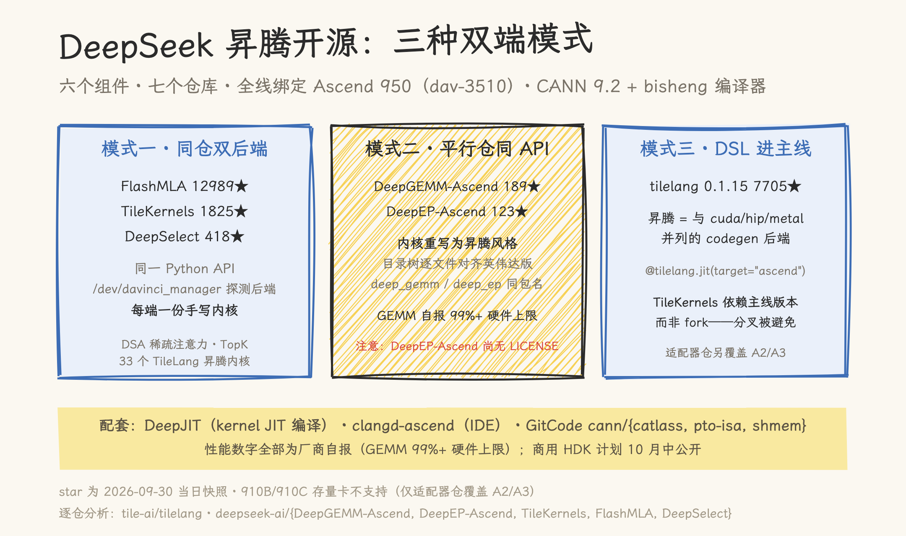
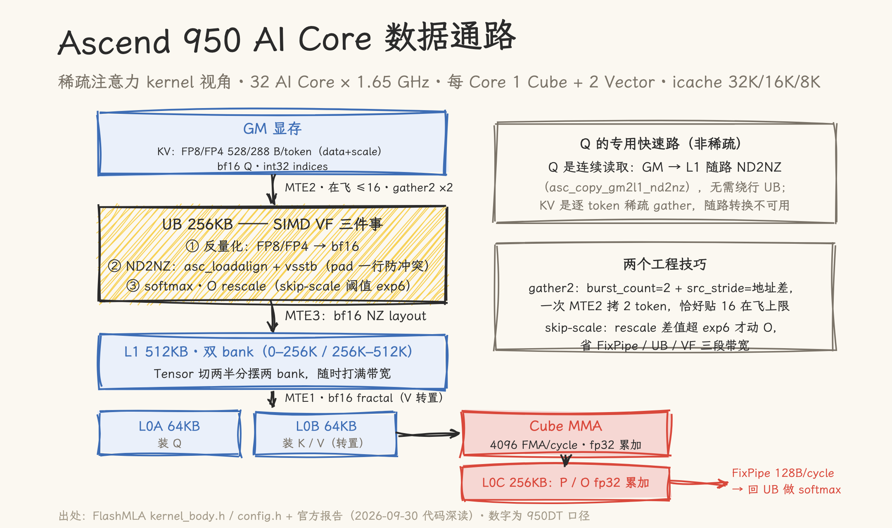
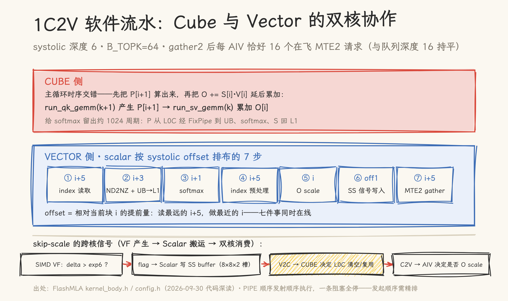

# DeepSeek 把家底搬上了昇腾：六个组件、三种双端模式与一份 950 微架构报告

> 2026-09-30 | 发布日分析 + 代码深读。基于当日 GitHub 实测（deepseek-ai 与 tile-ai 两个 org 全仓扫描、六仓库浅克隆、star 数与 commit 历史为当日快照）与当日完成的代码深读（FlashMLA/DeepGEMM-Ascend/DeepEP-Ascend/TileKernels/tilelang-ascend，文件:行号随文标注）；未在昇腾硬件上实测，性能数字均为厂商自报口径。

2026 年 9 月 30 日，DeepSeek 官宣开源面向华为昇腾算力平台的基础设施组件：TileLang 昇腾版、DeepGEMM、DeepEP、TileKernels、FlashMLA、DeepSelect，并给出一句关键定位——**所有组件与此前面向英伟达平台的开源组件一一对应**。配合与华为共同推进的基于昇腾 950 的 128 卡超节点方案，这是 DeepSeek 训练与推理的生产栈第一次整体出现在非英伟达平台上。

我们当日对相关仓库做了逐仓分析（GitHub 定位、浅克隆、代码结构与 commit 历史核对）。这篇把看到的讲清楚：六个项目对应哪些仓库、用了哪几种「双端」模式、性能口径怎么读、缺口在哪里，以及 FlashMLA 仓库里那份少见的 950 微架构中文报告说了什么。

## 一、总表：六个组件，七个仓库

先修正官宣阅读时最容易产生的两个误会：其一，六个组件并非六个新仓库；其二，TileKernels 与 DeepSelect 不是从零发布的昇腾组件——它们此前已是纯 CUDA 库，本次是**新增昇腾后端**。

| 组件            | 仓库                                                                                                                                                        | 状态（2026-09-30）                                                               | Star¹      |
| --------------- | ----------------------------------------------------------------------------------------------------------------------------------------------------------- | -------------------------------------------------------------------------------- | ---------- |
| TileLang 昇腾版 | [tile-ai/tilelang](https://github.com/tile-ai/tilelang)（主线合入 0.1.15）+ [tile-ai/tilelang-ascend](https://github.com/tile-ai/tilelang-ascend)（适配器） | 主线 PR #3308/#3310 合入 Ascend 950 后端；适配器仓 2025-09 创建、约 1489 commits | 7705 / 384 |
| DeepGEMM 昇腾版 | [deepseek-ai/DeepGEMM-Ascend](https://github.com/deepseek-ai/DeepGEMM-Ascend)                                                                               | 新仓，单 commit                                                                  | 189        |
| DeepEP 昇腾版   | [deepseek-ai/DeepEP-Ascend](https://github.com/deepseek-ai/DeepEP-Ascend)                                                                                   | 新仓，单 commit；**无 LICENSE 文件**                                             | 123        |
| TileKernels     | [deepseek-ai/TileKernels](https://github.com/deepseek-ai/TileKernels) v2.0.0                                                                                | 2026-04-22 创建（CUDA-only），v2.0.0 新增昇腾后端                                | 1825       |
| FlashMLA 昇腾版 | [deepseek-ai/FlashMLA](https://github.com/deepseek-ai/FlashMLA)（与英伟达版同仓）                                                                           | 分支 `20260930-ascend-open-source` 已合入 main（#229）                           | 12989      |
| DeepSelect      | [deepseek-ai/DeepSelect](https://github.com/deepseek-ai/DeepSelect)                                                                                         | 2026-09-09 创建（CUDA TopK 库），PR #23 新增昇腾内核                             | 418        |

¹ 2026-09-30 当日 GitHub API 实测值。

两个值得单独说的点。**其一，TileLang 走的是「合入主线」**：昇腾作为与 cuda/hip/metal 并列的 codegen 后端进了 tilelang 0.1.15，默认设备代号 `dav-3510`（即 950），`@tilelang.jit(target="ascend")` 即可编译；适配器仓 tilelang-ascend 则是一条运行了一年的独立线（含 B 站课程与中文编程指南，实测覆盖上一代 A2/A3）。**其二，清单外还有配套**：DeepGEMM-Ascend 与 DeepEP-Ascend 共同依赖的 [DeepJIT](https://github.com/deepseek-ai/DeepJIT)（xPU kernel JIT 编译库）、IDE 补全用的 clangd-ascend，以及华为 CANN 生态放在 GitCode 上的 `cann/{catlass,pto-isa,shmem}` 三个 submodule——这套组件的指令层依赖，在华为的 GitCode 而不是 GitHub。

**其三，最小的 DeepSelect 卡在两个热路径上**：DSA 稀疏注意力里 Lightning Indexer 的 token 筛选（DeepSeek V4 的 topk 即 512）与推理采样器对约 128K 词表的 TopK 采样——每生成一个 token 都要跑一遍的地方。README 明确只优化 topk ≤ 4096 的场景。

## 二、三种双端模式

六个组件在「英伟达版 ↔ 昇腾版」的组织方式上分成了三种，每一种都有代码级证据。

**模式一：同仓双后端**（FlashMLA、TileKernels、DeepSelect）。同一个仓库、同一套 Python API，运行时或安装期选择后端——`flash_mla_interface.py` 开头 `os.path.exists("/dev/davinci_manager")` 判定是否加载 NPU 后端，TileKernels 的 `config.py` 同款。内核是每端各写一份：TileKernels 的算子按 `*_kernel.py`（分发）+ `*_cuda.py` + `*_asc.py` 三件套组织（代码深读实测 33 个 `*_asc.py`、32 个 `*_cuda.py`，仅 `randn` 无 CUDA 对应）——官宣「DeepSeek 训练中用到的每一个 TileLang 算子，在昇腾上都有对应的高性能实现」，在这个仓库里可以逐文件核对。注意这不是跨端自动编译，是**每端一份手写内核、共享 Python 接口**。

**模式二：平行仓、同 API**（DeepGEMM-Ascend、DeepEP-Ascend）。内核完全重写为昇腾风格（DeepGEMM 的 `__global__ __mix__(1, 2)` 即 1 Cube + 2 Vector 核混合编程，走 CANN 9.20 的 bisheng 编译器经 DeepJIT 运行时编译），但接口层逐文件对齐英伟达版：`csrc/` 目录树一一对应、Python 包同名（`deep_gemm`、`deep_ep`）、连 JIT 环境变量命名与测试目录结构都对应。DeepGEMM-Ascend 自述 "fully API-compatible"，连英伟达版的 `cublaslt_gemm_*` 都以 ACLNN 后端的同名别名提供；DeepEP-Ascend README 明示 implementation follows DeepEP V2.5 APIs——而英伟达仓恰在 9 月 29 日合入 DeepEP V2.5（#763），两边是同一次架构重构的两份实现。

**模式三：DSL 后端进主线**（TileLang）。这是生态价值最大的一步：昇腾不是 fork，而是进入一个跨硬件内核 DSL 的正式后端列表（现有后端：CUDA SM70–SM120、ROCm、Metal，如今再加昇腾 950），TileKernels v2 依赖主线 `tilelang>=0.1.15` 而非任何 fork——分叉被从根上避免了。

**图 1**｜三种双端模式：同仓双后端 / 平行仓同 API / DSL 进主线，六个组件各归其位。

## 三、硬件与性能口径：全线 950，数字自报

六个组件的昇腾后端**全部绑定 Ascend 950**（设备代号 `dav-3510`，性能实测在 950DT）+ CANN 9.2.x + 华为毕昇（bisheng）编译器。**上一代 910B/910C 存量卡无一支持**——只有 tilelang-ascend 适配器仓覆盖 A2/A3（910B/910C 代产品）。128 卡超节点在仓库层的对应物，是 DeepEP-Ascend 的 EP128 实测数据与「supernode 外层 Clos（netlayer 1）」的组网表述。

自报性能（950DT + CANN 9.2.0）：

| 组件            | 数字                                                     | 对硬件上限                    |
| --------------- | -------------------------------------------------------- | ----------------------------- |
| DeepGEMM-Ascend | FP8×FP8 861 TFLOPS；BF16 431 TFLOPS；FP4×FP4 1701 TFLOPS | 99.5% / 99.8% / 98.3%         |
| FlashMLA 昇腾版 | 稀疏注意力 prefill 410 TFLOPS；decode 360 TFLOPS         | 95% / 83%                     |
| DeepEP-Ascend   | Dispatch EP8 373–375 GB/s → EP128 313–320 GB/s           | EP≤32 时达物理载荷带宽 90–95% |

读这组数字有三个前置：**全部为厂商自报，无第三方复现**；DeepEP-Ascend README 明确当前数字来自手工配置的 PoC HDK、不代表商用版——商用固件（Atlas 850E 的 Q3 HDK）计划 2026-10-15 前后才公开发布；性能复现的硬件门槛是尚未开售的 950 新卡，910 存量用户暂时拿不到这批内核。

## 四、那份 950 微架构报告

FlashMLA 仓库当日随代码附了一篇中文文档《Ascend Sparse Attention Forward 算子与优化技术简析》（`docs/20260930-ascend-prefill-deep-dive-zh.md`），是公开渠道少见的 950 一手微架构资料。密度举几条：

- 每个 AI Core 为 **1 CUBE Core + 2 VECTOR Core**；CUBE 吞吐 4096 FMA/cycle（关闭 HF32 后仅 256）；L0C 约 256 KB；
- **L1 512 KB 分双 bank**（0–256K / 256K–512K），Tensor 切两份配平摆放打满带宽；L2 总带宽 5 TB/s（32 核场景）；
- **MTE2 单 VECTOR Core 在飞拷贝上限 16 个**（稀疏 gather 因此需要 gather2 技巧：`burst_count=2` 一次拷两个 token）；**FixPipe 向外搬运 128 Byte/cycle/AI Core**——1C1V 方案被否的三个瓶颈里这两个都在其中；
- BIU 只有源、目的都连续才做访存合并——稀疏 KV 的 ND2NZ 被迫绕行 UB 用 SIMD VF 完成；
- icache 仅 CUBE 32K / VECTOR 16K / SIMD VF 8K，报告建议内核用 `VLOOP` 硬件循环控制代码体积（该符号未在源码中检出，见第七节）。

**图 2**｜数据通路全图：GM →(MTE2)→ UB(SIMD VF)→(MTE3)→ L1 双 bank →(MTE1)→ L0A/L0B → Cube MMA → L0C →(FixPipe)→ UB → GM，每段标注数据格式与带宽约束。

更难得的是文档把设计选择全部还原成硬件数字：为什么每 AI Core 配 64 个 q head（存算比按 4096 FMA/cycle 与 5 TB/s 算，head ≥ 64 才是 compute bound）、为什么 1C2V、为什么 `B_TOPK` 最终取 64（报告在 1C1V 口径下要求 `B_TOPK > 73.14`、故建议 96/128；最终 1C2V 代码取 64，gather2 折半后每 AIV 恰好 16 个在飞 MTE2 请求，与 16 的队列深度持平）。

顺带一个格式细节：V4.1 的 KV cache 每 token **528 字节**（FP8：512 字节数据 + 16 字节 e8m0 scale，每 32 个值一个），FP4 版压到 **288 字节**——scale 与 data 相邻放置，正是给昇腾 MTE2 一次拷齐优化的。

本站已将原文转载存档并整理了一份速查：

- [Ascend950 稀疏注意力 Forward 算子与优化技术简析](../../01_hardware_architecture/ascend/Ascend950_稀疏注意力Forward算子与优化技术简析.md)（转载存档）
- [Ascend950 微架构速查](../../01_hardware_architecture/ascend/Ascend950_微架构速查.md)（硬件信息整理版，逐条标注出处）

**图 3**｜1C2V 软件流水：CUBE 侧错位累加（P[i+1] 先算、O[i] 后加），VECTOR 侧按 systolic offset 排布的七步，skip-scale 信号经 SS buffer 跨核传递。

## 五、缺口与诚实清单

对齐官宣口径之后，缺口同样清楚：

- **覆盖不完整**：FlashMLA 的 fused norm-RoPE-attn-RoPE-cast 内核与 MHA dense 仍 CUDA-only；DeepSelect 昇腾版仅 BF16 输入、索引仅 int32、不支持 sorted 输出；DeepEP-Ascend 的 reduce-scatter/all-reduce 内核、专家负载均衡通信、graph capture 均未实现（README「Ongoing」自列）；
- **没有框架同步开源**：Megatron / vLLM / SGLang 的昇腾后端不在本次范围——组件是组件，端到端训练与推理方案还得等生态接入；
- **工程规范瑕疵**：DeepEP-Ascend 没有 LICENSE 文件（同批其他仓均 MIT）；DeepGEMM-Ascend 与 DeepEP-Ascend 单 commit 放出，无演进历史；
- **双路线未声明收敛方向**：tilelang-ascend 适配器（A2/A3、Ascend C & PTO 路线）与主线 950 后端长期关系如何，README 未说；
- **数字全部自报**，且 DeepEP-Ascend 自己说明 PoC HDK 上的数字不代表商用版。

## 六、生态观察

把当日的发布放进更大的图景里看三层。**华为侧的开放深度**是前提：PTO ISA、shmem、catlass 放在 GitCode 供 submodule 引用，CANN 9.2 的 bisheng 编译器与 Ascend C 指令层直接暴露给外部 kernel 作者——没有指令层的开放，FlashMLA 的内核打不到 95%。**DeepSeek 侧的组织方式**是方法论：三种双端模式覆盖了「接口稳定的老组件」「接口刚重构的新组件」「DSL 化的新算子」三类场景，英伟达/昇腾双栈维护成为一等公民工作流。**对整个行业**，官宣原文自己说了：希望对更多 AI 芯片建立高可用软件生态起到示范作用——TileLang 路线（编程更简单、又能打到硬件上限）确实是一条可复制的路径。

对推理系统的从业者，接下来值得盯的是两件事：vLLM / SGLang 的昇腾后端何时接上这批组件（本站[并行策略](../parallelism/parallelism_strategies.md)与 [SGLang 源码系列](../sglang/README.md)会持续跟踪）；以及 10 月中商用 HDK 公开后，第三方对这批自报数字的复现。

## 七、代码深读补遗：报告没写的三件事

当日对五个仓库的代码深读，除了验证官方报告（八条微架构与设计 claim：七条证实、一条部分证实——`VLOOP` 硬件循环源码中未见，疑为 bisheng 编译器对未展开循环的生成行为），还挖到三件报告没写的事：

- **decode 支持 FP8 主缓存 + FP4 附加缓存混用**：内核实例 `v41fp4_h64_decode_sink.asc` 声明主缓存 V41（FP8）+ 附加缓存 V41_FP4，kernel 内按 `is_extra_kv` 切换反量化路径——DSA 预测的 extra topk 可以走更省带宽的 FP4，报告只字未提；
- **kernel 在主动管理 L2 与 NaN 安全**：decode 按缓存大小与复用度启发式选择 L2 驻留策略（高复用小缓存走 `NORMAL_LAST_VICTIM`，否则 `NOTALLOC_CLEAN`）；被 mask 掉的 gather 对直接 `n_burst=0` 跳过，且启动时清零三个 UB KV buffer——注释明说否则 SV MMA 会算出 `0 × stale(NaN)` 毒化 O 累加器；
- **两则 CANN 花絮**：`asc_storealign_postupdate` 因 CANN 忘传指针引用而失效，被迫改用 `vsstb`；CANN 9.2 会转发 mode 12 但没在 C API 枚举里给它命名（write-through-share）。生态早期，工具链的毛边 firsthand 可见。

另有一处对官方报告的修正已在第四节给出：B_TOPK 最终代码取 64，而非报告 1C1V 讨论中的 96/128——gather2 折半后每 AIV 恰好 16 个在飞 MTE2 请求，是与 16 的队列深度持平的精确数字（`config.h:55`、`kernel_body.h:1041`）。

## 仓库与文档索引

| 仓库/文档                                                         | 关键路径                                                                                                      |
| ----------------------------------------------------------------- | ------------------------------------------------------------------------------------------------------------- |
| [tilelang](https://github.com/tile-ai/tilelang)                   | `tilelang/ascend/`（0.1.15 新增）；PR #3308、#3310                                                            |
| [tilelang-ascend](https://github.com/tile-ai/tilelang-ascend)     | `src/target/codegen_ascend*.cc`；`examples/deepseek_v4/`（6 组 V4 算子带测试）                                |
| [DeepGEMM-Ascend](https://github.com/deepseek-ai/DeepGEMM-Ascend) | `deep_gemm/include/deep_gemm/ascend/*.hpp`；`tests/` 13 个测试文件                                            |
| [DeepEP-Ascend](https://github.com/deepseek-ai/DeepEP-Ascend)     | `csrc/kernels/comm/hccl.hpp`；`deep_ep/buffers/` 七类 buffer                                                  |
| [TileKernels](https://github.com/deepseek-ai/TileKernels)         | `tile_kernels/*/​*_{kernel,cuda,asc}.py` 三件套；v2.0.0                                                       |
| [FlashMLA](https://github.com/deepseek-ai/FlashMLA)               | `csrc/ascend_kernels/prefill/sparse/kernel_body.h`（1701 行）；`docs/20260930-ascend-prefill-deep-dive-zh.md` |
| [DeepSelect](https://github.com/deepseek-ai/DeepSelect)           | `csrc/ascend_kernels/kernel.asc`（946 行 radix select）                                                       |
| 配套                                                              | [DeepJIT](https://github.com/deepseek-ai/DeepJIT)、clangd-ascend、GitCode `cann/{catlass,pto-isa,shmem}`      |

## 参考资料

- 深度求索公众号《DeepSeek 开源昇腾基础组件》（2026-09-30）——官宣原文
- 本站 [Ascend950 稀疏注意力 Forward 算子与优化技术简析](../../01_hardware_architecture/ascend/Ascend950_稀疏注意力Forward算子与优化技术简析.md)、[Ascend950 微架构速查](../../01_hardware_architecture/ascend/Ascend950_微架构速查.md)——950 微架构一手资料存档与速查
- 本站 [把 KV Cache 压缩推到极限：DeepSeek-V4.1-Flash 技术报告精读](../kv_compression/02-deepseek-v41-flash.md)——V4.1 的 DSA、Engram 背景阅读
- 本站 [从 MLA 到 CSA + HCA：DeepSeek 注意力架构的进化之路](../vllm/module_analysis/deepseek_attention_evolution_mla_to_csa_hca.md)——注意力演进前篇
- 本站 [华为 NPU 编程入门](../../02_npu_programming/README.md)——昇腾软件栈编程侧系列
