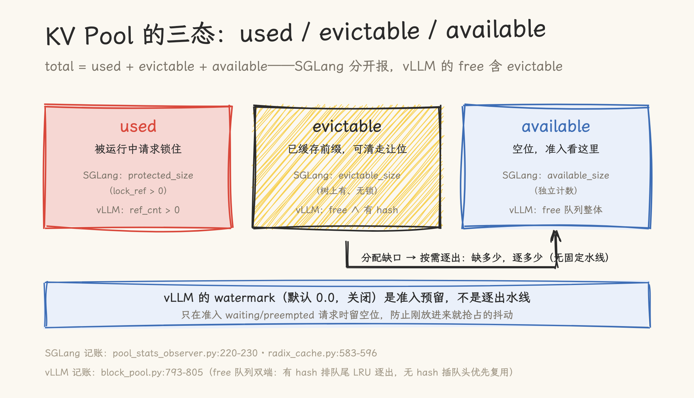
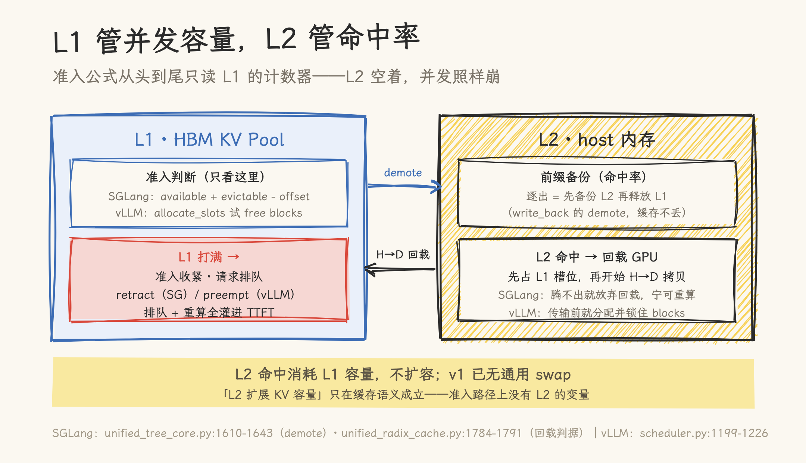
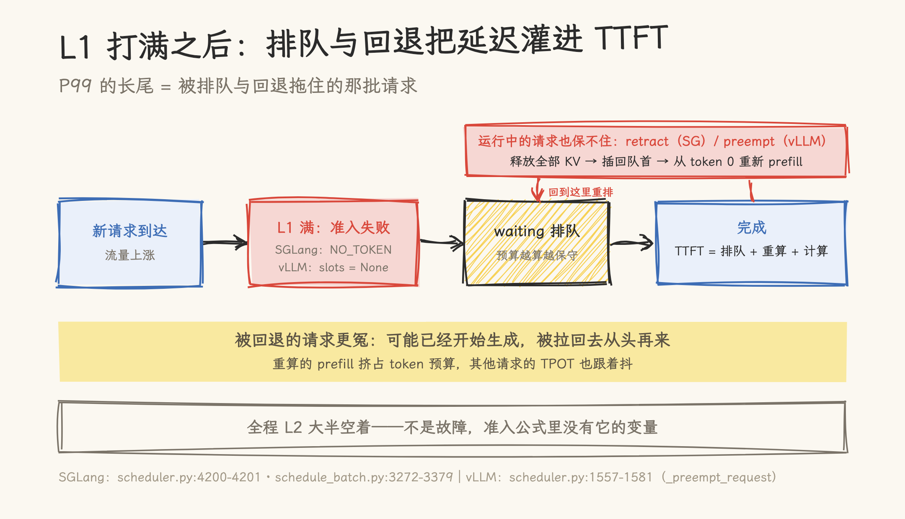

# L2 还有大半空着，TTFT 为什么先崩了？L1 KV Pool 才是系统并发的上限

> 2026-09-29 | 源码深读。基于 SGLang `f4de6abee6`（2026-09-28）与 vLLM `8b365ff949`（2026-09-25）静态阅读，行号已核对，未实际压测。SGLang 与 vLLM 各讲一半：容量怎么记账、准入怎么判断、打满之后发生什么，最后回到题目里的现象。

监控面板上，L2 的曲线一直趴在底部：HiCache 的 host 内存（或 LMCache 的 CPU 池）大半空着，命中率看着也不差。按直觉，缓存健康、容量富余，服务应该高枕无忧。但 P99 TTFT 已经从 2 秒爬到 40 秒，告警群里吵成一团。

这类问题的排查方向常常一开始就偏了：大家盯着 L2 找问题，而瓶颈在 L1——HBM 里的 KV Pool。**推理系统的并发容量记在 L1 的账本上，L2 只记缓存的账。** L1 打满之后，引擎收紧准入、请求排队、运行中的请求被整体回退重算，排队和重算的延迟全部灌进 TTFT；这一切发生时，L2 可以依然是空的。

本文对照 SGLang 与 vLLM 的源码把这件事讲清楚：并发能力由什么决定（第一节）、KV Pool 的三态记账（第二节）、看哪几个指标确认 L1 瓶颈（第三节）、L1 与 L2 各自管什么（第四节），最后把现象完整解释一遍并给出诊断清单（第五节）。

## 一、并发能力由什么决定

### 1.1 一条先行的物理公式

一个 token 的 KV 占用在生成时就定死了。MHA/GQA 的账目：

```text
KV per token = 2 (K 和 V) × layers × kv_heads × head_dim × dtype_bytes
```

以 Llama-3-70B 为例（80 层、GQA 8 个 KV head、head_dim 128、bf16）：2 × 80 × 8 × 128 × 2 = 320 KiB/token。80 GB HBM 扣掉权重、激活和 CUDA 图预留后，假设 60 GiB 留给 KV Pool，约 19 万 token；TP8 摊到 8 张卡后约 157 万 token——32K 上下文约 48 路并发，128K 上下文只剩 12 路。上下文翻倍，并发减半（以上为估算，实际预留比例因部署而异）。

MLA 系好得多：DeepSeek-V3 每层 576 元素的压缩 latent，61 层 bf16 约 68.6 KiB/token，一个 128K 请求约 9 GB——这也是本站 [dp-attention 篇](../../../sglang/sglang-dp-attention-dcp.md)算过的同一笔账。

于是有了那条先行的公式：

```text
并发数 ≤ KV Pool 总 token 数 ÷ 平均序列长度（输入 + 输出）
```

算力不够，请求可以慢慢跑；Pool 装不下，请求是进不来的。KV Pool 是并发容量唯一的硬约束——而它就是 L1。

### 1.2 引擎实际怎么准入：两条只认 L1 的预算线

物理公式是天花板，引擎的准入是逐 token 的精细账。

**vLLM：内联试探。** v1 的 `schedule()` 每轮按三条线试到装不下为止：token 预算 `max_num_batched_tokens`、并发条数 `max_num_seqs`（`vllm/v1/core/sched/scheduler.py:577-580,877-879`）、以及逐请求调用 `allocate_slots` 分配 block，装不下返回 None（`scheduler.py:743-767`）。Pool 总量在启动时由 profile 定出：profiling 算出峰值显存占用，剩余部分除以每 block 字节数得到 `num_gpu_blocks`（`vllm/v1/worker/gpu_worker.py:567-659`、`vllm/v1/engine/core.py:312-337`、`vllm/v1/core/kv_cache_utils.py:1766`），block_size 默认 16（`vllm/config/cache.py:71`）。

**SGLang：预算公式。** 准入走 `PrefillBudget`，核心一行：

```python
# python/sglang/srt/mem_cache/prefill_budget.py:75-84
def _available_and_evictable(self):
    evictable = (self.tree_cache.full_evictable_size() ...)
    return self.allocator.available_size() + evictable

@property
def remaining_total(self):
    return self._available_and_evictable() - self.total_offset
```

`total_offset` 里每准入一个请求就 `reserve()` 一笔：`reserved = extend_input_len + max_new_tokens + page_size`（`prefill_budget.py:37`）——**给「这个请求将来还要生成多少」预留预算**。预留多少由 `new_token_ratio` 估计：从 0.7 × schedule_conservativeness 起步，随 decode 步数线性衰减到下限（`managers/scheduler_components/new_token_ratio_tracker.py:22-31`）。起步保守、逐步放宽，发生 retract 时立刻调回高值重新保守。

两个引擎的准入逻辑完全不同，但有一个共同点：**两条预算线读的都是 L1 的计数器**。`allocate_slots` 比的是 `get_num_free_blocks`，`remaining_total` 算的是 `available_size + evictable_size`——L2 有多少空间，在准入公式里一次都不出现。

## 二、KV Pool 的三态：used、evictable、available

把 Pool 想成一个停车场：**used** 是被运行中请求锁住的车位；**evictable** 停着已缓存的前缀，随时可清走让位；**available** 是空位。三态之间的迁移，就是两个引擎记账的全部内容。

### 2.1 SGLang：树上的三态

SGLang 用 radix tree 管前缀缓存，三态在树上迁移。请求持有一个前缀时，路径上每个节点的 `lock_ref` 加一，加锁瞬间完成三态迁移：

```python
# python/sglang/srt/mem_cache/radix_cache.py:583-596
def inc_lock_ref(self, node: TreeNode) -> IncLockRefResult:
    ...
    if node.lock_ref == 0:
        self.evictable_size_ -= len(node.key)
        self.protected_size_ += len(node.key)
```

`protected_size` 就是三态里的 used。账目合成在 `pool_stats_observer.py:220-230`：

```python
available_size = self.token_to_kv_pool_allocator.available_size()
evictable_size = self.tree_cache.evictable_size()
num_used = self.max_total_num_tokens - (available_size + evictable_size)
token_usage = num_used / self.max_total_num_tokens
```

即 `total = protected + evictable + available`，三项各有一个计数器，直接可查。

逐出是按需的：分配缺口出现时，`evict_to_free_tokens` 算出 `shortfall = 需求 − available`，从 eviction heap 逐叶子节点，正好逐出 shortfall（`mem_cache/allocator/base.py:135-149`、`mem_cache/common.py:188-210`）。**没有「水位到 90% 开始逐出」的固定水线参数——缺多少，逐多少。**

### 2.2 vLLM：块上的三态

vLLM 没有显式的 evictable 计数器，三态藏在 block 的两个字段里：`ref_cnt`（是否被请求持有）和 `block_hash`（是否已注册进前缀缓存哈希表）。`ref_cnt == 0 ∧ block_hash 非空` 就是 evictable——释放后进了 `free_block_queue`，但哈希还在，随时可以按前缀命中复用，也可以在需要时被逐出（`vllm/v1/core/block_pool.py:793-805`）。

释放路径上有个巧思：块**在被持有期间**满块时就注册哈希（`cache_full_blocks`，`block_pool.py:225-298`），释放时零操作自动变成 evictable。SGLang 是释放时才在两套计数间迁移，vLLM 是提前挂好牌。

free 队列一个队列、两种排序：有哈希的块（可逐出的缓存）排队尾，按 FIFO 实现近似 LRU 逐出；无哈希的块插队头优先复用，照顾 GPU 访问局部性（`block_pool.py:793-805`）。

vLLM 还有一个 watermark 参数，语义容易误会：它是**准入预留**，不是逐出水线。`watermark` 默认 0.0（关闭，`vllm/config/scheduler.py:197-202`）；开启后只在准入 waiting/preempted 请求时保留 `watermark_blocks` 个空位不分配，避免刚放进来就抢占、抢占完又放进的抖动（`vllm/v1/core/kv_cache_manager.py:205-208,506-513`）。旧版 v1 默认 0.01，当前 HEAD 已改为 0.0——对照旧资料时注意版本。

### 2.3 两边记账对照

| 三态         | SGLang                            | vLLM                                          |
| ------------ | --------------------------------- | --------------------------------------------- |
| used（被锁） | `protected_size_`（lock_ref > 0） | `ref_cnt > 0`，不在 free 队列                 |
| evictable    | `evictable_size_`（树上有、无锁） | free 队列中 ∧ `block_hash` 非空               |
| available    | `available_size_`（独立计数）     | free 队列整体（**含 evictable，无单独计数**） |

注意最后一行：vLLM 的 free 把 evictable 含在里面，看它的空闲指标要心里有数——「free」里一部分是真空闲，另一部分是缓存可清。SGLang 把两者分开报。这也是第三节里两家指标口径差异的根源。



**图 1**｜三态与逐出：used 被运行中请求锁住；evictable 是已缓存可清的前缀；available 是空位。分配缺口出现时按需逐出——缺多少逐多少，没有固定水线。SGLang 三个计数分开报，vLLM 的 free 指标把 evictable 含在里面。

## 三、观测 KV Pool 的几个指标

两个引擎的指标各成一族，按「容量账」与「缓存账」分两组看。

**SGLang**（Prometheus `sglang:*`，`observability/metrics_collector.py`；日志行默认每 40 个 decode step 打一条，`arg_groups/fields/observability.py:136-139`）：

| 指标                                         | 口径                                    | 出处                             |
| -------------------------------------------- | --------------------------------------- | -------------------------------- |
| `sglang:token_usage`                         | (total − available − evictable) / total | `pool_stats_observer.py:220-230` |
| `sglang:num_running_reqs` / `num_queue_reqs` | 运行中 / 排队中                         | `metrics_collector.py:281-287`   |
| `sglang:cache_hit_rate`                      | 命中 token /（命中 + 新算）             | `metrics_reporter.py:786-792`    |
| `sglang:num_retracted_reqs_total`            | retract 累计数                          | `metrics_collector.py:469-486`   |

**vLLM**（Prometheus `vllm:*`，`vllm/v1/metrics/loggers.py`）：

| 指标                                                 | 口径                                             | 出处                    |
| ---------------------------------------------------- | ------------------------------------------------ | ----------------------- |
| `vllm:kv_cache_usage_perc`                           | 1 − free/(num_gpu_blocks − 1)，分母减 null block | `block_pool.py:879-890` |
| `vllm:num_requests_running` / `num_requests_waiting` | 运行中 / 排队中                                  | `loggers.py:509-519`    |
| `vllm:num_preemptions`                               | 抢占累计（另有每请求直方图）                     | `loggers.py:677,902`    |
| `vllm:prefix_cache_queries/hits`                     | 本地（L1）前缀命中                               | `loggers.py:600-611`    |
| `vllm:external_prefix_cache_queries/hits`            | connector/L2 命中                                | `loggers.py:624-636`    |

两组指标的用法不同。**容量组**（token_usage、kv_cache_usage_perc、queue、retracted/preemptions）回答「Pool 装不装得下」；**缓存组**（cache_hit_rate、prefix_cache_hits）只回答「prefill 省了多少计算」。诊断「L2 空着 TTFT 崩」看容量组就够了：usage 贴 1、waiting 堆积、retract/preempt 计数增长，三条同时出现就是 L1 瓶颈，不必再怀疑缓存。vLLM 的 `external_prefix_cache_hits` 还顺带告诉你 L2 命中了多少——它是缓存组的指标，跟 P99 长尾对不上号。

## 四、L1 与 L2 的关系

分层的官方定义在 HiCache 设计文档里：L1 是 GPU 显存（HBM），L2 是 host 内存（CPU DRAM），L3 是分布式存储（`docs/docs/advanced_features/hicache_design.mdx:12`）。vLLM 侧对应的机制是 KVConnector 体系里的 offloading：`OffloadingConnector`、`SimpleCPUOffloadConnector`、`LMCacheConnectorV1`（`vllm/distributed/kv_transfer/kv_connector/v1/`）。

### 4.1 L2 帮 L1 的方式：让逐出不丢缓存

SGLang HiCache 在 write_back 策略下，逐出变成**降级（demote）**：先把该节点备份到 L2，再释放 L1 槽位（`mem_cache/unified_cache/unified_tree_core.py:1610-1643`）。没有 L2 时，逐出意味着缓存作废，前缀再来要整段重算；有了 L2，`available` 变现回来了，缓存还在 host 里躺着。`--hicache-ratio` 默认 2.0（`arg_groups/hicache_hook.py:100-103`）。

要点：**备份不占 L1 的记账。** L2 空间的大小不会让 L1 的 `available_size` 变大或变小——L2 改变的只是「evictable 变现成 available 时，缓存丢不丢」。

### 4.2 L2 命中回 GPU：先占 L1，才能回

两个引擎在这一点上姿势一致，而且都有点反直觉。

SGLang 在准入时发起 `init_load_back`，承诺的 host 命中长度必须全部提交或全部不认（`managers/schedule_policy.py:1400-1418`）；回载前先看 L1 的 available，不够就先 `evict_for_alloc` 腾位，**还腾不出就放弃回载，宁可重算**（`mem_cache/unified_radix_cache.py:1784-1791`）。H→D 拷贝在 prefill 前完成，有显式同步点。

vLLM 更直白：GPU blocks 在传输开始前就分配并持有（`scheduler.py:1214-1226` 的 `delay_cache_blocks` 路径），还为在飞的 prefill 追加 `reserved_blocks` 保护（`:1199-1209`）——L2 命中的请求在等 KV 搬回来时，它占的 L1 车位是锁着的。

所以结论要倒过来说：**L2 命中消耗 L1 容量，而不是扩容。** 「L2 扩展了 KV 容量」只在缓存语义上成立（前缀可备份、不丢失）；在并发语义上不成立——没有任何一条准入路径会去读 L2 的计数器。

v1 还顺手封死了一条歧路：v0 曾有 swap 机制（把运行中请求的 KV 换出到 CPU 腾 L1），v1 主线调度器里没有它的继任者——通用的「L1 换出再换回、变相扩容准入」不存在，仅稀疏注意力 hisparse 有专用的 GPU/host 分层，属于特性而非通用机制。SGLang 侧 retract 时可以把被回退请求的 KV offload 到 host（`retract_decode` 的 `release_req` 支持），但那是请求退出后的缓存备份，不是运行中的换页。



**图 2**｜L1/L2 分工：逐出在 write_back 下变成「备份到 L2、释放 L1」的降级；L2 命中回 GPU 前要先占 L1 槽位，腾不出宁可重算。准入公式从头到尾只读 L1 的计数器——L2 决定命中率，L1 决定并发上限。

## 五、回到现象：把时间线串起来

1. **流量上来，L1 爬向满。** token_usage / kv_cache_usage_perc 逐级抬升。此刻 L2 依然空着——demote 还没发生几次，或者 `hicache_ratio` 给的 L1 本来就宽裕。
2. **引擎收紧准入。** SGLang 的 `remaining_total` 不足，`budget_state()` 返回 `NO_TOKEN`（`managers/schedule_policy.py:850-869`），新请求堆进 waiting；`new_token_ratio` 一路衰减，预算越算越保守。vLLM 的 waiting 请求每轮在 `schedule()` 里试探 `allocate_slots`，装不下就继续等。
3. **高水位下连 decode 都装不下。** SGLang 的 `check_decode_capacity` 先逐缓存，逐完还不够，触发 `retract_decode`（`managers/scheduler.py:4200-4201`、`managers/schedule_batch.py:3272-3379`）：从运行批次里挑请求、释放其全部 KV、回 waiting 重新排队，日志打出 `KV cache pool is full. Retract requests. #retracted_reqs: ...`。vLLM 的对应动作是抢占：`_preempt_request` 释放 block、`num_computed_tokens` 清零、请求插回 waiting **队首**，从 token 0 重新 prefill（`scheduler.py:1557-1581`）。
4. **这些延迟全部落进 TTFT。** 排队的请求在等准入；被 retract/preempt 的请求在重算 prefill——后者更冤，它可能已经开始生成，被拉回去从头再来。P99 的长尾就是这批请求：均值被缓存命中保护着，P99 被高水位的排队与回退拖着。
5. **全程 L2 空着。** 它空着不是故障，是结构性无关：准入公式里没有它的变量。



**图 3**｜L1 打满之后：新请求在 waiting 里等准入，运行中的请求被 retract/preempt、释放全部 KV 后从头重新 prefill——排队与重算的时间都灌进 TTFT，P99 的长尾就是这批请求。

L2 什么时候才派上用场：多轮对话、长 system prompt、Agent 循环这类共享前缀比例高的负载。L2 命中省掉 prefill 计算，TTFT 均值与吞吐受益；但一批互不共享前缀的新请求打进来，L1 该满还是满。

### 诊断清单

P99 TTFT 异常时，按序看：

1. **容量组三件套**：token_usage / kv_cache_usage_perc 是否长期贴 1；num_queue_reqs / num_requests_waiting 是否堆积；num_retracted_reqs_total / num_preemptions 是否增长。三条同时成立即 L1 瓶颈。
2. **缓存组对照**：cache_hit_rate / prefix_cache_hits 高而 P99 差，坐实是并发账问题，不是缓存账问题——排查方向转向准入参数（`mem_fraction_static`、`max_running_requests` / `max_num_seqs`）与每 token KV 体积。
3. **处方三条**：降每 token 体积（KV 量化、压缩、MLA、稀疏注意力）；加 L1（TP/DP/DCP 摊大池子，见本站[并行策略](../../../parallelism/parallelism_strategies.md)与 [dp-attention 篇](../../../sglang/sglang-dp-attention-dcp.md)）；或承认上限、做准入控制（限流排队）。L2 / HiCache / LMCache 只解决命中率，别拿它救 P99。

## 说明

- 全部结论来自静态源码阅读（行号以上述 commit 为准），未实际压测；第五节的时间线是机制推演，具体延迟量级取决于负载与硬件；
- vLLM `watermark` 默认 0.0 是 `8b365ff949` 的行为，旧版 v1 为 0.01，升级对照旧资料时注意；
- SWA/hybrid 池的 full/swa 双侧记账、vLLM hisparse 的专用分层属于支线，本文未展开；
- 1.1 节的并发数字为估算，实际预留比例随部署（CUDA 图、激活峰值）浮动；
- SGLang 逐出策略（eviction heap）支持 LRU/LFU 等多种 strategy，本文只描述「按需逐出」的触发机制，不展开策略选择。

## 源文件索引

SGLang（`f4de6abee6`，路径省略 `python/sglang/srt/` 前缀）：

- `mem_cache/prefill_budget.py` — 准入预算：`_available_and_evictable`（:75）、`remaining_total`（:84）、reserved 公式（:37）
- `mem_cache/radix_cache.py` — `inc_lock_ref`/`dec_lock_ref` 三态迁移（:583-616）
- `mem_cache/allocator/base.py`、`mem_cache/common.py` — 按需逐出 `evict_to_free_tokens`（:135-149）、`_evict_until_allocatable`（:188-210）
- `managers/scheduler_components/pool_stats_observer.py` — 三态合成与 token_usage 公式（:220-230）
- `managers/scheduler_components/new_token_ratio_tracker.py` — 预估系数起步与衰减（:22-31）
- `managers/scheduler.py`、`managers/schedule_batch.py` — retract 触发（:4200-4201）、`retract_decode`/`release_req`（:3272-3379）
- `managers/schedule_policy.py` — `budget_state`（:850-869）、`init_load_back` 准入回载（:1400-1418）
- `mem_cache/unified_radix_cache.py`、`mem_cache/unified_cache/unified_tree_core.py` — demote（:1610-1643）、回载放行判据（:1784-1791）
- `observability/metrics_collector.py`、`managers/scheduler_components/metrics_reporter.py` — 指标定义与日志行
- `arg_groups/hicache_hook.py` — hicache_ratio 默认值（:100-103）
- `docs/docs/advanced_features/hicache_design.mdx` — L1/L2/L3 官方定义（:12）

vLLM（`8b365ff949`）：

- `vllm/v1/core/kv_cache_utils.py` — block 数推导（:1766）、`KVCacheBlock` 字段（:177-193）
- `vllm/v1/core/block_pool.py` — free 队列与哈希表（:174-180）、cache_full_blocks（:225-298）、双端复用（:793-805）、usage 公式（:879-890）
- `vllm/v1/core/kv_cache_manager.py` — watermark 计算（:205-208）与准入应用（:506-570）
- `vllm/v1/core/sched/scheduler.py` — 三条准入线（:577-580,877-879）、`allocate_slots`（:743）、抢占（:1557-1581）、L2 回载预占（:1199-1226）
- `vllm/config/cache.py`、`vllm/config/scheduler.py` — block_size 默认 16（:71）、watermark 默认 0.0（:197-202）
- `vllm/v1/metrics/loggers.py` — 全部 Prometheus 指标定义
- `vllm/v1/worker/gpu_worker.py`、`vllm/v1/engine/core.py` — profile 推导 num_gpu_blocks（:567-659、:312-337）
- `vllm/distributed/kv_transfer/kv_connector/v1/` — `offloading_connector.py`、`simple_cpu_offload_connector.py`、`lmcache_connector.py`

## 参考资料

- [SGLang](https://github.com/sgl-project/sglang) 仓库，commit `f4de6abee6`（2026-09-28）
- [vLLM](https://github.com/vllm-project/vllm) 仓库，commit `8b365ff949`（2026-09-25）
- 本站 [SGLang KV Pool 管理：物理存储、Radix Tree 索引与请求视图](../../../sglang/sglang-kv-pool-management.md)——本文第二节的展开版：物理存储、lock_ref、分配器与 page
- 本站 [七池与八池：HiCache 支持 DeepSeek V4 与 V4.1 的不同接法](../../../kv_compression/03-multilevel-cache.md)——HiCache 池形态与读写的进一步拆解
- 本站 [GLM-5 模型 KV Cache 容量规划报告](glm5_kv_cache_capacity_planning.md)、[KV Cache ROI](kv_cache_roi.md)——容量测算的业务侧方法
- 本站 [MoE 与百万上下文：请求怎么分卡，长文怎么切](../../../sglang/sglang-dp-attention-dcp.md)——「加 L1」路线里 DCP 的机制篇
- 本站 [PagedAttention](../basic/paged_attention.md)、[KV Cache 基础](../basic/kv_cache_basics.md)——block 化与 KV 基础概念
