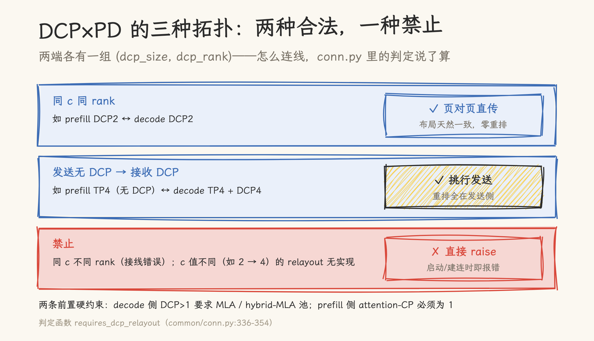
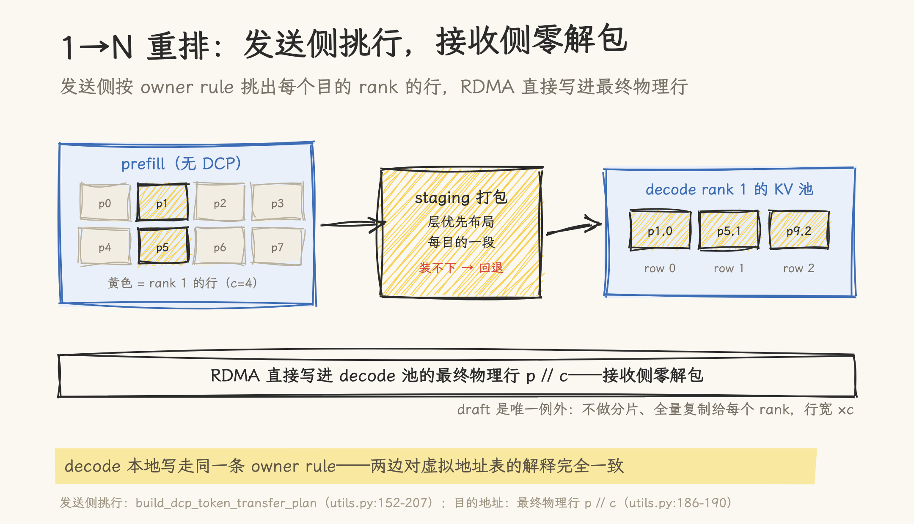

# 分卡之后再跨机：DCP 与 PD 分离叠加时的 KV 传输

> 2026-09-28 | 源码深读。基于 SGLang main `f4de6abee6`（2026-09-28）。本文是 [PD 分离架构下的 KV Cache 传输](01_disaggregated_prefill_kv_transfer.md)与 [PD 状态交接优化的四条轴](02-pd-state-handoff-optimization-map.md)的续篇，回答一个此前留白的问题：**DCP（decode context parallel，按位置分卡）开启时，PD 分离的 KV 传输怎么变**。全部结论来自静态源码阅读（行号已核对），未实际运行测试——涉及部署验证的部分见文末诚实声明。

前两篇讲 PD 分离的 KV 传输时，decode 侧还是「一张卡（或一个 TP 组）拿着完整 KV」的形态。开了 DCP 之后，decode 侧的每张卡只持有这个请求序列的 1/c——按 owner rule，rank r 只存位置 p % c == r 的那些 token，物理上放在第 p // c 行。

于是传输问题变了。旧的问法是「KV 什么时候从 prefill 卡搬到 decode 卡」；新的问法多了一层：**prefill 侧生产的 KV 是完整序列，decode 侧每个 rank 却只缺自己的 1/c——谁来挑行、按什么顺序发、发到哪一行**。

SGLang 的答案可以压缩成一句话：**重排全部由发送侧的地址计算完成，网络直接把每一行写进 decode 池的最终物理位置，接收侧零解包**。这句话展开是三种拓扑、一套打包、一条回退路，下面逐个拆。

## 一、先看接线：三种拓扑，两种合法

DCP 开启时，PD 分离的两端各有一组 (dcp_size, dcp_rank)。`requires_dcp_relayout`（`srt/disaggregation/common/conn.py:336-354`）把它们分成三种情况：

- **同 c 同 rank 直传**：两端的分卡方式完全一致，页对页 1:1 拷贝即可，不打包、不重排——两侧布局天然一致；
- **发送侧无 DCP（dcp_size == 1）→ 接收侧 DCP（> 1）**：prefill 持有完整序列，按 owner rule 为每个目的 rank 挑出它的 1/c 行分别发送——这是唯一需要「重排」的拓扑，且重排发生在发送侧；
- **其余一律 raise**。同 c 但 rank 对不上（prefill 的 rank 0 连 decode 的 rank 1）视为接线错误；c 值不同（2 → 4、N → 1 等）的 relayout 没有实现。

两条硬约束在连接建立期就会检查（`common/conn.py:994-1003`）：decode 侧开 DCP 要求 KV 池是 MLA 或 hybrid-MLA；prefill 侧的 attention-CP 必须为 1。也就是说，DCP × PD 目前只对 MLA 系模型成立，且不与 prefill-CP 叠加。

**图 1**｜三种拓扑与接线判定：同 c 同 rank 页对页直传；发送侧无 DCP 时按 owner rule 为每个目的 rank 挑行；其余拓扑建连即报错。

## 二、发送侧：为每个目的 rank 挑行、打包

挑行的数学很简单。对每个目的 decode rank（dcp_rank, dst_dcp_size），在 chunk 内的全局位置里选 `offset ≡ (dcp_rank − chunk_start) (mod c)` 的那些 token——正是它按 owner rule 拥有的位置（`build_dcp_token_transfer_plan`，`srt/disaggregation/common/utils.py:152-207`）。源物理行与目的本地行在同一次地址计算里成对得出：源 = `src_pages[offset // pps] × pps + offset % pps`，目的 = decode 池的最终物理行 `p // c`。

挑出来的行进 staging buffer 打包（`try_pack_dcp_src`，`common/dcp_pack.py:38-90`）：一个独立 gather stream 上跑 Triton kernel 把稀疏的行收拢成连续大块，RDMA 侧每层只剩一条连续传输。打包布局是**层优先**的——每层一段、段内按 token 顺序，段与段之间互不交叠。

两个工程数字。其一，打包缓冲的容量公式是 `dcp_size × ceil(max_tokens / dcp_size) × sum(kv_item_lens)`——32K tokens、61 层 MLA（每层 576 维 bf16）约 **2.14 GiB 每缓冲**，4 条队列 8.58 GiB（`dcp_pack.py:109-111`）。其二，prefill 侧的发送范围按这个容量切段（`get_max_transfer_tokens`，`prefill.py:1502-1509`），注释写明了原因：**cache hit 会让待传 KV 超过缓冲容量**，不切段就会触发回退（见第四节）。

**图 2**｜1→N 重排的全链路：prefill 按目的 rank 挑行打包，RDMA 直接写进 decode 池的最终物理行；装不下时回退 per-token RDMA。

## 三、接收侧：零解包

收到数据后，decode 侧没有任何「解开重排」的代码——`decode.py` 全文没有一处 DCP 引用。原因在目的地址的算法里：发送侧算出的目的地址就是 decode 池的最终物理行 `p // c`（`utils.py:186-190`），RDMA 直接写到位于；decode 侧唯一的配合是上送自己池的页号列表（`mooncake/conn.py:2178-2181` 里 DCP 分支下 `dst_kv_indices` 整段使用、不做 chunk 切片）。

这套「直接写最终行」能成立，是因为发送侧与 decode 本地写走的是**同一条 owner rule**：decode 池自己的写入也是「widened loc 选属主、塌缩到 p // c 行」（`mem_cache/memory_pool.py:4537-4557`、`mla_buffer.py:250-268`）。两边对同一张虚拟地址表的解释完全一致，传输就只是把行送到该在的地方。

## 四、draft：唯一被复制而非分片的部分

MTP draft 模型的 KV 是例外——它**不做 DCP 分片，全量复制给每个目的 rank**（`utils.py:196-199`：draft 的偏移是 `arange(num_kv_tokens)`，目的行按虚拟位置编址、行宽是物理的 c 倍）。纯 MLA 且两端 TP 数不同时，draft 的 head 切片映射直接被拒绝：「PD DCP draft head slicing is unsupported for pure MLA」（`mooncake/conn.py:1216-1220`）——宁可 raise 也不切片。代码能确认的到「draft 全量、c 倍宽行」为止；为什么这样设计（推测与 draft/verify 不做位置分片有关），源码没有注释，不替它编。

## 五、两个后端的打包策略差异

Mooncake 与 NIXL 都走同一条挑行与打包逻辑，但 staging buffer 的用法分成了两派：

| 维度      | Mooncake                               | NIXL                                           |
| --------- | -------------------------------------- | ---------------------------------------------- |
| pack 区域 | 每 worker 一块缓冲，从 0 偏移顺序使用  | 划成 c 个固定 rank 区域，各归各的目的          |
| 并发控制  | `futures.wait` 等传输完成才复用缓冲    | chunk 屏障防止区域复用竞争                     |
| TP 共享   | 逐请求串行                             | `tp_rank % c` 相同的多个目的**复用同一次打包** |
| draft     | 计入 pack 缓冲（`include_draft=True`） | 不 pack，按连续组直接发                        |

NIXL 的复用是个巧思：TP8 × DCP8 的拓扑下，`tp_rank % 8` 相同的多个 decode 目的持有相同的行集合，一次 gather 的打包结果可以发往多个目的地——同样的行不用收八遍。

## 六、回退：当缓冲装不下时

打包缓冲装不下当前批（cache hit 让待传 KV 超出预期时会发生），`try_pack_dcp_src` 返回 None，回退为 **per-token RDMA**：不打包，直接对每个散行发起小传输。性能含义在单测里有断言（`test_dcp_pack.py:141-150`）：不打包时源行是跨步 c 的散行，`group_concurrent_contiguous` 退化成单行一组——从「每层一条大块」变成 O(tokens/c × layers) 条小 RDMA。前文说的按容量切段，就是为了让正常路径不落到这条回退上。

## 七、说明

- 本文全部结论来自静态源码阅读（行号以 `f4de6abee6` 为准），**未实际运行任何 PD×DCP 传输**；端到端验证由 `test_kimi_linear_pd_dcp4.py` 覆盖（prefill TP4 无 DCP → decode TP4 + DCP4，32K NIAH + GSM8K ≥ 0.88）；
- draft 全量复制的设计动机是推断（源码无注释）；「draft 不参与 DCP 分片」到「draft/verify 前向为何这样写」之间有一段未验证的空隙；
- 仅 Mooncake 与 NIXL 实现了 DCP 传输路径；ascend/mori 等后端 grep 零引用——「不支持」是实现覆盖事实，无显式报错；
- 小 RDMA 放大、2.14 GiB/块等性能含义来自代码结构与注释推断，无实测数字；
- 「DCP 组嵌在 attention-TP 组内」的嵌套校验在当前版本缺失，配错拓扑要等运行时 raise——部署前需自查。

## 源文件索引

| 文件                                          | 关键内容                                                                                                                                                                                                                                                      |
| --------------------------------------------- | ------------------------------------------------------------------------------------------------------------------------------------------------------------------------------------------------------------------------------------------------------------- |
| `srt/disaggregation/common/conn.py`           | 拓扑判定 `requires_dcp_relayout`（:336-354）、连接硬约束（:994-1003）、draft 行宽校验（:356-384）、chunk 切分（:1596-1607）                                                                                                                                   |
| `srt/disaggregation/common/utils.py`          | 挑行计划 `build_dcp_token_transfer_plan`（:152-207）、源/目的地址成对计算（:186-195）、prefix 对齐校验（:163-168）、draft 偏移（:196-199）                                                                                                                    |
| `srt/disaggregation/common/dcp_pack.py`       | 缓冲容量公式（:16-35）、打包与回退（:38-90）、缓冲分配与量级注释（:93-130）                                                                                                                                                                                   |
| `srt/disaggregation/common/staging_buffer.py` | 容量分段（:782-798）                                                                                                                                                                                                                                          |
| `mooncake/conn.py`                            | DCP 分支整段使用 dst（:2178-2181）、draft 异构 TP 拒绝（:1216-1220）、顺序打包与串行化（:1329-1333）、注册帧传递（:2910-2911）                                                                                                                                |
| `nixl/conn.py`                                | c 个固定 rank 区域（:1855-1863）、TP 共享复用（:1840-1845）、逐 part 非预提交（:1940-1954）、注册帧传递（:3403-3404）                                                                                                                                         |
| `kernels/ops/kvcache/pd_dcp_gather.py`        | 层优先打包 kernel（:51-65）                                                                                                                                                                                                                                   |
| `mem_cache/memory_pool.py`、`mla_buffer.py`   | decode 本地写的同款 owner rule（:4537-4557、:250-268）                                                                                                                                                                                                        |
| 测试                                          | `test/registered/unit/disaggregation/test_dcp_pack.py`（挑行手算/跨页/溢出回退）、`test_mooncake_transfer_batching.py`（draft 切片/缓冲生命周期）、`test_disaggregation_kimi_linear.py:98-102`（双侧 DCP2 直传 parity）、`test_kimi_linear_pd_dcp4.py`（e2e） |

## 参考资料

- [SGLang](https://github.com/sgl-project/sglang) 仓库，commit `f4de6abee6`（2026-09-28）——本文所有源码引用的基准版本
- 本站 [PD 分离架构下的 KV Cache 传输](01_disaggregated_prefill_kv_transfer.md)——传输时序/发起方/内容的三维框架
- 本站 [PD 状态交接优化的四条轴](02-pd-state-handoff-optimization-map.md)——压缩、重叠、复用、隔离的优化地图
- 本站 [MoE 与百万上下文：请求怎么分卡，长文怎么切](../../../sglang/sglang-dp-attention-dcp.md)——DCP 本体的机制篇，本文是它在 PD 场景的落地
