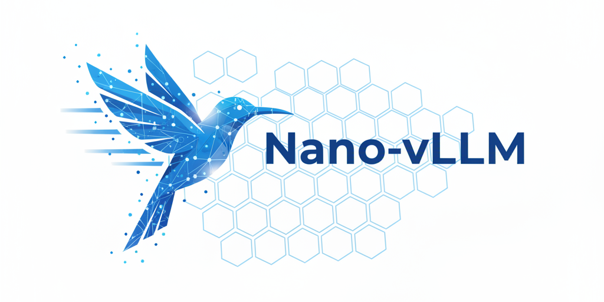

<p align="center">

</p>

<p align="center">
<a href="https://trendshift.io/repositories/15323" target="_blank"></a>
</p>

# Nano-vLLM

从零构建的轻量级 vLLM 实现。

## 关键特性

- 🚀 **快速离线推理** - 推理速度与 vLLM 相当
- 📖 **可读性强的代码** - 约 1,200 行 Python 代码，结构清晰
- ⚡ **优化套件** - 前缀缓存、张量并行、Torch 编译、CUDA Graph 等

## 实战课程

[nano-vllm 实战课程](docs/llm-inference-visual/) — 从源码走读 LLM 推理引擎：调度、KV cache、注意力、Tensor Parallel、CUDA Graph。8 课逐步展开，每课附带可运行的验证脚本。

## 安装

```bash
pip install git+https://github.com/GeeeekExplorer/nano-vllm.git
```

## 模型下载

手动下载模型权重：

```bash
huggingface-cli download --resume-download Qwen/Qwen3-0.6B \
  --local-dir ~/huggingface/Qwen3-0.6B/ \
  --local-dir-use-symlinks False
```

## 快速开始

参考 `example.py`。API 接口与 vLLM 一致，仅 `LLM.generate` 方法有细微差异：

```python
from nanovllm import LLM, SamplingParams
llm = LLM("/YOUR/MODEL/PATH", enforce_eager=True, tensor_parallel_size=1)
sampling_params = SamplingParams(temperature=0.6, max_tokens=256)
prompts = ["Hello, Nano-vLLM."]
outputs = llm.generate(prompts, sampling_params)
outputs[0]["text"]
```

## 性能测试

参见 `bench.py`。

**测试配置：**

- 硬件：RTX 4070 Laptop (8GB)
- 模型：Qwen3-0.6B
- 总请求数：256 条
- 输入长度：100–1024 tokens 随机采样
- 输出长度：100–1024 tokens 随机采样

**性能结果：**

| 推理引擎  | 输出 Tokens | 耗时 (s) | 吞吐 (tokens/s) |
| --------- | ----------- | -------- | --------------- |
| vLLM      | 133,966     | 98.37    | 1361.84         |
| Nano-vLLM | 133,966     | 93.41    | 1434.13         |

## Star History

[](https://www.star-history.com/#GeeeekExplorer/nano-vllm&Date)
