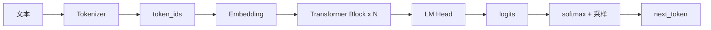
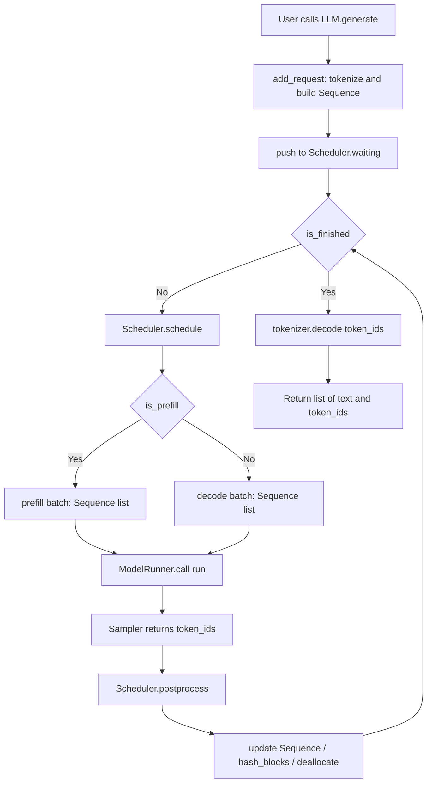

# 第 1 课：从 LLM.generate 走到 step 循环

## 1. 本课概述

**一句话概述**：从用户调用 `generate("你好")` 开始，追踪代码到底做了什么，直到拿到生成的回答。

nano-vllm 推理引擎的全局路径：对外接口 `LLM.generate` 进入系统后，把 prompt 变成 `Sequence`，调度器在每个 step 选择 prefill（一次性处理用户输入的阶段）或 decode（逐 token 生成回答的阶段），模型执行端返回 token，调度器推进状态直到请求完成。最终我们将得到一张端到端流程图，以及能在代码里一键定位每个方框的锚点。

### 1.1 课时安排

| 阶段     | 时长   | 内容要点                                                     |
| -------- | ------ | ------------------------------------------------------------ |
| 原理铺垫 | 25 min | Transformer 架构总览、Tokenizer 原理、自回归生成动机         |
| 代码走读 | 35 min | `LLM` → `LLMEngine.generate` → `add_request` → `step` 三段式 |
| 动手练习 | 20 min | 运行 example.py，观察输出结构，手绘 step 循环流程            |
| 答疑讨论 | 10 min | 开放提问                                                     |

### 1.2 学习目标

学完本课后，我们应该能回答以下问题：

- `LLM` 和 `LLMEngine` 是什么关系？为什么用户调 `LLM.generate` 最终执行的是 `LLMEngine` 里的代码？
- 每个 step 的"三段式"是什么？（调度 → 执行 → 回写）
- prefill 和 decode 在 step 循环里分别对应什么？为什么引擎需要区分二者？

---

## 2. 原理说明：从文字到 token 再到生成

理解推理引擎之前需要三个 LLM 基础直觉：模型是什么、输入怎么来、输出怎么一步步产生。如果读者已经了解 Transformer 与自回归生成，可以直接跳到第 3 节。

### 2.1 Transformer 是什么？

我们可以把 Transformer 模型想象成一个"黑箱函数"：**输入一串数字编号（token_ids），输出下一个数字编号的概率分布**。

内部结构可以简化为三层：

1. **Embedding 层**：把每个整数编号变成一个向量（一组浮点数）
2. **N 层 Transformer Block**：反复对所有向量做"互相看一看"（注意力）和"各自想一想"（前馈网络），逐步提炼语义
3. **LM Head（输出头）**：把最后一个位置的向量变回词表大小的概率分布（logits → softmax → 概率）

现阶段我们只需记住这个输入/输出契约。第 5 课会打开"注意力"这个子模块，第 7 课会深入 KV cache 写入。



### 2.2 Tokenizer：文字怎么变成数字

LLM 不直接"看"文字。Tokenizer（分词器）负责把文本拆成子词片段，每个片段对应词表中的一个整数 ID：

- 例如：`"Hello world"` → 分成 `["Hello", " world"]` → 对应 `[9707, 1879]`
- 中文：`"你好世界"` → 可能被拆成 `["你好", "世界"]` → 对应 `[108386, 99489]`

这就是为什么代码里 `add_request` 的第一步是 `tokenizer.encode(prompt)`——把人类能读的字符串变成模型能处理的整数列表。

### 2.3 自回归生成：为什么要一个接一个地产出 token

Transformer 模型的核心特性是：**每次只预测一个下一个 token**。要生成一整句话，必须循环执行：

1. 把当前所有 token 送入模型 → 得到下一个 token 的概率
2. 从概率中采样得到一个新 token
3. 把新 token 追加到序列末尾
4. 重复步骤 1，直到生成结束标志（EOS）或达到长度上限

这个循环自然地分成两个阶段：

- **Prefill（预填充）**：把用户的整个问题一次性全部读入，计算所有位置的中间结果。类比：把试卷题目从头到尾读一遍。
- **Decode（解码）**：一个 token 一个 token 地写答案，每写一个都要回头"看"前面所有内容。类比：写答案时每个字都要参考题目和已写内容。

**这就是为什么 `generate` 里有一个 while 循环反复调用 `step()`**——每调用一次 step，模型就吐出一个新 token。

---

## 3. 推理主链路

先看一张端到端流程图建立全局印象，再按真实调用顺序逐个对齐到函数与数据形态。阅读图时建议同时打开 `LLMEngine.step` 的代码，把图中每个方框逐个对齐到真实实现。



### 3.1 LLM 是 LLMEngine 的别名入口

`nanovllm.LLM` 并不新增行为，而是直接继承 [`LLMEngine`](../../nanovllm/llm.py)，因此后续所有推理逻辑都在引擎实现中。我们可以把 `LLM` 理解成一个“方便用户调用的外壳”。

### 3.2 generate：把 prompts 放入调度器并循环 step

[`LLMEngine.generate`](../../nanovllm/engine/llm_engine.py#L60-L90) 把每个 prompt 变成 `Sequence` 加入调度器，然后循环调用 `step()`，直到 `scheduler.is_finished()` 返回 True，最后把 token_ids decode 成文本。其中“入队”这一步由 [`add_request`](../../nanovllm/engine/llm_engine.py#L43-L47) 专门负责，它会 tokenize 字符串 prompt 并构造 `Sequence` 后调用 `Scheduler.add`。

- 数据形态：
  - 输入：`prompts: list[str] | list[list[int]]` 与 `sampling_params`
  - 中间：`Sequence`（请求状态容器）经由 `add_request` 加入 `Scheduler.waiting`
  - 输出：`list[{"text": str, "token_ids": list[int]}]`
- prefill / decode 同循环辨识：`step` 返回的 `num_tokens` 大于 0 表示本轮走的是 prefill（等于本轮所有 seq 的 `num_scheduled_tokens` 之和）；等于 `-len(seqs)` 表示 decode（每个 seq 只前进一格）。这也是终端进度条上 `Prefill tok/s` 与 `Decode tok/s` 能够分开统计吞吐的原因（见 [llm_engine.py:L51](../../nanovllm/engine/llm_engine.py#L51) 与 [llm_engine.py:L76-L79](../../nanovllm/engine/llm_engine.py#L76-L79)）。

### 3.3 step：调度 → 执行 → 回写

[`LLMEngine.step`](../../nanovllm/engine/llm_engine.py#L49-L55) 是理解推理引擎的最佳切入点。**每次 step 只在 prefill 和 decode 中选一种执行**，这与第 2.3 节的“读题目”与“写答案”两个阶段一一对应：两种模式不混合执行，但共用同一个三段式调用（调度 → 执行 → 回写）。

```python
# LLMEngine.step：一次调度 → 一次执行 → 一次回写；仅用 num_tokens 的正负区分 prefill / decode。
def step(self):
    seqs, is_prefill = self.scheduler.schedule()
    num_tokens = sum(seq.num_scheduled_tokens for seq in seqs) if is_prefill else -len(seqs)
    token_ids = self.model_runner.call("run", seqs, is_prefill)
    self.scheduler.postprocess(seqs, token_ids, is_prefill)
    outputs = [(seq.seq_id, seq.completion_token_ids) for seq in seqs if seq.is_finished]
    return outputs, num_tokens
```

- 三段式数据流：
  - 调度器输出：`seqs: list[Sequence]` 与 `is_prefill: bool`（后者决定模型走 prefill 还是 decode 分支）
  - 模型执行端输出：`token_ids: list[int]`（每个 seq 一个 token，仅 rank0 返回；见第 8 课）
  - 回写结果：由 `scheduler.postprocess` 更新 `Sequence` 的 token、计数器、状态，并回收 KV cache block

#### 3.3.1 Prefill 分支：一次性把 prompt 读完

对应第 2.3 节的“读题目”：只要 `waiting` 队列非空，[`Scheduler.schedule`](../../nanovllm/engine/scheduler.py#L29-L55) 优先从 `waiting` 取出 seq，为其分配 KV cache block，并把一整段 prompt（或分片）打包成一个 prefill batch 送入模型一次性计算所有位置的隐状态。注意：**只要产出了 prefill batch，本轮就不会再去 decode**（`return scheduled_seqs, True`）。

```python
# Scheduler.schedule 中的 prefill 循环：逐条打包 waiting 头部的 seq，注意 L42 的 chunked prefill 约束。
while self.waiting and len(scheduled_seqs) < self.max_num_seqs:
    seq = self.waiting[0]
    remaining = self.max_num_batched_tokens - num_batched_tokens
    if remaining == 0:
        break
    if not seq.block_table:
        num_cached_blocks = self.block_manager.can_allocate(seq)  # 前缀缓存命中的 block 数
        if num_cached_blocks == -1:
            break
        num_tokens = seq.num_tokens - num_cached_blocks * self.block_size
    else:
        num_tokens = seq.num_tokens - seq.num_cached_tokens
    if remaining < num_tokens and scheduled_seqs:  # only allow chunked prefill for the first seq
        break
```

- 关键行为：
  - 每个 seq 的 `num_scheduled_tokens` 设为本轮要塞入 prefill batch 的 token 数量
  - Chunked prefill：当 `waiting[0]` 单条的待填 token 数超过 `max_num_batched_tokens` 剩余时，只允许 batch 中的第一条 seq 被切分（[scheduler.py:L42](../../nanovllm/engine/scheduler.py#L42)）
  - 前缀缓存命中时，`can_allocate` 返回已命中的 block 数，只有未命中部分参与本轮前向计算（[scheduler.py:L35-L39](../../nanovllm/engine/scheduler.py#L35-L39)；第 4 课详谈）

#### 3.3.2 Decode 分支：每步追加一个 token

对应第 2.3 节的“写答案”：`waiting` 为空时，[`Scheduler.schedule`](../../nanovllm/engine/scheduler.py#L57-L73) 才会从 `running` 队列取出 seq，每个 seq 的 `num_scheduled_tokens` 固定为 1。送入模型前调用 `may_append`：若已用 block 的最后一格写满就分配新 block。

```python
# Scheduler.schedule 中的 decode 循环：while/else 配合 preempt，保证 KV 不够时队尾先被抢占。
while self.running and len(scheduled_seqs) < self.max_num_seqs:
    seq = self.running.popleft()
    while not self.block_manager.can_append(seq):
        if self.running:
            self.preempt(self.running.pop())   # 扣掉队尾的 seq 让出 block
        else:
            self.preempt(seq)                  # 只剩自己一条也被抢占
            break
    else:
        seq.num_scheduled_tokens = 1
        seq.is_prefill = False
        self.block_manager.may_append(seq)     # 满则追加新 block
        scheduled_seqs.append(seq)
```

- 抢占机制：当 KV cache 不够继续 decode 任何一条 seq 时，`preempt` 会把队尾（或自身）的 seq 释放回 `waiting`，下一轮重新走 prefill 恢复（[scheduler.py:L60-L65, L75-L79](../../nanovllm/engine/scheduler.py#L60-L79)；详见第 3 课）

### 3.4 postprocess：回写 token 与完成判定

模型返回的 `token_ids` 由 [`scheduler.postprocess`](../../nanovllm/engine/scheduler.py#L81-L92) 写回：计入 `num_cached_tokens`、调用 `hash_blocks` 做前缀复用的哈希登记（第 4 课）；仅当 seq 已竟本轮 prefill 所需的全部 token 时才 `append_token` 追加生成的 token，否则下轮继续 chunked prefill。对满足 EOS 或到达 `max_tokens` 的 seq，将状态置为 `FINISHED` 并 `deallocate` 其 KV cache。

```python
# Scheduler.postprocess：更新计数器 → （可选）append_token → 完成判定与资源回收。
def postprocess(self, seqs: list[Sequence], token_ids: list[int], is_prefill: bool):
    for seq, token_id in zip(seqs, token_ids):
        self.block_manager.hash_blocks(seq)
        seq.num_cached_tokens += seq.num_scheduled_tokens
        seq.num_scheduled_tokens = 0
        if is_prefill and seq.num_cached_tokens < seq.num_tokens:
            continue                                           # chunked prefill 未写完，不追加采样 token
        seq.append_token(token_id)
        if (not seq.ignore_eos and token_id == self.eos) or seq.num_completion_tokens == seq.max_tokens:
            seq.status = SequenceStatus.FINISHED
            self.block_manager.deallocate(seq)
            self.running.remove(seq)
```

- 完成条件：`token_id == eos` 且未设置 `ignore_eos`，或 `num_completion_tokens == max_tokens`（[scheduler.py:L89](../../nanovllm/engine/scheduler.py#L89)）
- chunked prefill 回写只累计计数器、不 append（[scheduler.py:L86-L87](../../nanovllm/engine/scheduler.py#L86-L87)），避免未写完的 prompt 提前追加采样 token

---

## 4. 练习

用仓库自带的 `example.py` 跑一次生成，观察 `LLM.generate` 返回结构中的 `text` 与 `token_ids`，并把它们对齐到"主循环三段式"。

```python
# 练习：运行 example.py 等价的最小片段，观察 generate 的输出结构（需要本地模型权重路径）。
# 参考：example.py 与 README.md 的下载模型说明。
import os
from nanovllm import LLM, SamplingParams

model_path = os.path.expanduser("~/huggingface/Qwen3-0.6B/")  # 替换为本地权重目录
llm = LLM(model_path, enforce_eager=True, tensor_parallel_size=1)
params = SamplingParams(temperature=0.1, max_tokens=16)

outputs = llm.generate(["Hello, nano-vllm!"], params)
# outputs[0] 形如 {"text": "...", "token_ids": [...]}；
# 其中 text 来自 tokenizer.decode，token_ids 是去掉 prompt 的 completion token。
print("text:", outputs[0]["text"])
print("token_ids:", outputs[0]["token_ids"])
```

- 验收要点（依据代码）：`generate` 返回的每个元素为 `{"text": tokenizer.decode(token_ids), "token_ids": token_ids}`，其中 `token_ids` 来自每个 seq 的 `completion_token_ids`（见 [llm_engine.py:L84-L90](../../nanovllm/engine/llm_engine.py#L84-L90) 与 [llm_engine.py:L54](../../nanovllm/engine/llm_engine.py#L54)）
- 示例来源：[example.py](../../example.py) 与 [README.md §Quick Start](../../README.md#L35-L46)
