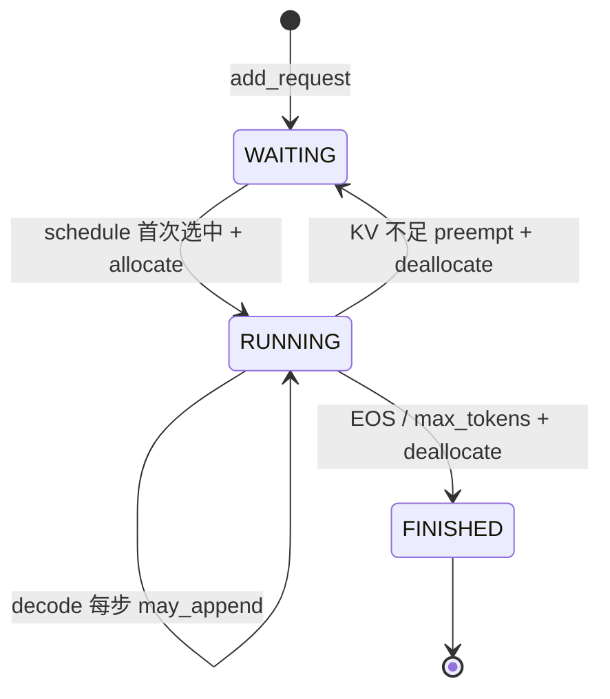

# 第 2 课：Sequence 数据结构与请求生命周期

## 1. 本课概述

**一句话概述**：一个推理请求在引擎内部长什么样 —— `Sequence` 是每个请求的"身份证"。

nano-vllm 的核心数据结构 `Sequence` 承载了"一个推理请求"的全部状态：它保存 prompt 与生成 token，记录调度与 KV cache 相关的计数器与 `block_table`，其生命周期状态（WAITING/RUNNING/FINISHED）在调度器里不断变化。掌握 `Sequence` 后，后续课程里的调度与 KV cache 管理都有了落点。

### 1.1 课时安排

| 阶段     | 时长   | 内容要点                                                 |
| -------- | ------ | -------------------------------------------------------- |
| 概念回顾 | 10 min | 回顾 L01 的 step 循环，引出"Sequence 是 step 操作的对象" |
| 代码走读 | 40 min | Sequence 字段分组、计数器不变量、block_table、序列化     |
| 动手练习 | 25 min | 构造 Sequence 验证 num_blocks/last_block_num_tokens      |
| 答疑讨论 | 15 min | 讨论"为什么 decode 只需发 last_token"等                  |

### 1.2 学习目标

学完本课后，我们应该能回答以下问题：

- `Sequence` 保存了哪三类信息？（token_ids、调度计数器、KV cache 映射）
- `num_cached_tokens`、`num_scheduled_tokens`、`num_tokens` 分别表示什么？它们在什么时候被更新？
- `Sequence.__getstate__/__setstate__` 是做什么的？为什么 Tensor Parallel 场景需要它？

---

## 2. 原理说明：请求生命周期与 KV cache 映射

在看代码之前，先用两个操作系统课的类比建立直觉：`Sequence` 为什么要分这么几类字段，以及为什么要有 `block_table`。

### 2.1 请求生命周期 ≈ 进程状态

推理引擎同时要服务很多请求，而 GPU 显存有限——这与操作系统调度多个进程共享 CPU 是同一个问题。因此 nano-vllm 给每个请求一个生命周期状态，和 OS 的 ready/running/terminated 几乎一一对应：

- `WAITING`≈ready：已入队，等待被调度。
- `RUNNING`≈running：已分配 KV cache，每个 step 推进一步。
- `FINISHED`≈terminated：命中 EOS 或达到 `max_tokens`，回收资源。

OS 中的"抢占"在这里对应 `preempt`：当新请求需要 KV cache 但没有空闲 block 时，调度器会把某个 `RUNNING` 请求退回 `WAITING`，先释放它的 KV cache。这解释了为什么 `Sequence` 需要承载状态而不仅仅是数据。

### 2.2 `block_table` ≈ 虚拟内存页表

KV cache 占显存大头，但每个请求的长度不一定；如果给每个请求预留"最大长度"的连续显存，就会浪费大量空闲。PagedAttention 的思路与虚拟内存分页一致：

- 物理层：把 KV cache 切成固定大小（`block_size`）的块，全局一个池。
- 逻辑层：每个请求持有一个 `block_table`，就是它的"页表"——把 token 序列（逻辑地址）映射到 block_id 序列（物理地址）。

这个类比后续课会反复用到：第 4 课讲 `BlockManager`（相当于页分配器），第 7 课讲注意力内核如何通过 `block_table` 读写不连续的 KV cache。

---

## 3. Sequence：生命周期与字段

先看一张生命周期状态机建立全局印象，再按字段分组逐个对齐到代码。阅读图时建议同时打开 `sequence.py`，把图中每个转移动作（`add_request`/`allocate`/`may_append`/`preempt`/`deallocate`）对齐到真实调用。



- 状态的主控方：`Scheduler` 在每个 step 保持两个队列（`waiting/running`）并驱动上述转移（详见第 3 课）；`Sequence` 本身只负责承载状态字段。
- 字段分组（下文§2.1–§2.4）：token_ids 类、调度计数器、KV cache 映射、TP 序列化。

### 2.1 token 与生成结果

[`Sequence`](../../nanovllm/engine/sequence.py#L14-L31) 的 `token_ids` 持有"prompt + 已生成 token"的完整序列；`num_prompt_tokens` 固定为初始 prompt 长度；[`completion_token_ids`](../../nanovllm/engine/sequence.py#L51-L53) 则是 prompt 之后的生成部分。

### 2.2 调度相关计数器

调度器用两个计数器推进 prefill（一次性处理用户输入的阶段）：[`num_cached_tokens`](../../nanovllm/engine/sequence.py#L25) 表示"已经在 KV cache 中可用"的 token 数；[`num_scheduled_tokens`](../../nanovllm/engine/sequence.py#L26) 表示"本 step 计划处理的 token 数"。在 [`Scheduler.postprocess`](../../nanovllm/engine/scheduler.py#L81-L92) 中，二者会被更新并清零（详见第 3 课）。

### 2.3 KV cache 映射：block_table 与 block_size

[`Sequence.block_table`](../../nanovllm/engine/sequence.py#L28) 是该请求持有的 block_id 列表；[`Sequence.block_size`](../../nanovllm/engine/sequence.py#L15) 是每个 block 的 token 容量。`num_blocks/last_block_num_tokens` 与 `block(i)` 帮我们把 token 序列切成 block 视角；我们可以把 block_table 理解成"这个请求的 KV cache 数据存在哪些内存块里"。

```python
# Sequence 把 token 序列切成 block 视角的三个入口：block 数、末块实际 token 数、按下标取 block。
@property
def num_blocks(self):
    return (self.num_tokens + self.block_size - 1) // self.block_size

@property
def last_block_num_tokens(self):
    return self.num_tokens - (self.num_blocks - 1) * self.block_size

def block(self, i):
    assert 0 <= i < self.num_blocks
    return self.token_ids[i*self.block_size: (i+1)*self.block_size]
```

- block_size 的来源：`LLMEngine.__init__` 会将其设为配置中的 `kvcache_block_size`（见 [llm_engine.py:L17-L22](../../nanovllm/engine/llm_engine.py#L17-L22)）

### 2.4 序列的可序列化：为 Tensor Parallel 服务

[`Sequence.__getstate__/__setstate__`](../../nanovllm/engine/sequence.py#L72-L83) 让对象在多进程场景中可被 pickle（Python 的对象序列化方式）。实现细节体现了一个关键选择：prefill 阶段需要完整 `token_ids`，而 decode 阶段子进程只需要 `last_token`——对应状态机中 `RUNNING` 状态下往返传递的数据体量。

```python
# Sequence 的 pickle 协议：prefill 传全量 token_ids，decode 只传 last_token，以减少 IPC 带宽。
def __getstate__(self):
    last_state = self.last_token if not self.is_prefill else self.token_ids
    return (self.num_tokens, self.num_prompt_tokens, self.num_cached_tokens, self.num_scheduled_tokens, self.block_table, last_state)

def __setstate__(self, state):
    self.num_tokens, self.num_prompt_tokens, self.num_cached_tokens, self.num_scheduled_tokens, self.block_table, last_state = state
    if isinstance(last_state, list):
        self.token_ids = last_state
        self.last_token = self.token_ids[-1]
    else:
        self.token_ids = []
        self.last_token = last_state
```

---

## 4. 练习

### 4.1 课堂练习

纯 CPU 练习：手算 `block_size` 与 `num_blocks` 的关系，验证 `last_block_num_tokens` 的定义。

```python
# 练习：用不同长度的 token_ids 观察 num_blocks 与 last_block_num_tokens 的变化。
from nanovllm.engine.sequence import Sequence

Sequence.block_size = 4  # 为了便于手算，这里把 block_size 临时改小。

for n in [1, 4, 5, 8, 9]:
    seq = Sequence(list(range(n)))
    print(n, "num_blocks=", seq.num_blocks, "last_block_num_tokens=", seq.last_block_num_tokens, "blocks=", [seq.block(i) for i in range(seq.num_blocks)])
```

- 验收要点（依据代码）：`num_blocks = (num_tokens + block_size - 1) // block_size`，`last_block_num_tokens = num_tokens - (num_blocks - 1) * block_size`（见 [sequence.py:L55-L62](../../nanovllm/engine/sequence.py#L55-L62)）

### 4.2 课后自测题

1. `block_size` 是类变量 `Sequence.block_size`。如果多组请求需要不同的 block_size，当前设计会有什么问题？如何改进？
2. `__getstate__` 中 decode 阶段只传 `last_token`，丢失了完整 `token_ids`。这个信息在子进程中真的不需要吗？什么场景下子进程需要完整的 prompt？
3. `num_cached_tokens` 和 `num_scheduled_tokens` 的更新放在 `Scheduler.postprocess` 里，如果把这个逻辑移到 `Sequence.append_token` 里，需要额外传入什么信息？哪种设计更好？
