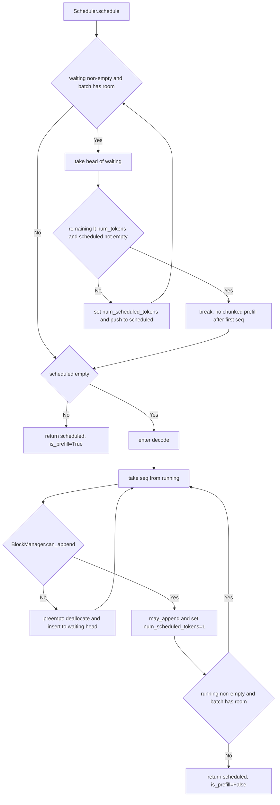

# 第 3 课：Scheduler 的队列、chunked prefill 与 preempt

## 1. 本课概述

**一句话概述**：每个 step 里谁来决定跑哪些请求、跑多少 token？答案是调度器（Scheduler），它的角色类似 OS 进程调度器。

nano-vllm 的调度器在"吞吐量优先（即尽可能多地同时处理请求）"的约束下做批处理：prefill 阶段从 waiting 队列拼 batch（把多个请求合并处理以提高效率），decode 阶段从 running 队列逐步生成，KV cache block 不足时 preempt（抢占：暂时释放某个请求的资源，让其他请求能继续运行）。最终我们将得到一张调度流程图，每个分支条件都能对应到代码。

### 1.1 课时安排

| 阶段     | 时长   | 内容要点                                                          |
| -------- | ------ | ----------------------------------------------------------------- |
| 概念回顾 | 10 min | 从"step 里谁决定跑哪些 seq"引出调度器的角色                       |
| 代码走读 | 40 min | waiting/running 队列、prefill batch 拼接规则、分块预填充、preempt |
| 动手练习 | 25 min | 用整数模拟 prefill 拼接，验证 chunked prefill 限制                |
| 答疑讨论 | 15 min | 讨论 preempt 策略的权衡                                           |

### 1.2 学习目标

学完本课后，我们应该能回答以下问题：

- waiting 和 running 两个队列分别存放什么状态的请求？它们如何流转？
- `max_num_seqs` 和 `max_num_batched_tokens` 这两个配置是怎么限制 prefill batch 大小的？
- decode 阶段的 `preempt()` 在什么条件下触发？触发后请求的状态会怎么变？

---

## 2. 原理说明：为什么调度器要分两个阶段

推理引擎同时要服务很多请求，而 GPU 显存与算力都有限——调度器要在每个 step 里决定"跑哪些 seq、跑多少 token"。nano-vllm 把这件事拆成 prefill 与 decode 两个分支，理解这两个分支的动机，就能读懂本章所有代码。

### 2.1 prefill vs decode：计算特征决定批次形状

- prefill：一次处理 prompt 的几十到几千个 token，每个位置都要做完整的 Transformer 前向。这是 compute-bound（算力瓶颈）阶段——GPU 的矩阵乘越大越划算，所以单步塞尽量多的 token，不同 seq 合并成一个大 batch。
- decode：每步只生成 1 个新 token，但要读取全部历史 KV cache。这是 memory-bound（访存瓶颈）阶段——GPU 的计算单元大量空闲，瓶颈是显存带宽，所以单步尽量多塞 seq，共摊访存成本。

因此 `Scheduler.schedule` 会优先做 prefill（长 token 序列更划算），没有 prefill 可做时才转 decode——这也是为什么下一节两个分支是互斥的。

### 2.2 KV cache block 是瓶颈资源：preempt ≈ OS 换出

GPU 显存分给 KV cache 的 block 总数是固定的。当 decode step 需要给某个 seq 追加 block 但池里没空闲时，只能牺牲一个 `RUNNING` seq：释放它的 block，把它退回 `WAITING`。这就是 preempt，与操作系统的换出（swap out）同构——资源不足时挑一个任务换出，给其他任务腾地方。nano-vllm 用的是简单策略（从 running 队尾 pop），下一轮 prefill 再把它恢复（KV cache 已清空，必须重算）。

---

## 3. Scheduler 的关键逻辑

先看一张 `schedule()` 的流程图建立全局印象，再按分支对齐到代码。只围绕调度器的核心控制流展开，刻意不引入模型执行与算子细节。



### 3.1 队列与配置约束

[`Scheduler.__init__`](../../nanovllm/engine/scheduler.py#L10-L17) 从 `Config` 读取批处理约束，并维护两个双端队列 `waiting/running`。这些字段决定了每个 step 最多调度多少个 seq、最多调度多少 token。

- 配置默认值来源：`Config.max_num_batched_tokens/max_num_seqs`（见 [config.py:L6-L18](../../nanovllm/config.py#L6-L18)）

### 3.2 prefill：从 waiting 里拼 batch（含分块预填充）

[prefill 分支](../../nanovllm/engine/scheduler.py#L29-L56)的核心循环是：只要 `waiting` 非空且 batch 仍有容量，就取队首 seq 计算本轮可以处理的 token 数，并更新 `seq.num_scheduled_tokens`。一个关键限制是：只有当 batch 中还没有其他 seq 时，才允许对首个 seq 做分块预填充（chunked prefill，即一次处理不完全部 token 时截断处理，下一轮再继续）——对应 `if remaining < num_tokens and scheduled_seqs: break`（见 [scheduler.py:L42-L43](../../nanovllm/engine/scheduler.py#L42-L43)）。

> 逐行实现见第 1 课 §3.3.1 的嵌入片段。

### 3.3 decode：从 running 里逐步生成 1 token

当本轮无法做 prefill（`scheduled_seqs` 为空）时，[调度器进入 decode 分支](../../nanovllm/engine/scheduler.py#L57-L73)：从 `running` 里取 seq，并为其安排 `num_scheduled_tokens = 1`。在进入执行前，调度器会询问 [`BlockManager.can_append`](../../nanovllm/engine/block_manager.py#L103-L104) 是否还能为该 seq 追加 token 分配所需的 block。

> 逐行实现见第 1 课 §3.3.2 的嵌入片段。

### 3.4 preempt：KV cache block 不足时的退避策略

如果 `BlockManager` 判断无法 append（例如需要新 block 但空闲 block 不够），调度器会 [`preempt`](../../nanovllm/engine/scheduler.py#L75-L79)：把某个 seq 的状态改回 `WAITING`，并释放其占用的 block，然后把它插回 `waiting` 的队首。这是一种"以牺牲部分公平性换取继续运行"的策略，类似操作系统中的进程换出（swap out）。

```python
# Scheduler.preempt：状态改回 WAITING + 释放 block + 回插 waiting 队首，下一轮 prefill 重新恢复。
def preempt(self, seq: Sequence):
    seq.status = SequenceStatus.WAITING
    seq.is_prefill = True
    self.block_manager.deallocate(seq)
    self.waiting.appendleft(seq)
```

### 3.5 postprocess：回写 token 与完成条件

模型执行端返回 token 后，[`Scheduler.postprocess`](../../nanovllm/engine/scheduler.py#L81-L92) 会先把本 step 完成的 block 做哈希写回（为 prefix caching 服务），再推进 `num_cached_tokens`，最后在满足结束条件时回收资源并将 seq 从 `running` 移除。结束条件：遇到 EOS（结束标志）且不忽略，或生成 token 达到 `max_tokens`（见 [scheduler.py:L89-L91](../../nanovllm/engine/scheduler.py#L89-L91) 与 [sampling_params.py:L4-L11](../../nanovllm/sampling_params.py#L4-L11)）。

> 逐行实现见第 1 课 §3.4 的嵌入片段。

---

## 4. 练习

### 4.1 课堂练习

用整数模拟 `max_num_batched_tokens` 的消耗，推导 prefill 阶段每次给 seq 分配多少 `num_scheduled_tokens`，验证分块预填充的限制条件。

```python
# 练习：用整数模拟 Scheduler.prefill 的批拼接规则（不依赖 GPU）。
def simulate_prefill(prompt_lens, max_num_batched_tokens, block_size=256, num_cached_tokens=None):
    # num_cached_tokens 表示 prefix cache 命中后的已缓存 token 数；默认都为 0。
    if num_cached_tokens is None:
        num_cached_tokens = [0] * len(prompt_lens)
    scheduled = []
    remaining = max_num_batched_tokens
    for i, (n, cached) in enumerate(zip(prompt_lens, num_cached_tokens)):
        num_tokens = n - cached
        if remaining == 0:
            break
        if remaining < num_tokens and scheduled:
            break  # 对应 scheduler.py 的 "only allow chunked prefill for the first seq"
        scheduled_tokens = min(num_tokens, remaining)
        scheduled.append((i, scheduled_tokens))
        remaining -= scheduled_tokens
    return scheduled, remaining

print(simulate_prefill([1000, 900, 800], max_num_batched_tokens=1200))
```

- 验收要点（依据代码）：除首个 seq 外，不允许分块预填充（见 [scheduler.py:L42-L43](../../nanovllm/engine/scheduler.py#L42-L43)）

### 4.2 课后自测题

1. preempt 策略是"从 running 队尾抢占"，如果改成"从队首抢占"或"抢占占用 block 最多的 seq"，各自对吞吐和公平性有什么影响？
2. chunked prefill 限制只有 batch 中第一条 seq 可分块。如果允许任意 seq 分块，`postprocess` 的 `continue` 逻辑（L86-L87）需要怎么改？
3. `max_num_seqs` 和 `max_num_batched_tokens` 中，哪个参数主要卡住 prefill、哪个主要卡住 decode？为什么？
