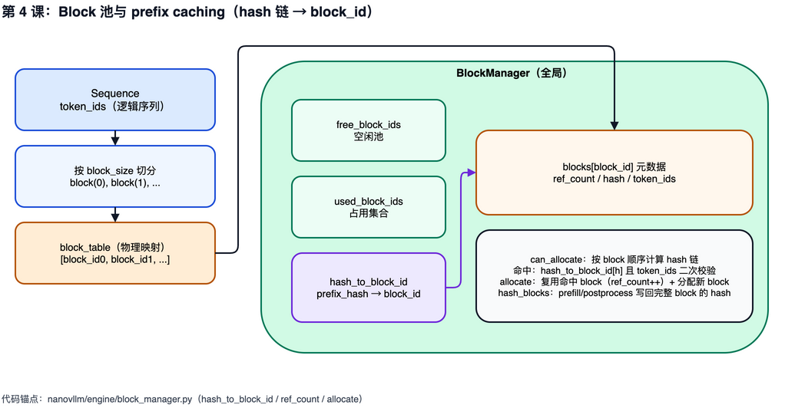

# 第 4 课：BlockManager 与 prefix caching

## 1. 本课概述

**一句话概述**：KV cache 的显存是怎么管理的——BlockManager 就像操作系统课里的内存分页管理器，把显存切成固定大小的 block 来分配和回收。

注意力需要访问所有历史 token 的 K/V 向量，KV cache 因此占用大量 GPU 显存，需要精细管理。nano-vllm 把 KV cache 管理抽象为一个 block 池：空闲池 `free_block_ids`、占用集合 `used_block_ids`、以及用哈希表 `hash_to_block_id` 支撑的 prefix caching（类似操作系统的共享只读页：相同前缀的 KV cache block 被多个请求复用，无需重复计算和分配）。理解 `can_allocate/allocate/deallocate/hash_blocks` 的分工后，我们就能解释调度器为什么在 `postprocess()` 中调用 `hash_blocks()`。

### 1.1 课时安排

| 阶段     | 时长   | 内容要点                                                        |
| -------- | ------ | --------------------------------------------------------------- |
| 概念回顾 | 10 min | "注意力需要所有历史 KV" → 显存占用大 → 需要精细管理             |
| 代码走读 | 40 min | free/used 池、ref_count、can_allocate 哈希链、prefix cache 闭环 |
| 动手练习 | 25 min | 构造哈希链 + 手算 prefix cache 命中                             |
| 答疑讨论 | 15 min | 讨论"为什么哈希链而不是直接比较 token_ids"                      |

### 1.2 学习目标

学完本课后，我们应该能回答以下问题：

- `Sequence.block_table` 在"逻辑序列"与"物理 KV cache"之间起什么桥接作用？
- prefix caching 的命中条件是什么？它如何减少新分配的 block 数量？
- `ref_count`（引用计数，和操作系统课里的概念一样）的意义是什么？为什么同一个 block 可以被多个 seq 复用？

---

## 2. 原理说明：分页管理与前缀共享

BlockManager 要解决两个问题：显存里几十 GB 的 KV cache 如何被多个长度不一的请求共享？相同前缀（例如同一个 system prompt）的请求如何避免重复计算？两者的答案都能在操作系统课里找到同构。

### 2.1 KV cache 池 ≈ 虚拟内存分页

- 物理层：把 KV cache 切成固定大小（`block_size`）的块，全局一个 free 池 + 一个 used 集合——就像 OS 把物理内存切成页，用 free list / used set 管理。
- 逻辑层：每个 `Sequence` 持有的 `block_table` 就是它的"页表"，把逻辑 token 序列映射到物理 block_id 序列——这也是 PagedAttention 名字的由来。

好处与 OS 分页完全一致：分配粒度小，碎片少；请求长度变化时可以动态追加 block 而无需搬移已有数据。

### 2.2 `ref_count` 与 prefix caching ≈ 共享段 / 写时只读

推理引擎经常遇到这种场景：多个请求共享同一段 system prompt（几百到几千 token 完全一致）。如果每个请求都单独计算并存一份 KV cache，显存和算力都被浪费。

- `ref_count`（引用计数）记录一个 block 被多少个 seq 引用——和 OS 共享内存段的引用计数一样。
- prefix caching 命中时，新 seq 不再分配新 block，而是把已有 block 加入自己的 `block_table` 并 `ref_count += 1`。
- `hash_to_block_id` 相当于一张反查表：用链式哈希（prefix hash + 当前 block 的 token）作为"内容指纹"，O(1) 判断"这个前缀是否已在池里"。

关键前提：KV cache 的 block 一旦写入就不再修改（写时只读），因此共享是安全的——这与共享库页只读加载同理。

---

## 3. BlockManager 与 prefix caching

先看一张 block 池与 prefix 哈希链的总览图建立全局印象，再按"数据结构 → 命中判断 → 分配 → 写回"的顺序对齐到代码。



### 3.1 全局池与映射表

[`BlockManager`](../../nanovllm/engine/block_manager.py#L26-L34) 持有全部 block 的元数据列表 `blocks`，并用 `free_block_ids/used_block_ids` 维护可分配与已占用 block 的集合。prefix caching 则由 `hash_to_block_id` 维护哈希到 block_id 的映射。

### 3.2 Block 元数据：ref_count 与 token_ids

[每个 `Block`](../../nanovllm/engine/block_manager.py#L8-L23) 记录 `ref_count`（引用计数：有多少个 seq 在使用这个 block）、`hash`（该 block 对应前缀链的哈希值）与 `token_ids`（用于二次校验，避免哈希碰撞——即两个不同输入算出相同哈希值——导致错误复用）。

### 3.3 can_allocate：计算可复用的 cached blocks

[`can_allocate(seq)`](../../nanovllm/engine/block_manager.py#L58-L73) 会按 block 顺序为每个 block 计算链式哈希，并尝试在 `hash_to_block_id` 中找到候选 block。如果候选 block 的 `token_ids` 与 seq 当前 block 完全一致，则判定命中并累加 `num_cached_blocks`；命中后还会根据 `used_block_ids` 决定这次分配到底需要新增多少 block。

```python
# BlockManager.can_allocate：逐块计算链式哈希 → 命中且 token_ids 全等则累加缓存块；最后按 free 池判断是否够新块。
def can_allocate(self, seq: Sequence) -> int:
    h = -1
    num_cached_blocks = 0
    num_new_blocks = seq.num_blocks
    for i in range(seq.num_blocks - 1):
        token_ids = seq.block(i)
        h = self.compute_hash(token_ids, h)
        block_id = self.hash_to_block_id.get(h, -1)
        if block_id == -1 or self.blocks[block_id].token_ids != token_ids:
            break
        num_cached_blocks += 1
        if block_id in self.used_block_ids:
            num_new_blocks -= 1
    if len(self.free_block_ids) < num_new_blocks:
        return -1
    return num_cached_blocks
```

### 3.4 allocate：复用与新分配的组合

[`allocate(seq, num_cached_blocks)`](../../nanovllm/engine/block_manager.py#L75-L92) 先把命中的 cached blocks 加入 `seq.block_table`（可能增加 `ref_count`），再为剩余 blocks 从 `free_block_ids` 中分配新 block，最后设置 `seq.num_cached_tokens = num_cached_blocks * block_size`。

### 3.5 hash_blocks：在合适时机写回可复用信息

[`hash_blocks(seq)`](../../nanovllm/engine/block_manager.py#L110-L120) 会对本 step 新完成的整块 token 做哈希计算，并把 `(hash -> block_id)` 写回 `hash_to_block_id`。调度器在 [`postprocess()` 的最开头](../../nanovllm/engine/scheduler.py#L81-L85)调用它，使得"刚刚完成写入 KV cache 的 block"可以尽快被后续请求复用（尤其是多个请求共享前缀时）。

---

## 4. 练习

### 4.1 课堂练习

练习分两步：先用 `BlockManager.compute_hash` 构造一条两块的哈希链，理解"前缀哈希要作为下一块计算的 prefix 输入"；再基于两条"共享前缀"的请求，手算 prefix cache 命中后第二个请求的 `num_cached_blocks` 与实际需要新分配的 block 数。

```python
# 练习 1：用 BlockManager.compute_hash 构造哈希链（需要 xxhash 与 numpy）。
from nanovllm.engine.block_manager import BlockManager

block0 = [1, 2, 3, 4]
block1 = [5, 6, 7, 8]

h0 = BlockManager.compute_hash(block0, prefix=-1)
h1 = BlockManager.compute_hash(block1, prefix=h0)

print("h0:", h0)
print("h1:", h1)
```

```python
# 练习 2：两条共享前缀的请求，手算第二个请求的 num_cached_blocks 与需新分配的 block 数。
# 约定：block_size = 4；第一个请求已完成并通过 hash_blocks 写回 hash_to_block_id。
# seq_a 的 token_ids: [1,2,3,4, 5,6,7,8, 9,10]      -> 3 个 block（最后一块未满不参与哈希写回）
# seq_b 的 token_ids: [1,2,3,4, 5,6,7,8, 11,12,13,14] -> 4 个 block（前两块与 seq_a 完全一致）
#
# 依据 can_allocate 的逻辑：按 block 顺序链式计算 hash，在 hash_to_block_id 中命中且 token_ids 完全相同
# 才记一次 num_cached_blocks；hash_blocks 只对"整块"写回，因此 seq_a 只会写回前两块。
#
# 手算结果：
#   num_cached_blocks(seq_b) = 2          # 前两块命中
#   需要新分配的 block 数     = 4 - 2 = 2   # 剩余两块从 free_block_ids 新分配
#   seq_b.num_cached_tokens   = 2 * 4 = 8
block_size = 4
num_blocks_b = 4
num_cached_blocks = 2  # 两条 seq 的前两块 token_ids 完全一致且已写回
print("num_cached_blocks:", num_cached_blocks)
print("new_blocks_needed:", num_blocks_b - num_cached_blocks)
print("num_cached_tokens :", num_cached_blocks * block_size)
```

- 验收要点（依据代码）：
  - `compute_hash(token_ids, prefix)` 会先写入 prefix（若存在），再写入当前 block 的 token 字节序列（见 [block_manager.py:L35-L41](../../nanovllm/engine/block_manager.py#L35-L41)）
  - `can_allocate` 通过链式 hash 与 `token_ids` 全等校验累加 `num_cached_blocks`（见 [block_manager.py:L58-L73](../../nanovllm/engine/block_manager.py#L58-L73)）；`allocate` 据此只为剩余块从 `free_block_ids` 新分配，并把 `seq.num_cached_tokens` 置为 `num_cached_blocks * block_size`（见 [block_manager.py:L75-L93](../../nanovllm/engine/block_manager.py#L75-L93)）
  - `hash_blocks` 只对"已完成的整块"写回 `hash_to_block_id`，最后一个未满 block 不会参与前缀命中（见 [block_manager.py:L110-L120](../../nanovllm/engine/block_manager.py#L110-L120)）

### 4.2 课后自测题

1. 链式哈希为什么是 `compute_hash(current_block, prefix=prev_hash)` 而不是对每个 block 单独哈希后拼接比较？如果哈希碰撞发生了（两个不同序列算出相同哈希），代码在哪个环节兜底？
2. `can_allocate` 中对已命中但不在 `used_block_ids` 中的 block 不扣 `num_new_blocks`（L69-L70），这个 block 处于什么状态？什么时候会处于这种状态？
3. `hash_blocks` 只写回完整 block。如果一条请求只有 3 个 token（不满一个 block），它的 KV cache 就永远不会被 prefix cache 复用了。这在什么场景下影响最大？
