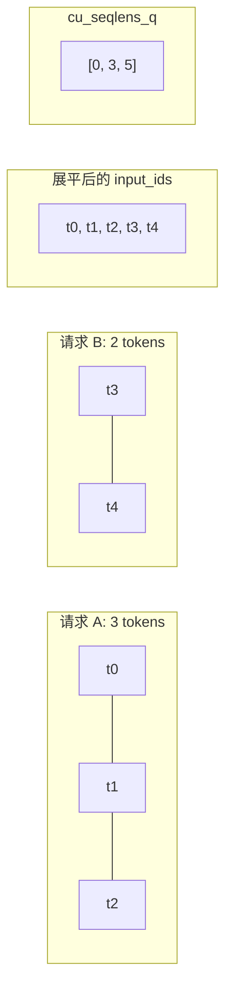
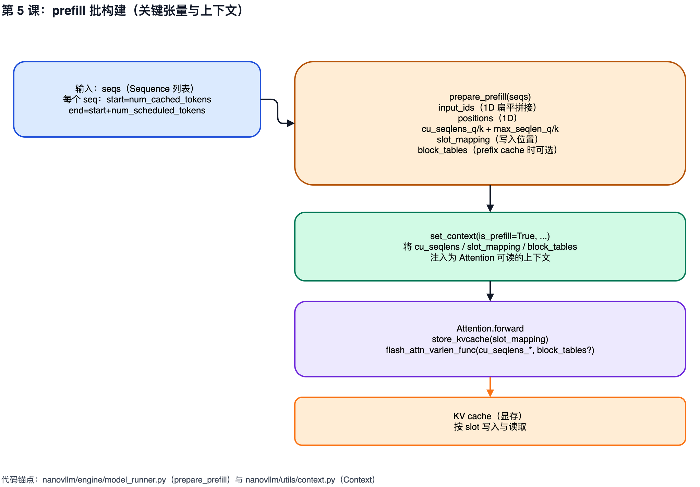

# 第 5 课：prefill 批构建与 context 注入

## 1. 本课概述

**一句话概述**：prefill 阶段模型实际吃进去的张量长什么样——多个请求被展平拼接成一个大批次。

从 `ModelRunner.prepare_prefill` 出发，理解 `input_ids/positions` 如何被展平拼接（flatten），`cu_seqlens_q/cu_seqlens_k` 与 `max_seqlen_q/max_seqlen_k` 如何为变长注意力提供边界信息，以及 `slot_mapping` 与 `block_tables` 为什么要作为上下文被注入到注意力层。

### 1.1 课时安排

| 阶段     | 时长   | 内容要点                                                                    |
| -------- | ------ | --------------------------------------------------------------------------- |
| 原理铺垫 | 20 min | Self-Attention 直觉（Q/K/V 语义、N^2 计算量、变长边界问题）                 |
| 代码走读 | 35 min | prepare_prefill: input_ids 展平、cu_seqlens_q/k、slot_mapping、block_tables |
| 动手练习 | 25 min | 手算 cu_seqlens_q 与 positions                                              |
| 答疑讨论 | 10 min | 开放提问                                                                    |

### 1.2 学习目标

学完本课后，我们应该能回答以下问题：

- prefill 时 `input_ids` 为什么是 1D 展平张量（一维数组）而不是 2D padding（二维补零矩阵）？
- `cu_seqlens_q` 与 `cu_seqlens_k` 分别代表什么？prefix cache 何时让两者不同？
- `slot_mapping` 如何告诉 KV cache "这个 token 应该写到哪个位置"？（第 7 课会落到 Triton kernel）

---

## 2. 原理铺垫：Self-Attention 为什么需要看所有 token

注意力机制的直觉与变长问题。如果读者已经了解 Self-Attention 的 Q/K/V 概念，可以直接跳到第 3 节。

### 2.1 注意力机制的直觉

在自然语言中，一个词的含义往往取决于上下文。例如：

- "苹果很好吃" → "苹果"指水果
- "苹果发布了新手机" → "苹果"指公司

Self-Attention（自注意力）的核心思想就是：**让每个 token "看一看"序列中的所有其他 token，根据相关性来决定自己应该关注谁**。

具体来说，每个 token 会生成三个向量：

- **Q（Query，查询）**：代表"我在找什么信息"
- **K（Key，键）**：代表"我能提供什么信息"
- **V（Value，值）**：代表"我的实际内容"

计算过程可以用一个公式概括（不需要记忆，理解直觉即可）：

```text
Attention(Q, K, V) = softmax(Q * K^T / sqrt(d)) * V
```

直觉解读：Q 和所有 K 做点积得到"相关性分数"，softmax 归一化后作为权重，对 V 做加权求和——相关性越高的 token，对当前 token 的贡献越大。

### 2.2 为什么 prefill 的变长边界如此重要

注意力的计算量与序列长度的平方相关：N 个 token 中，每个 token 要看所有 N 个 token，产生 N x N 对关系。

当我们把多个不等长的请求展平拼接成一个大批次时，注意力算子需要知道"token 5 属于请求 A，token 6 开始是请求 B"——否则请求 B 的 token 会错误地"看到"请求 A 的内容。这就是为什么代码中需要 `cu_seqlens`（累积序列长度）来标记变长边界。



---

## 3. prepare_prefill：从 Sequence 列表到批张量

先看一张批构建总览图建立全局印象：它把 prefill 拆成三层——Sequence 视角（start/end）、批张量视角（展平 input_ids 与 cu_seqlens）、显存视角（slot_mapping 指向 KV cache slot）。看完图再回到 `prepare_prefill` 的真实实现，按生成顺序解释每个中间变量如何被构造，以及它们后续在哪里被消费。



### 3.1 input_ids 与 positions：展平拼接

[`prepare_prefill`](../../nanovllm/engine/model_runner.py#L129-L170) 会对每个 seq 取出"本次要处理"的 token 区间 `[start:end)`，并把这些片段依次 append 到一个 Python 列表中，最终转为 1D 张量 `input_ids`；`positions` 则是每个 token 的位置索引，范围与 `[start:end)` 对齐。

- 关键输入：`seq.num_cached_tokens` 与 `seq.num_scheduled_tokens`（由调度器设置，见 [scheduler.py:L29-L52](../../nanovllm/engine/scheduler.py#L29-L52)）

### 3.2 cu_seqlens_q 与 max_seqlen_q：查询侧变长边界

[`cu_seqlens_q`](../../nanovllm/engine/model_runner.py#L132) 是一个长度为 `bs+1` 的前缀和数组（cumulative sum，和算法课里的含义相同），标记每个 seq 的 query token 在展平 `input_ids` 里的起止偏移；[`max_seqlen_q`](../../nanovllm/engine/model_runner.py#L134) 是本 batch（把多个请求合并处理以提高效率）中 query 的最大长度，用于算子侧的边界优化。

### 3.3 cu_seqlens_k 与 max_seqlen_k：键值侧可能更长（prefix cache）

在 prefix cache 场景下，某些 seq 的 key/value 侧长度 `seqlen_k` 可以大于本次 query 的长度 `seqlen_q`，因为 KV cache（存储注意力计算中间结果的缓存）里已经有更长的历史前缀可用。代码用 [`if cu_seqlens_k[-1] > cu_seqlens_q[-1]`](../../nanovllm/engine/model_runner.py#L162-L163) 判断是否需要构造 `block_tables`。

### 3.4 slot_mapping 与 block_tables：把"逻辑 token"映射到"物理 KV cache"

[`slot_mapping`](../../nanovllm/engine/model_runner.py#L149-L161) 是一个长度为 `N` 的 int32 张量（N 为本次 prefill 处理的 token 总数），其中每个元素是该 token 在 KV cache 中应写入的"slot（位置编号）"。当启用 prefix cache 时，会额外构造 [`block_tables`](../../nanovllm/engine/model_runner.py#L162-L163)（每个 seq 的 block_id 列表 padding 成矩阵），供注意力算子在访问 cache 时查表。

```python
# prepare_prefill 中的 slot_mapping 构造：逐 block 展开 [start, end) 区间到 "block_id * block_size + 块内偏移"。
if not seq.block_table:    # warmup
    continue
start_block = start // self.block_size
end_block = (end + self.block_size - 1) // self.block_size
for i in range(start_block, end_block):
    slot_start = seq.block_table[i] * self.block_size
    if i == start_block:
        slot_start += start % self.block_size
    if i != end_block - 1:
        slot_end = seq.block_table[i] * self.block_size + self.block_size
    else:
        slot_end = seq.block_table[i] * self.block_size + end - i * self.block_size
    slot_mapping.extend(range(slot_start, slot_end))
```

- 上下文注入：[`set_context(...)`](../../nanovllm/engine/model_runner.py#L169) 与 [`context.py:L5-L27`](../../nanovllm/utils/context.py#L5-L27)

---

## 4. 练习

### 4.1 课堂练习

用纯 Python 手算 `cu_seqlens_q` 与 `positions`，把"展平拼接"落到两个可打印的列表上。完成后，我们应能解释 `cu_seqlens_q[i]` 与 `cu_seqlens_q[i+1]` 的语义，并说清 `positions` 为什么要以 `num_cached_tokens` 为起点。

```python
# 练习：给定两条 seq 的 num_cached_tokens 与 num_scheduled_tokens，
# 同时构造 cu_seqlens_q（前缀和）与 positions（展平绝对位置）。
# 对齐 prepare_prefill 的实现：start = seq.num_cached_tokens,
# end = seq.num_cached_tokens + seq.num_scheduled_tokens,
# 当前批的 query token 位置即 range(start, end)。
def build_prefill_tensors(seqs):
    cu_seqlens_q = [0]
    positions = []
    for cached, scheduled in seqs:
        start = cached
        end = cached + scheduled
        positions.extend(range(start, end))
        cu_seqlens_q.append(cu_seqlens_q[-1] + scheduled)
    return cu_seqlens_q, positions

# seq_a：无 prefix 命中，prompt 长 3 全部参与 prefill
# seq_b：已缓存 4 个 token，本轮再处理 2 个 token（分块预填充场景）
cu_q, pos = build_prefill_tensors([(0, 3), (4, 2)])
print("cu_seqlens_q:", cu_q)  # 期望：[0, 3, 5]
print("positions   :", pos)   # 期望：[0, 1, 2, 4, 5]
```

- 验收要点（对应实现）：
  - `cu_seqlens_q` 以 0 开头，每个元素是前面所有 seq 的 query 累计长度（见 [model_runner.py:L132-L146](../../nanovllm/engine/model_runner.py#L132-L146)）
  - `positions` 在 prefill 下为 `range(seq.num_cached_tokens, seq.num_cached_tokens + seq.num_scheduled_tokens)` 的展平拼接，因此 prefix cache 命中时起点会跳过已缓存 token（见 [model_runner.py:L129-L148](../../nanovllm/engine/model_runner.py#L129-L148)）

### 4.2 课后自测题

1. 为什么 `input_ids` 是 1D 展平而不做成 2D padding？如果用 2D padding 矩阵，注意力计算中无效 token 的处理会引入什么问题（提示：causal mask 在这个场景下还能直接用吗）？
2. `cu_seqlens_q` 和 `cu_seqlens_k` 在 prefix cache 场景下长度相同但值不同，这对 `flash_attn_varlen_func` 的 `max_seqlen_q` 和 `max_seqlen_k` 参数有什么影响？
3. Context 通过模块级全局变量传递，而不是作为参数传入 `Attention.forward`。这种设计的 trade-off 是什么？如果改成显式传参会改动多少代码？
