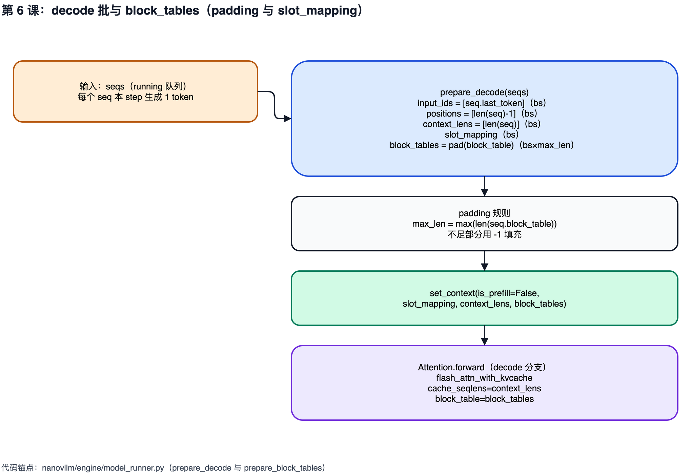

# 第 6 课：decode 一步生成与 block_tables

## 1. 本课概述

**一句话概述**：decode 阶段每个 step 具体需要准备哪些张量——decode 比 prefill 简单得多，因为每个请求只送入 1 个 token。

decode 阶段每一步只生成 1 个新 token，因为历史 token 的 K/V 已经缓存好了（回忆第 1 课的自回归生成原理）。`ModelRunner.prepare_decode` 为每个 seq 构造最小输入：`input_ids`（last_token）、`positions`（当前位置）、`context_lens`（cache 长度）、`slot_mapping`（写入位置）与 `block_tables`（每个 seq 的 block_table padding 成矩阵）。

### 1.1 课时安排

| 阶段     | 时长   | 内容要点                                                                                 |
| -------- | ------ | ---------------------------------------------------------------------------------------- |
| 概念回顾 | 10 min | 回顾"decode 每步 1 token" + KV cache 已存历史                                            |
| 代码走读 | 40 min | prepare_decode: last_token、context_lens、slot_mapping、block_tables padding、may_append |
| 动手练习 | 25 min | 手算 slot 公式 + 推导 may_append 触发条件                                                |
| 答疑讨论 | 15 min | 对比 prefill 与 decode 的张量形状差异                                                    |

### 1.2 学习目标

学完本课后，我们应该能回答以下问题：

- decode 批的输入为何是 1D 的 `input_ids`（长度为 bs），而不是类似 prefill 的展平拼接？
- `context_lens` 与 `block_tables` 在注意力算子里分别扮演什么角色？
- `BlockManager.may_append` 什么时候会为 seq 新增一个 block？触发条件的公式是什么？

---

## 2. 原理说明：decode 为什么"更简单"

prefill 和 decode 虽然共用同一个 Transformer，但准备输入的代码风格差异很大：prefill 要展平拼接、要 `cu_seqlens`，decode 只有几个 `bs` 维小向量。先从"自回归 + KV cache"两个事实出发，解释这个简化是怎么自然得到的。

### 2.1 自回归 + KV cache ⇒ 每步只需 1 个 token

第 1 课讲过自回归生成：下一步只依赖"全部历史 token + 当前输入 token"。decode 阶段的"历史 token"的 K/V 已经在 prefill 里算过并写进了 KV cache，不需要重算；"当前输入 token"就是上一步的输出。所以每步每个 seq 只需要送 1 个 token 进模型——这就是为什么 decode 的 `input_ids` 是 `bs` 维向量而不是 prefill 那种展平拼接。

### 2.2 张量形状的二维规整：bs 维 + padding 哨兵

既然每个 seq 固定贡献 1 个 token，批维度就天然规整为 `bs`：`input_ids/positions/context_lens/slot_mapping` 都是长度 `bs` 的一维向量。唯一的不规则来自 `block_table`——不同 seq 的历史长度不一，`block_table` 长度也不一。所以需要把它们 padding 到 `bs x max_num_blocks` 的二维矩阵，用 `-1` 作为哨兵值（和算法题里的"无效 index"同一思路）告诉注意力算子"这位置没有有效 block"。

---

## 3. prepare_decode：最小输入集

先看一张 decode 批张量总览图：左侧 `bs` 维向量（`input_ids/positions/context_lens/slot_mapping`），右侧 `bs x max_num_blocks` 的 `block_tables`，`-1` 标出 padding 位置。看完图再按 `prepare_decode` 的实现对齐到代码：每个张量都能从 `Sequence` 的字段直接读出来，最终通过 `set_context` 传入注意力层。



### 3.1 input_ids 与 positions

decode 只需要每个 seq 的最后一个 token 与它的绝对位置：[`input_ids.append(seq.last_token)`](../../nanovllm/engine/model_runner.py#L178)，`positions.append(len(seq) - 1)`。这对应自回归生成的基本事实：下一步只依赖"已生成的全部历史 + 当前输入 token"，而当前输入 token 就是上一步输出的 token。

### 3.2 context_lens：cache 的有效长度

[`context_lens.append(len(seq))`](../../nanovllm/engine/model_runner.py#L180) 表示每个 seq 的上下文长度（prompt + 已生成 token 的总长度）。注意力算子用它来限定每个请求在 KV cache 中应访问的有效范围——"只看前面这么多个 token 的 K/V"。

### 3.3 slot_mapping：写入 KV cache 的最后一个 slot

decode 每个 seq 只写入 1 个新 token，因此 `slot_mapping` 也是长度为 `bs` 的向量。[`prepare_decode`](../../nanovllm/engine/model_runner.py#L172-L188) 把"当前 seq 的最后一个 block"与"该 block 内 token 偏移"组合为一个线性 slot（位置编号）：

```python
# prepare_decode 的最小输入集：每个 seq 只送 last_token、当前位置、cache 长度，以及"末块中要写的那个 slot"。
for seq in seqs:
    input_ids.append(seq.last_token)
    positions.append(len(seq) - 1)
    context_lens.append(len(seq))
    slot_mapping.append(seq.block_table[-1] * self.block_size + seq.last_block_num_tokens  - 1)
```

### 3.4 block_tables：把每个 seq 的 block_table padding 成矩阵

注意力算子在 decode 阶段需要根据每个 seq 的 `block_table` 查找 KV cache 中的 block。为此，[`prepare_block_tables`](../../nanovllm/engine/model_runner.py#L123-L127) 会把不同长度的 `block_table` padding（补齐）到同一长度，并转为 `int32` GPU 张量。padding 值为 `-1`，表示"无效 block"（调用见 [model_runner.py:L186-L188](../../nanovllm/engine/model_runner.py#L186-L188)）。

### 3.5 may_append：跨 block 边界时新增 block

调度器在 decode 阶段会先检查 [`can_append(seq)`](../../nanovllm/engine/block_manager.py#L103-L104)，随后调用 [`may_append(seq)`](../../nanovllm/engine/block_manager.py#L106-L108)：当 `len(seq) % block_size == 1` 时，说明即将写入的 token 会落在新 block 上，需要分配一个新 block 并追加到 `seq.block_table`。

```python
# can_append / may_append：空闲池是否够下一步；以及"跨 block 边界"时追加新 block。
def can_append(self, seq: Sequence) -> bool:
    return len(self.free_block_ids) >= (len(seq) % self.block_size == 1)

def may_append(self, seq: Sequence):
    if len(seq) % self.block_size == 1:
        seq.block_table.append(self._allocate_block())
```

- 调用点：[scheduler.py:L60-L70](../../nanovllm/engine/scheduler.py#L60-L70)

---

## 4. 练习

分两步：先复现 slot 计算公式，把 `block_table`、`block_size` 与"线性 slot 地址"对齐；再构造一个跨 block 边界的 seq，手算 `may_append` 是否会在下一轮 decode 前追加新 block。

```python
# 练习 1：给定 block_table、block_size 与 last_block_num_tokens，计算 decode 写入位置 slot。
def slot(block_table_last, block_size, last_block_num_tokens):
    return block_table_last * block_size + last_block_num_tokens - 1

print(slot(block_table_last=3, block_size=256, last_block_num_tokens=1))    # 新 block 的第 0 个位置
print(slot(block_table_last=3, block_size=256, last_block_num_tokens=256))  # 该 block 的最后一个位置
```

```python
# 练习 2：跨 block 边界时，推导 decode 前后 block_table 是否新增 block。
# 依据 may_append 的规则：当 len(seq) % block_size == 1 时，说明即将写入的 token
# 会落在新 block 上，需要分配一个新 block 追加到 seq.block_table。
#
# 约定：block_size = 4；该 seq 当前 len(seq) = 8（恰好填满两个 block，block_table 长 2）。
# 场景：本轮 decode 结束后会产生第 9 个 token，此时 len(seq) 将变为 9。
# 下一轮 decode 进入前，Scheduler 先调用 may_append：
#   len(seq) % block_size == 9 % 4 == 1  -> 触发新分配，block_table 长度 2 -> 3
# 因此"跨越 block 边界"的那一步是 len(seq) 从 8 增加到 9 时发生的。
block_size = 4
for length in [7, 8, 9, 10]:
    need_new_block = (length % block_size == 1)
    print(f"len(seq)={length:>2}  may_append new block? {need_new_block}")
```

- 验收要点（对应实现）：
  - slot 公式：`slot_mapping.append(seq.block_table[-1] * block_size + seq.last_block_num_tokens - 1)`（见 [model_runner.py:L181-L182](../../nanovllm/engine/model_runner.py#L181-L182)）
  - `may_append` 仅在 `len(seq) % block_size == 1` 时新分配 block 并追加到 `seq.block_table`（见 [block_manager.py:L106-L108](../../nanovllm/engine/block_manager.py#L106-L108)），`can_append` 据此判断空闲池是否足够（见 [block_manager.py:L103-L104](../../nanovllm/engine/block_manager.py#L103-L104)）
