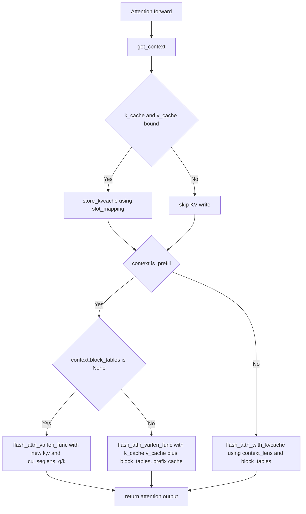

# 第 7 课：Attention：KV 写入与算子分支

## 1. 本课概述

**一句话概述**：把前两课注入的上下文字段真正落到注意力计算函数里——`slot_mapping` 如何驱动写入，prefill 和 decode 为什么调用不同的注意力 API。

`slot_mapping` 驱动 Triton kernel 把 K/V 写入 KV cache；prefill 阶段调用 `flash_attn_varlen_func`（变长批注意力），decode 阶段调用 `flash_attn_with_kvcache`（增量生成注意力）；prefix cache 场景下可以直接复用 `k_cache/v_cache` 作为注意力的 K/V 输入。理解这些分支后，"上下文对象"与"注意力算子调用"就在脑中连成一条线。

### 1.1 课时安排

| 阶段     | 时长   | 内容要点                                                                                   |
| -------- | ------ | ------------------------------------------------------------------------------------------ |
| 原理铺垫 | 15 min | KV Cache 的数学动机（为什么可以只算新 token 的 Q）                                         |
| 代码走读 | 40 min | store_kvcache kernel、prefill 算子 (varlen)、decode 算子 (with_kvcache)、prefix cache 分支 |
| 动手练习 | 20 min | 模拟 slot_mapping 的 -1 哨兵语义                                                           |
| 答疑讨论 | 15 min | 讨论"为什么 prefill 和 decode 用不同的 FlashAttention API"                                 |

### 1.2 学习目标

学完本课后，我们应该能回答以下问题：

- `store_kvcache` 在什么条件下触发？它写入的地址由什么决定？
- prefill 与 decode 在注意力算子调用上有什么差异？为什么不能用同一个 API？
- prefix cache 下 `block_tables` 为什么会影响 prefill 的注意力计算？

---

## 2. 原理铺垫：KV Cache 的数学直觉

decode 阶段只需要送入 1 个新 token 而不需要重跑整个序列，原因在于注意力计算的可分解性。

### 2.1 为什么 decode 只需送 1 个 token

回忆第 5 课的注意力公式：新 token 的 Query 需要与所有历史 token 的 Key 做点积，然后对所有历史 token 的 Value 做加权求和。

关键洞察：**历史 token 的 K 和 V 向量不会因为新 token 的加入而改变**——它们只取决于自身的位置和内容。因此：

- 第一次（prefill）：计算所有 token 的 K/V 并存入缓存
- 后续每步（decode）：只计算新 token 的 Q/K/V，新 token 的 K/V 追加写入缓存，然后用新 Q 对缓存中所有 K 做注意力

这就是 KV cache 的核心原理——**缓存等价于重算，但速度快得多**。这也解释了代码中 `store_kvcache`（写入新 K/V）和 `flash_attn_with_kvcache`（读取历史 K/V 做注意力）的存在理由。

```mermaid
flowchart LR
    subgraph 已缓存 [KV Cache: token 0..8 的 K/V]
        C[K0,V0 | K1,V1 | ... | K8,V8]
    end
    subgraph 新token [token 9 进入]
        N[计算 Q9, K9, V9]
    end
    N --> |"K9,V9 写入 cache"| C
    N --> |"Q9 与 K0..K9 做注意力"| O[attention output for token 9]
    C --> O
```

---

## 3. Attention.forward：上下文驱动的分支

先看一张 `Attention.forward` 的分支总览图：三个步骤——写 cache → 分支选择 → 算子调用，每个上下文字段（`slot_mapping / is_prefill / block_tables / context_lens / cu_seqlens`）都在特定分支中被消费。看完图再回到代码，建议同时打开 `context.py`，确认字段名一致。



### 3.1 上下文来源：get_context

注意力层通过 [`get_context()`](../../nanovllm/utils/context.py#L5-L15) 获取当前 step 的上下文。上下文对象由 ModelRunner 在 prefill/decode 批构建后注入，并在 `run()` 的结尾 [`reset_context()`](../../nanovllm/engine/model_runner.py#L214-L220) 清空。

### 3.2 store_kvcache：用 slot_mapping 写入 KV cache

当层内 `k_cache/v_cache` 已经被绑定到全局 KV cache（由 ModelRunner 分配并赋值，见第 8 课）时，[`Attention.forward`](../../nanovllm/layers/attention.py#L59-L64) 会调用 `store_kvcache(k, v, k_cache, v_cache, slot_mapping)`，将本 step 的 K/V 写入对应 slot（位置编号）。[Triton kernel](../../nanovllm/layers/attention.py#L10-L30) 对每个 token 使用 `slot_mapping[idx]` 计算写入地址，并对 `slot == -1` 做跳过（表示"这个位置不需要写入"）：

```python
# store_kvcache_kernel：每个 token idx 读自己的 slot；slot==-1 直接跳过，避免 CUDA Graph 的 padding 区越界写入。
@triton.jit
def store_kvcache_kernel(key_ptr, key_stride, value_ptr, value_stride,
                         k_cache_ptr, v_cache_ptr, slot_mapping_ptr, D: tl.constexpr):
    idx = tl.program_id(0)
    slot = tl.load(slot_mapping_ptr + idx)
    if slot == -1: return
    key_offsets = idx * key_stride + tl.arange(0, D)
    value_offsets = idx * value_stride + tl.arange(0, D)
    key = tl.load(key_ptr + key_offsets)
    value = tl.load(value_ptr + value_offsets)
    cache_offsets = slot * D + tl.arange(0, D)
    tl.store(k_cache_ptr + cache_offsets, key)
    tl.store(v_cache_ptr + cache_offsets, value)
```

### 3.3 prefill：flash_attn_varlen_func（含 prefix cache 分支）

当 `context.is_prefill` 为 `True` 时，[注意力层调用 `flash_attn_varlen_func`](../../nanovllm/layers/attention.py#L64-L70)，并将 `cu_seqlens_q/cu_seqlens_k/max_seqlen_q/max_seqlen_k` 传入以支持变长 batch。若 `context.block_tables is not None`，代码会将 `k, v` 替换为 `k_cache, v_cache`，表示 K/V 直接来自 cache（prefix cache 场景：类似操作系统的共享只读页，已计算的前缀 KV cache block 被多个请求的页表共同引用，无需重复计算和分配）。

```python
# Attention.forward 的 prefill 分支：prefix cache 命中时 (k, v) 直接读自 cache，否则用本轮新计算的 (k, v)。
if context.is_prefill:
    if context.block_tables is not None:    # prefix cache
        k, v = k_cache, v_cache
    o = flash_attn_varlen_func(q, k, v,
                               max_seqlen_q=context.max_seqlen_q, cu_seqlens_q=context.cu_seqlens_q,
                               max_seqlen_k=context.max_seqlen_k, cu_seqlens_k=context.cu_seqlens_k,
                               softmax_scale=self.scale, causal=True, block_table=context.block_tables)
```

### 3.4 decode：flash_attn_with_kvcache

当 `context.is_prefill` 为 `False` 时，[注意力层调用 `flash_attn_with_kvcache`](../../nanovllm/layers/attention.py#L71-L75)，把 `cache_seqlens=context.context_lens` 与 `block_table=context.block_tables` 传入，从 KV cache 中读取历史并做增量注意力计算。

---

## 4. 练习

用最小伪代码复现"slot == -1 时跳过写入"的语义——理解 decode 的 CUDA Graph 分支为什么先把 `slot_mapping` fill 为 `-1` 再写入前 bs 个元素。

```python
# 练习：用 Python 模拟 slot_mapping 的 -1 哨兵语义（-1 表示本 token 不写入 KV cache）。
def store(cache, slot_mapping, values):
    for idx, slot in enumerate(slot_mapping):
        if slot == -1:
            continue
        cache[slot] = values[idx]

cache = {}
store(cache, slot_mapping=[10, -1, 12], values=["k0", "k1", "k2"])
print(cache)  # 期望只写入 slot 10 与 12
```

- 验收要点（依据代码）：Triton kernel 在 `slot == -1` 时直接 return，跳过写入（见 [attention.py:L21-L24](../../nanovllm/layers/attention.py#L21-L24)）；decode 的 graph replay 会先 `fill_(-1)` 再写入有效部分（见 [model_runner.py:L206-L208](../../nanovllm/engine/model_runner.py#L206-L208)）
