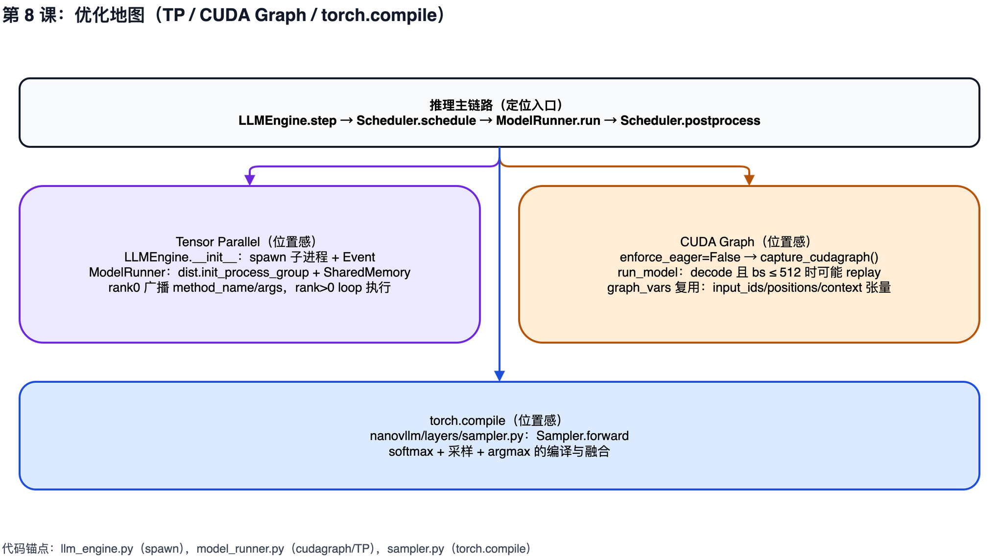

# 第 8 课：常见优化的"位置感"（TP、CUDA Graph、torch.compile）

## 1. 本课概述

**一句话概述**：本课不再逐行推导实现，而是建立一张"优化地图"——告诉我们三种常见优化（TP、CUDA Graph、torch.compile）分别"住在"代码的哪里。

LLM 推理的性能瓶颈可以分为两大类：**计算瓶颈**（GPU 算力不够）和**内存瓶颈**（显存带宽不够）。本课建立一张"优化地图"：Tensor Parallel（多进程 + NCCL，即 NVIDIA 的 GPU 间通信库）在哪里启用、数据如何广播；CUDA Graph 在什么条件下录制（capture）与重放（replay）；以及 `torch.compile` 在采样模块中如何出现。目标是让我们在需要进一步性能排查时，能快速定位入口与触发条件，并知道这些优化分别影响"吞吐、延迟、显存"中的哪些维度。

### 1.1 课时安排

| 阶段     | 时长   | 内容要点                                                        |
| -------- | ------ | --------------------------------------------------------------- |
| 概念回顾 | 10 min | 回顾推理主链路，标注"优化可以作用的位置"                        |
| 代码走读 | 35 min | TP 进程模型、CUDA Graph capture/replay 条件、torch.compile 位置 |
| 动手练习 | 20 min | 复刻 replay 判定条件                                            |
| 答疑讨论 | 25 min | 开放讨论：这些优化分别影响延迟/吞吐/显存的哪个维度              |

### 1.2 学习目标

学完本课后，我们应该能回答以下问题：

- Tensor Parallel 的进程模型在代码中的入口在哪？rank0 和子进程之间如何通信？
- CUDA Graph replay 的触发条件是什么？为什么它只覆盖 decode 的一部分场景？
- `torch.compile` 出现在哪个模块上？为什么采样模块适合用编译优化？

---

## 2. 原理说明：三种优化各自攻击的瓶颈

回忆第 3 课：prefill 是 compute-bound（算力瓶颈），decode 是 memory-bound（访存瓶颈）。除此之外还有一类常被忽略的"元开销"——Python 解释器每步都要逐行执行、CUDA kernel 每次都要从 CPU launch。三种优化正好各打一类瓶颈：

- **Tensor Parallel**：把矩阵乘切到多张 GPU 并行算，攻击 compute-bound 阶段的算力上限。
- **CUDA Graph**：把一次 decode 前向传播"录像"再重放，消掉 CPU 侧 kernel launch 的累积延迟——decode 因为算子小、步数多，对 launch 开销最敏感。
- **torch.compile**：把 Python 层的 op 融合为更少的 kernel，减少解释器开销；nano-vllm 只在采样模块用它，因为采样的计算图最稳定。

这三种优化不互斥，它们住在代码的不同位置。接下来的地图告诉我们每个开关在哪个文件。

---

## 3. 三种优化的位置地图

先看一张"色块叠加"图：TP 影响模型执行端的并行方式；CUDA Graph 影响 decode 路径的执行形态；torch.compile 影响采样模块的执行开销。看图即可定位"该去哪个文件找开关与触发条件"，然后按下面三个子节分别核对代码入口。



### 3.1 Tensor Parallel：多进程与共享内存广播

TP 的最小机制：rank0 通过 spawn 创建子进程，并以共享内存作为 IPC（进程间通信）通道广播方法调用。这与操作系统的 fork/spawn + 共享内存多进程模型同构：主进程（rank0）将任务描述写入共享内存段，子进程通过 Event 信号量唤醒后读取，并在各自的 GPU 上执行相同的方法以完成张量并行计算。

- **进程创建与事件**：[`LLMEngine.__init__`](../../nanovllm/engine/llm_engine.py#L22-L34) 使用 `spawn` 启动 `tensor_parallel_size - 1` 个子进程，并为每个子进程创建一个 Event（事件信号）。rank0 仍在主进程内创建一个 `ModelRunner`。
- **共享内存与方法调用广播**：[`ModelRunner.__init__`](../../nanovllm/engine/model_runner.py#L41-L48) 中当 `world_size > 1` 且 `rank == 0` 时创建共享内存；`rank > 0` 通过 [`loop()`](../../nanovllm/engine/model_runner.py#L61-L66) 阻塞等待 Event 被 set，然后从共享内存反序列化出 `method_name, args` 并执行同名方法。rank0 通过 [`write_shm` 与 `call`](../../nanovllm/engine/model_runner.py#L76-L89) 广播调用。

### 3.2 CUDA Graph：capture 与 replay 的触发条件

关注点只有"何时用图重放"，不涉及图内部捕获了哪些算子。nano-vllm 的图重放只在 decode 的一部分场景生效，依赖 context 中的若干张量被写入到预先分配的 graph_vars 缓冲里。

- **何时 capture（录制）**：若 `enforce_eager` 为 `False`，[`ModelRunner.__init__`](../../nanovllm/engine/model_runner.py#L34-L38) 会在 warmup 与 KV cache 分配后调用 [`capture_cudagraph()`](../../nanovllm/engine/model_runner.py#L222-L257)，提前为不同 batch size 捕获图。简单来说：把一次完整的 decode 前向传播"录像"下来，之后直接"回放"就不需要 Python 解释器逐行执行了。
- **何时 replay（重放）**：[`run_model`](../../nanovllm/engine/model_runner.py#L195-L212) 在满足以下任一条件时会走普通 eager 路径（逐步执行）：prefill、`enforce_eager` 为 `True`、或 `input_ids.size(0) > 512`。否则才会根据 batch size 选择一个已捕获的图，并把当步的 `slot_mapping/context_lens/block_tables` 写入缓冲后 `graph.replay()`。

```python
# run_model：prefill / enforce_eager / batch 过大 → eager；其余 → 填 graph_vars 再 replay。
@torch.inference_mode()
def run_model(self, input_ids, positions, is_prefill):
    if is_prefill or self.enforce_eager or input_ids.size(0) > 512:
        return self.model.compute_logits(self.model(input_ids, positions))
    bs = input_ids.size(0)
    context = get_context()
    graph = self.graphs[next(x for x in self.graph_bs if x >= bs)]
    graph_vars = self.graph_vars
    graph_vars["input_ids"][:bs] = input_ids
    graph_vars["positions"][:bs] = positions
    graph_vars["slot_mapping"].fill_(-1)
    graph_vars["slot_mapping"][:bs] = context.slot_mapping
    graph_vars["context_lens"].zero_()
    graph_vars["context_lens"][:bs] = context.context_lens
    graph_vars["block_tables"][:bs, :context.block_tables.size(1)] = context.block_tables
    graph.replay()
    return self.model.compute_logits(graph_vars["outputs"][:bs])
```

### 3.3 torch.compile：采样模块的编译位置

[`torch.compile`](../../nanovllm/layers/sampler.py#L5-L12) 在 nano-vllm 中只出现在采样模块——采样的计算图相对稳定（softmax + 随机采样 + argmax），适合通过编译减少 Python 开销与融合算子。这本质上是 JIT 编译（Just-In-Time Compilation）：把反复执行的解释型热路径编译为优化后的机器码，消除 Python 解释器逐行调度的开销。

```python
# Sampler.forward：@torch.compile 修饰一次前向；Gumbel-Max 技巧（exponential + argmax）等价于按概率采样。
class Sampler(nn.Module):
    @torch.compile
    def forward(self, logits: torch.Tensor, temperatures: torch.Tensor):
        logits = logits.float().div_(temperatures.unsqueeze(dim=1))
        probs = torch.softmax(logits, dim=-1)
        sample_tokens = probs.div_(torch.empty_like(probs).exponential_(1).clamp_min_(1e-10)).argmax(dim=-1)
        return sample_tokens
```

---

## 4. 练习

### 4.1 课堂练习

练习目标：把 `run_model` 的条件分支写成一个可执行的判定函数，将"什么情况下会走 graph replay"变成可复述的规则。

```python
# 练习：用 Python 复刻 run_model 的 replay 判定条件（忽略具体图选择逻辑）。
def will_replay(is_prefill: bool, enforce_eager: bool, batch_size: int) -> bool:
    if is_prefill:
        return False
    if enforce_eager:
        return False
    if batch_size > 512:
        return False
    return True

print(will_replay(is_prefill=True, enforce_eager=False, batch_size=128))
print(will_replay(is_prefill=False, enforce_eager=False, batch_size=128))
```

- 验收要点（依据代码）：`if is_prefill or self.enforce_eager or input_ids.size(0) > 512: eager else: replay`（见 [model_runner.py:L195-L203](../../nanovllm/engine/model_runner.py#L195-L203)）

### 4.2 课后自测题

1. CUDA Graph replay 的阈值是 `bs > 512`。这个限制是出于什么考虑？如果改成 1024，每次 replay 前需要做什么额外操作？
2. TP 用 `spawn` + 共享内存而不是 `fork`。Python 的 fork 和 spawn 在 CUDA 上下文继承上有根本差异 —— 如果改用 fork，nano-vllm 的初始化流程会怎么简化？为什么真实 vLLM 也用 spawn？
3. `torch.compile` 只用在 `Sampler.forward`。如果给整个 Transformer 前向加上 compile，会遇到什么问题（提示：动态 shape、重编译开销、与 CUDA Graph 的互操作）？
