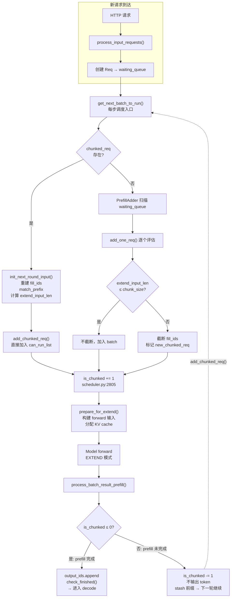

# SGLang Chunked Prefill — 原理与代码实现

调度是推理引擎的「操作系统」——GPU 一次只能跑一个 batch，当一个请求的 prompt 长达 150K tokens 时，它的 prefill 会霸占 GPU 十几秒。在这十几秒里，不管有多少短请求排在后面，都只能干等。**Chunked Prefill 就是为解决这个问题而生的。**

它的思路异常简洁：把「一个长 batch」切成「一串短 batch」。每个 batch 只有几十到几百毫秒，长请求不再能独占 GPU。新请求随时能被下一个短 batch 收编入队，不必等长 prefill 跑完。

本文从 SGLang 源码出发，覆盖 Chunked Prefill 的完整链路：

| 章节 | 内容                                                          |
| ---- | ------------------------------------------------------------- |
| 一   | 概念与动机：Prefill / Decode + 是什么                         |
| 二   | 整体流程：mermaid 流程图                                      |
| 三   | 关键状态字段：`fill_ids`、`is_chunked`、`extend_input_len`    |
| 四   | 调度循环：Prefill 优先与 `chunked_req` 的强制机制             |
| 五   | PrefillAdder：截断决策者（`add_one_req` / `add_chunked_req`） |
| 六   | Chunk 后处理：状态保存与结果输出                              |
| 七   | 调优：参数配置 + 性能数据（chunk 翻倍 → TPS +13.9%）          |
| 八   | 与 HiCache 的协同                                             |
| 九   | 总结速查表                                                    |

> 可以先看[调度器可视化动画](scheduler-visual.html)（[GIF 预览](scheduler-visual.gif)）对 Chunked Prefill 有一个直观感受，再回来看源码细节。

---

## 一、概念与动机

在理解 Chunked Prefill 之前，需要先了解 LLM 推理的两个阶段：

| 阶段        | 做什么                                                   | 计算特点                                  | 耗时特征                                             |
| ----------- | -------------------------------------------------------- | ----------------------------------------- | ---------------------------------------------------- |
| **Prefill** | 一次性处理整个 prompt 的所有 token，生成第一个输出 token | 计算密集（矩阵乘法），GPU 利用率高        | 随 prompt 长度线性增长，长 prompt 可达数秒甚至数十秒 |
| **Decode**  | 每次只处理 1 个新 token，自回归循环生成后续 token        | 显存带宽密集（查 KV Cache），GPU 利用率低 | 单步很快（~10ms），但需要反复执行数百上千次          |

**问题**：如果几十个请求同时在排队，其中一个请求的 prompt 有 150K tokens，它的 prefill 需要 10 秒，期间其他请求全部卡住——即使它们的 prompt 只有几百 token。

**Chunked Prefill 的解决思路**：GPU 处理 batch 是串行的——一个 batch 没跑完，后面的 batch 都得排队。长 prefill 把一个 batch 拖到几秒甚至十几秒，后续所有请求全部卡住。Chunked prefill 把"一个长 batch"拆成"多个短 batch"——每个 chunk 只占 ~100ms，其他请求有机会被 PrefillAdder 打包进后续的 chunk batch，不必等长 prefill 全部跑完。

---

### 1.1 是什么

Chunked prefill 是将长 prompt 切分为多个固定大小的 chunk（如 8192 tokens），分多次 forward 处理。它解决了"长 prefill 一次性计算数十万 token，阻塞其他请求生成"的调度问题。

**核心思想**：把"一个长 batch"变成"多个短 batch"。batch 内部多请求并行 prefill 的能力不变，但每个 batch 的执行时间被 `chunked_prefill_size` 限制在 ~100ms 以内。

> **关键点**：调度器 **Prefill 优先**（见第四节），`chunked_req` 存在时会连续调度 prefill chunk。但这不影响核心收益——每个 chunk 很短，后续到达的短请求可以被 PrefillAdder 打包进下一个 chunk batch，不必等长 prefill 全部完成。

```text
假设：Req A prompt 25K tokens，Req B 2K tokens，同时到达。
     Req C 在 A 的 chunk1 执行期间到达 (t≈50ms)。

没有 chunked prefill：
  ┌──────────────────────────────────────┐
  │ Batch 1: [A prefill 25K tokens, ~2s] │ ← 一个 batch 霸占 GPU 2s
  │          [B prefill 2K tokens]       │      B 虽然和 A 同批，但 batch 结束才完成
  └──────────────────────────────────────┘
                                         → Batch 2: C 的 prefill（C 等了 2s）
                                         → Batch 3: A,B,C decode

有 chunked prefill (size=8192)：
  ┌───────────┐  ┌───────────┐  ┌───────────┐  ┌───────────┐  ┌──────────┐
  │Batch1 80ms│  │Batch2 80ms│  │Batch3 80ms│  │Batch4 20ms│  │Batch5 dec│
  │A(ch1,8K)  │  │A(ch2,8K)  │  │A(ch3,8K)  │  │A(ch4,1K)  │  │ A,B,C    │
  │B(2K)      │  │C(1K)      │  │           │  │  完成!     │  │          │
  └───────────┘  └───────────┘  └───────────┘  └───────────┘  └──────────┘
       ↑ C 到达 ──→ 下一轮就被打包进 Batch2

  B 和 C 各自的 TTFT：
    无 chunk → B 等 2s，C 等 2s
    有 chunk → B 等 80ms（与 A chunk1 同批），C 等 80ms（被 A chunk2 批次打包）
```

---

## 二、整体流程

新请求和 chunked 续传请求走两条不同的入口路径：



---

## 三、关键状态字段

定义在 [`schedule_batch.py`](https://github.com/sgl-project/sglang/blob/main/python/sglang/srt/managers/schedule_batch.py) 的 `Req` 类：

| 字段               | 类型        | 说明                                                                                                |
| ------------------ | ----------- | --------------------------------------------------------------------------------------------------- |
| `fill_ids`         | `List[int]` | 当前工作的 token 序列。**每次 chunk 会截断到 chunk 边界**。基础值 = `origin_input_ids + output_ids` |
| `prefix_indices`   | `Tensor`    | 前缀缓存命中的 token 索引，这部分不需要 GPU 重算                                                    |
| `extend_input_len` | `int`       | 这一轮需要新 prefill 的 token 数（= fill_ids 中 prefix 之后的部分）                                 |
| `is_chunked`       | `int`       | 计数器。> 0 = 还有剩余 chunk 未处理；= 0 = prefill 全部完成                                         |

### fill_ids 截断示意

```text
原始 fill_ids:  [prefix 100K tokens | 新 token 1..20000]
                                       ↑ extend_input_len = 20000

chunked_prefill_size = 8192，截断后:
  fill_ids:      [prefix 100K tokens | 新 token 1..8192]
  extend_input_len = 8192
  is_chunked = 1  ← 还剩 20000 - 8192 = 11808 tokens

下一轮:
  fill_ids:      [prefix 100K tokens | 新 token 8193..16384]
  extend_input_len = 8192
  is_chunked = 1  ← 还剩 16384 - 8192 = 8192 tokens

再下一轮:
  fill_ids:      [prefix 100K tokens | 新 token 16385..20000]
  extend_input_len = 3616
  is_chunked = 0  ← prefill 完成
```

---

## 四、调度循环：Prefill 优先于 Decode

`get_next_batch_to_run()` 是每步调度的入口（[`scheduler.py:2486`](https://github.com/sgl-project/sglang/blob/main/python/sglang/srt/managers/scheduler.py#L2486)）：

```python
def get_next_batch_to_run():
    # 1. 暂存上一个 chunked req 的部分前缀
    stash_chunked_request()

    # 2. 尝试创建 prefill batch
    new_batch = get_new_batch_prefill()

    # 3. 决策
    if new_batch is not None:
        return new_batch           # ← Prefill 优先
    elif running_batch:
        return update_running_batch()  # ← 无 prefill 时才 decode
    else:
        return None                # ← 空闲
```

**Prefill 永远优先**。只有当 `get_new_batch_prefill()` 返回 `None`（没有等待中的请求，且没有 `chunked_req` 待处理）时，才执行 decode。

> **为什么 decode 不能在 chunk 之间穿插？**
>
> 源码关键（`_get_new_batch_prefill_raw()`）：
>
> ```python
> # L2645-2648: chunked_req 存在时，跳过 early return
> if (batch_is_full or len(waiting_queue) == 0) and self.chunked_req is None:
>     return None
>
> # L2657-2663: chunked_req 存在时，跳过请求数上限检查
> if (get_num_allocatable_reqs(running_bs) <= 0
>     and self.chunked_req is None):  # ← 关键条件
>     return None
> ```
>
> 这意味着只要 `self.chunked_req` 不为 `None`（还有剩余 chunk），调度器**强制进入 prefill**，decode 无法执行。chunk 之间是**连续**的，并非交替。

**具体例子**：假设有 3 个请求同时到达，chunk_size=8192：

````text
Req A: prompt 25K tokens (需要 4 个 chunk)  ─┐
Req B: prompt 6K tokens  (1 个 chunk 就够)    ├─ 同时在 waiting_queue
Req C: prompt 2K tokens  (1 个 chunk 就够)   ─┘

时间线（修正）:
  Step 1 [PREFILL] Req A chunk1 (8K) + Req B (6K) + Req C (2K)
                   ↑ PrefillAdder 把三个请求一起打包。A 被截断为 8K。
                   B 和 C 在同一个 batch 里完成 prefill → 进入 decode 模式。

  Step 2 [PREFILL] Req A chunk2 (8K)
                   ↑ chunked_req 存在 → 强制 prefill。B、C 无法 decode，继续等。

  Step 3 [PREFILL] Req A chunk3 (8K)

  Step 4 [PREFILL] Req A chunk4 (1K) — is_chunked=0, chunked_req=None

  Step 5 [DECODE]   Req A, B, C 一起 decode
                   ↑ 此时 chunked_req 为 None，且 waiting_queue 为空
                     或 batch 已满，decode 终于能运行。

A 的 chunk2-4 跑完共 ~300ms，B/C 的 decode 被推迟了 300ms。
没有 chunked prefill：B/C 要等 A 的 25K prefill 全部完成（~2s）。
效果：decode 延迟从 2s 降到 300ms。

**更重要的场景**：假设请求 D 在 Step 2 开始前到达 waiting_queue：

```text
  Step 1 [PREFILL] A(chunk1 8K) + B(6K) + C(2K)   ← D 还没来
  Step 2 [PREFILL] A(chunk2 8K) + D(full prefill)  ← D 被 PrefillAdder 打包进同一个 batch
  Step 3 [PREFILL] A(chunk3 8K)
  Step 4 [PREFILL] A(chunk4 1K) 完成！
  Step 5 [DECODE]   A, B, C, D 一起 decode
````

没有 chunked prefill：D 在 Step 1 执行期间到达，但 Step 1 被 A 的 25K prefill 霸占 ~2s。D 等到 Step 2 才能 prefill。有 chunked prefill：D 在 Step 2 就被打包进 A 的 chunk2 batch，基本不用等。**batch 越短，新请求等入队的延迟越低。**

---

## 五、PrefillAdder：chunk 截断的决策者

定义在 [`schedule_policy.py:407`](https://github.com/sgl-project/sglang/blob/main/python/sglang/srt/managers/schedule_policy.py#L407)。

### 构造函数参数

```python
class PrefillAdder:
    rem_input_tokens: int   # 整个 batch 的总 prefill token 上限
    rem_chunk_tokens: int   # 单个请求的 chunk 上限（= chunked_prefill_size）
                            # None 表示禁用 chunked prefill
```

### `add_one_req()` 决策逻辑（[`schedule_policy.py:815`](https://github.com/sgl-project/sglang/blob/main/python/sglang/srt/managers/schedule_policy.py#L815)）

核心截断逻辑（[`schedule_policy.py:907-953`](https://github.com/sgl-project/sglang/blob/main/python/sglang/srt/managers/schedule_policy.py#L907)）：

```python
def add_one_req(self, req, has_chunked_req, truncation_align_size):
    # ... 预算检查 (total_tokens, rem_input_tokens, etc.) ...

    if rem_chunk_tokens is None or input_tokens <= rem_chunk_tokens:
        # 情况 A: 不分 chunk——请求能完整放入
        can_run_list.append(req)
    else:
        # 情况 B: 需要截断——请求超出 chunk 上限
        trunc_len = rem_chunk_tokens // page_size * page_size  # page 对齐
        # 二次对齐：prefix_len + trunc_len 也对齐到 page_size
        now_input_len = trunc_len + len(req.prefix_indices)
        now_input_len = now_input_len // page_size * page_size
        trunc_len = now_input_len - len(req.prefix_indices)

        req.set_extend_input_len(trunc_len)
        req.fill_ids = req.fill_ids[:len(req.prefix_indices) + trunc_len]
        can_run_list.append(req)
        self.new_chunked_req = req    # 标记为"下一轮继续"
        # is_chunked += 1 不在这里！在 scheduler.py:2805 中统一执行
```

### `add_chunked_req()` 继续上一轮的 chunked req（[`schedule_policy.py:668`](https://github.com/sgl-project/sglang/blob/main/python/sglang/srt/managers/schedule_policy.py#L668)）

```python
def add_chunked_req(self, req):
    _rem_tokens = min(self.rem_chunk_tokens, int(self.rem_total_tokens))
    if _rem_tokens <= 0:
        _rem_tokens = self.rem_chunk_tokens      # 防止 chunked_req 饿死

    truncated = req.extend_input_len > _rem_tokens
    req.set_extend_input_len(min(req.extend_input_len, _rem_tokens))
    req.fill_ids = req.fill_ids[:len(req.prefix_indices) + req.extend_input_len]
    can_run_list.append(req)
    return req if truncated else None    # 截断 → 返回 req；完成 → 返回 None
```

---

## 六、Chunk 后处理：状态保存与结果输出

### Stash：暂存部分前缀

每个 chunk 处理完后，部分前缀需要写回缓存，下一轮才能匹配到（[`scheduler.py:2447`](https://github.com/sgl-project/sglang/blob/main/python/sglang/srt/managers/scheduler.py#L2447)）：

```python
def stash_chunked_request(self, req):
    # 将 chunked req 的部分前缀缓存到 radix tree
    maybe_cache_unfinished_req(req, self.tree_cache, chunked=True)
```

调用时机：下一轮 `get_next_batch_to_run()` 的第一步（[`scheduler.py:2507`](https://github.com/sgl-project/sglang/blob/main/python/sglang/srt/managers/scheduler.py#L2507)）。

### init_next_round_input：恢复完整 fill_ids

每轮调度前重建 `fill_ids` 并重新匹配前缀（[`schedule_batch.py:988`](https://github.com/sgl-project/sglang/blob/main/python/sglang/srt/managers/schedule_batch.py#L988)）：

```python
def init_next_round_input(tree_cache):
    # 重建 fill_ids = origin_input_ids + output_ids
    self.fill_ids = self.origin_input_ids + self.output_ids
    # 重新匹配前缀缓存
    self.prefix_indices = tree_cache.match_prefix(self.fill_ids)
    # 计算 extend_input_len
    self.extend_input_len = len(self.fill_ids) - len(self.prefix_indices)
```

这样即使上轮 `fill_ids` 被截断了，新一轮也能恢复完整序列，重新计算 `extend_input_len` 并决定是否需要继续 chunk。

---

### Forward 结果输出

`process_batch_result_prefill()`（[`scheduler_output_processor_mixin.py:181`](https://github.com/sgl-project/sglang/blob/main/python/sglang/srt/managers/scheduler_output_processor_mixin.py#L181)）：

```python
for req in batch.reqs:
    if req.is_chunked <= 0:
        # prefill 完成——正常流程
        req.output_ids.append(next_token_id)
        req.check_finished()
        # ... cache、stream 输出 ...
    else:
        # prefill 未完成——静默处理
        req.is_chunked -= 1
        skip_stream_req = req  # 不推流（没有 token 输出）
        # 增量更新 input logprobs（如果需要）
```

**关键点**：chunked 状态下的请求**不产生 token 输出**，`next_token_id` 不会被追加到 `output_ids`。只有最后一个 chunk（`is_chunked == 0`）才会正常输出。

---

## 七、调优：参数配置与性能数据

### 显存自动调参（[`server_args.py:1401`](https://github.com/sgl-project/sglang/blob/main/python/sglang/srt/server_args.py#L1401)）

SGLang 根据 GPU 显存自动选择 `chunked_prefill_size`：

| GPU 显存 | 示例 GPU  | 默认 chunked_prefill_size |
| -------- | --------- | ------------------------- |
| <20 GB   | T4        | 2048                      |
| <35 GB   | A10       | 2048                      |
| <60 GB   | A100 40GB | 4096                      |
| <90 GB   | H100 80GB | **8192**                  |
| <160 GB  | H200      | 8192                      |
| ≥160 GB  | B200      | 16384                     |

> 我们的 8×H100 压测手动设置 `--chunked-prefill-size 16384`（翻倍优化），比默认 8192 吞吐提升 14%。

### 预留显存公式

```python
reserved_mem = chunked_prefill_size * 1.5 + cuda_graph_max_bs * 2
```

chunk 越大 → 预留越多 → 留给 KV cache 的显存越少。需要权衡。

---

### 性能数据

Qwen3.5-122B-A10B, 8×H100, HiCache write_through, 1600 requests:

| 指标             | chunk=8192 | chunk=16384 | 变化       |
| ---------------- | ---------- | ----------- | ---------- |
| Prefill batch 数 | 2,214      | 1,785       | −19.4%     |
| 整体 TPS         | 19,589     | 22,314      | **+13.9%** |
| 运行时间         | 106min     | 91min       | −14.2%     |
| TPOT P50         | 19.6ms     | 19.9ms      | +1.5%      |

> chunk 翻倍 → 每个请求的 chunk 数减半 → prefill 中断次数减半 → 吞吐显著提升。TPOT 略增（单个 chunk prefill 时间稍长），但整体吞吐收益远大于此。

---

## 八、与 HiCache 的交互

Chunked prefill 和 HiCache 配合使用时的一个关键细节：

```text
第 1 轮:
  fill_ids = [前缀 100K | chunk1 8K]
  prefix_indices = 前缀 100K（HiCache 命中）
  extend_input_len = 8K  ← 只 prefill 增量

第 2 轮:
  fill_ids = [前缀 100K | chunk1 8K | chunk2 8K]
  prefix_indices = 前缀 100K + chunk1 8K（stash 后 HiCache 命中）
  extend_input_len = 8K  ← 仍然只 prefill 增量
```

`stash_chunked_request()` 将每个 chunk 的部分结果写回 radix tree，后续 chunk 可以命中为前缀缓存。这意味着即使是最长链的第 20 轮，每个 chunk 的 `extend_input_len` 也被限制在 chunk_size 以内，TTFT 不会随 prompt 长度线性增长。

> 关于 HiCache 的完整架构（L1/L2/L3 三级存储、HiRadixTree、预取与写回策略等），参见同目录的 [HiCache 深入详解](hicache_deep_dive.md)。

---

## 九、总结

Chunked Prefill 本质上是一个**调度策略**——它不改变模型计算本身，而是改变"什么时候算哪些 token"：

| 维度                 | 要点                                                                                                                                       |
| -------------------- | ------------------------------------------------------------------------------------------------------------------------------------------ |
| **解决什么问题**     | 长 prompt 的 prefill 阻塞其他请求的 decode，导致 TTFT 抖动                                                                                 |
| **核心手段**         | 把"一个长 batch"拆成"多个短 batch"（每个 ≤ chunk_size），batch 间串行但每个 batch 很短，新请求随时入队                                     |
| **调度规则**         | Prefill 永远优先；`chunked_req` 存在时强制 prefill（绕过 batch_full 和 waiting_queue_empty 检查），chunk 连续执行不穿插                    |
| **状态管理**         | `is_chunked` 计数器追踪剩余 chunk 数；`fill_ids` 每轮截断到 chunk 边界；chunk 间通过 stash 保存前缀到 radix tree                           |
| **对用户可见的影响** | chunked 期间不输出 token（静默），只有最后一个 chunk 完成后才进入 decode；但新请求可被 PrefillAdder 打包进任意 chunk batch，TTFT 大幅降低  |
| **性能权衡**         | chunk 越大 → prefill 中断次数越少 → 吞吐越高，但单次 prefill 时间更长 → TTFT 略增                                                          |
| **与其他组件的协同** | 与 HiCache 配合：每个 chunk 结果 stash 后可被后续 chunk 命中；与 Continuous Batching 配合：新到达的 prefill 请求可被打包进任意 chunk batch |

一句话记住：**Chunked Prefill = 把"一堵墙"变成"一扇旋转门"**——长请求不再挡住短请求的路。

---

_参考代码：[`scheduler.py`](https://github.com/sgl-project/sglang/blob/main/python/sglang/srt/managers/scheduler.py), [`schedule_policy.py`](https://github.com/sgl-project/sglang/blob/main/python/sglang/srt/managers/schedule_policy.py), [`schedule_batch.py`](https://github.com/sgl-project/sglang/blob/main/python/sglang/srt/managers/schedule_batch.py), [`server_args.py`](https://github.com/sgl-project/sglang/blob/main/python/sglang/srt/server_args.py), [`scheduler_output_processor_mixin.py`](https://github.com/sgl-project/sglang/blob/main/python/sglang/srt/managers/scheduler_output_processor_mixin.py)_
