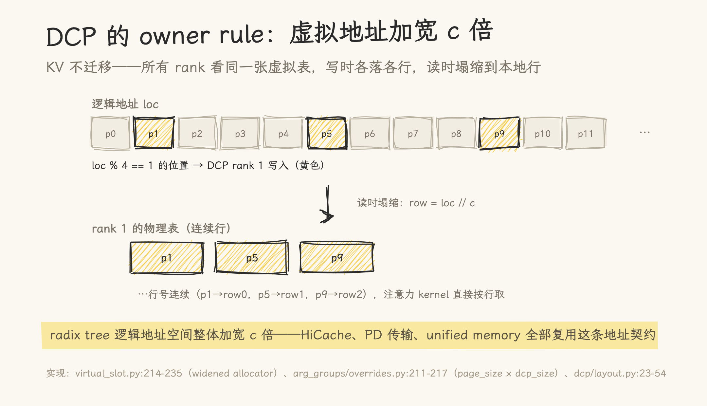
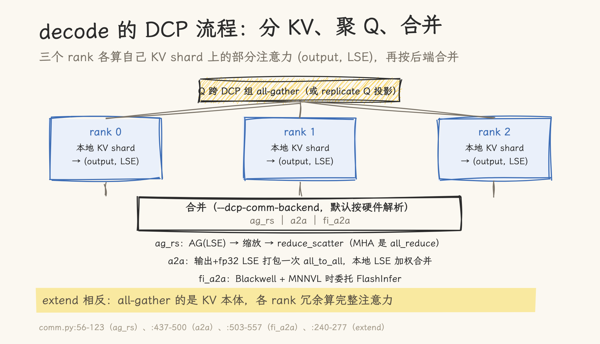
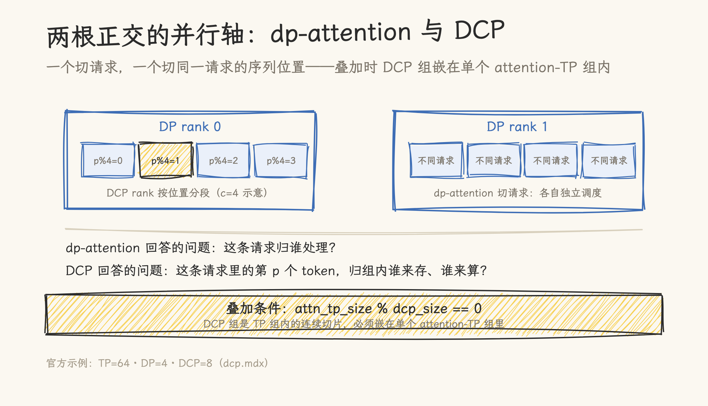

# MoE 与百万上下文：请求怎么分卡，长文怎么切

> 2026-09-27 | 机制解读，基于 SGLang main `f4de6abee6`（2026-09-25）源码。这篇不讲怎么调参，讲两条并行轴各自解决什么问题、代价在哪里。文中所有机制均可在文末源文件索引里对照源码。

部署一个大模型做推理，并行策略是绕不开的第一课。但 2026 年的旗舰模型把两个老问题顶到了新高度：模型是 MoE 的，专家权重巨大；上下文是百万 token 级的，KV Cache 更巨大。SGLang 为此落了两条新的并行轴——dp-attention 与 DCP（Decode Context Parallelism，解码上下文并行，第二节的主角）。这两条轴解决的是不同的问题，叠加时还有自己的规则。这篇从两个真实的部署难题讲起。

## 一、难题一：模型是 MoE 的，KV 却没得切

把一个 DeepSeek 这类 MLA（多头潜在注意力）模型用张量并行（TP）部署到 8 张卡上，会发生一件违反直觉的事：专家权重确实被切开了，但 **KV Cache 在 8 张卡上整份重复**。

原因在 MLA 的结构里。MLA 把 KV 压缩成一份所有 query head 共享的 latent——好处是 KV 极小，坏处是 TP 没了下手的地方：TP 切的是 head，而这里只有 1 份 latent，没有 head 维可切。8 张卡，每张都存着同一份完整 KV。KV 是常驻显存，复制 8 份直接吃掉 batch size——这是官方文档给出的原始动机。量级感受一下：以 DeepSeek-V3 的公开参数（61 层、每层每 token 576 个元素的压缩 KV、bf16）估算，一个 128K 请求的 KV 约 9 GB——TP=8 部署时，这 9 GB 要在 8 张卡上各存一份，70 多 GB 显存只为这一个请求。

MoE 还有一层。专家权重被切分摊在整个集群上，而每个 token 路由到的专家可能落在任何一张卡——所以 MoE 必须看到全部请求的 token，路由结果才能与专家对上；只喂子集，路由与负载都会失真。

这就是 dp-attention 要解决的问题：**attention 按请求切（每张卡独立处理自己的请求子集），MoE 按专家切（全局 token 汇总后路由）**。开启 `--enable-dp-attention` 后，控制器把请求按负载路由到各 DP rank（round-robin 或按最少 token），每个 rank 独立调度、独立计算自己请求的 attention；到了 MoE 层，再把各 rank 的 token 汇总成全局 batch 送进专家。效果直接：MLA 的 KV 重复份数从 tp_size 降为 dp_size。注意 MoE 侧的分片方式不变——专家本来就摊在整个 TP 组上，变的只是喂进来的 token 从本 rank 子集变成全局 batch。

这条轴有一个必须交代的语义变化：开启 dp-attention 后，**GPU 总数 = tp_size × pp_size**，而不是 dp × tp × pp——DP 副本是从 TP 组里「切」出来的，恒等式是 `tp_size = attention-TP × attention-DP × attention-CP`——attention-TP 是组内真正做张量切分的宽度，attention-DP 是复制份数，attention-CP 留给第三条轴（下一节）。换句话说，dp-attention 不是往集群里加卡，而是把原来做 TP 的一部分卡改派去复制 attention。

这条轴的运行成本集中在两处。一是请求不均匀时的 padding：各 rank 的请求长度不同，汇总成全局 batch 要对齐，SGLang 每次 forward 现场算一笔账（对齐到最长更省、还是按总量归约更省），选 all-gather 或 all_reduce 之一；还有一条按精确 token 数 gather 的变长路径作为第三选项。二是 pad 出来的行会真的跑一遍 MoE 路由，必须把它们的专家选择屏蔽掉，否则路由器的内部状态会爆。请求间的负载均衡则在分发时一次做完：round-robin 或按最少 token 选 rank。

这条 gather 路径在代码里留下了四个版本的演化痕迹：最早的 all-gather 要 pad 到最长；然后是省带宽的清零 + all_reduce；再往后是按精确 token 数 gather 的 all_gatherv；最新的一步把 gather 的数据本身换成 fp8 线格式。每一步都对应新的硬件与负载假设——这条路径的演化史，几乎就是 dp-attention 的工程化历史。

## 二、难题二：一个请求的 KV，一张卡装不下

dp-attention 解决「请求多了怎么办」，但百万 token 上下文提出了另一个问题：**单个请求**的 KV 一张卡装不下，或者一个请求的 attention 压在一张卡上算得太慢。把请求切开无济于事——它只有一个请求。

这就是第二条轴：DCP（Decode Context Parallelism，解码上下文并行）。开 `--dcp-size 4`，这个请求的序列就被切成 4 份，分给 DCP 组内的 4 张卡：第 0 张卡存位置 0、4、8……，第 1 张卡存位置 1、5、9……以此类推。每张卡的 KV 存储和读取都降到四分之一。

切完之后的注意力怎么算？每张卡只拿着四分之一的 KV，算出来的是**部分注意力**——直接相加是错的。SGLang 的做法是每张卡同时输出一个 LSE 值（该部分的指数归一化因子），合并时用 LSE 做加权还原，数学上等价于完整注意力。

decode 与 prefill 走的路还不一样。decode（逐 token 生成）时 KV 不动，把 query 聚合到各卡上，各卡对自己那份 KV 算部分注意力，再合并。prefill（长 prompt 首次处理，SGLang 里叫 extend）相反：把 KV 本体聚合到各卡，每张卡冗余地算完整注意力，算完再把 KV 归位——成本随上下文长度增长，所以官方把 DCP 的主路径明确放在 decode 侧。

这套切法还配了一个漂亮的地址设计（源码里叫 owner rule）：KV 不做任何物理迁移，而是把缓存的逻辑地址空间整体加宽 c 倍——所有卡看到同一张虚拟地址表，写入时每张卡只落自己负责的位置（位置除以 c 余几就是谁），读取时地址除以 c 塌缩成本地连续行。虚拟地址的顺序关系全部保留，前缀缓存、跨机传输这些既有机制都直接复用。

**图 1**｜owner rule 与虚拟地址加宽：rank 1 写入位置除 c 余 1 的 token，读取时塌缩成本地连续行。

工程上还有两处值得知道的细节。其一，合并部分注意力有三条后端（all-gather + reduce-scatter、单次 all-to-all、FlashInfer 的 MNNVL 路径），按硬件自动选择，其中 a2a 后端还把合并所需的统计量和部分输出打包进同一次通信，每层的通信调用次数减半。MNNVL 是 NVIDIA 多卡 NVLink 域的互联。其二，DCP 能进 decode 的 CUDA graph：靠的是捕获稳定的地址缓冲加回放时原地改写长度信息，而不是每次重新规划——代价是 prefill 侧的 CUDA graph 在 DCP 开启时被显式禁用。

为什么一个合并要三套实现？最优通信方式由硬件拓扑决定：MNNVL 域内带宽高，a2a 就近交换；没有特殊互联时，ag_rs 是不挑硬件的兜底。三条后端是同一问题在不同硬件上的三个答案，按机型自动解析即可。

**图 2**｜decode 的 DCP 流程：Q 跨组聚合，各 rank 对本地 KV shard 算部分注意力，按后端合并；extend 走相反路径。

## 三、两条轴叠加：正交，但有自己的规则

回到开头的部署难题：模型既是 MoE、上下文又长，怎么办？两条轴叠加。以官方示例 TP=64、DP=4、DCP=8 为例，按恒等式当场算一遍：attention-DP = 4，attention-CP = 8，attention-TP = 64 / 4 / 8 = **2**。于是 64 张卡的形态是：4 个 DP 组各自分流请求，每组内 2 张卡的 attention-TP 复制缓存，DCP=8 把序列切成 8 份。

**图 3**｜叠加后的完整形态：4 个 DP 组各管各的请求，组内按位置取模分片。dp-attention 回答「这条请求归谁处理」，DCP 回答「第 p 个 token 归组内谁来存、谁来算」。

读者多半会问：attention-TP 那 2 张卡在 MLA 里切什么？切的是解压缩后的注意力计算与权重——KV latent 没有可切的 head 维，缓存在这 2 张卡上仍是复制的，这正是第一节说的「没得切」的部分。

DSA（稀疏注意力）与这两条轴有三个交点，两个已处理、一个禁止：其一，latent KV 按 DCP 交错分片，但 DSA 用来选块的索引 K cache 在各卡间保持复制，否则各卡选出的 token 块不一致；其二，DSA 的 prefill-CP 辅助路径（另一套 CP 机制）有硬断言，不允许叠加 dp-attention；其三，启动校验只查 `tp_size % dcp_size == 0`，「DCP 组嵌在 attention-TP 组内」这一点要自己保证。

## 四、代价与边界

两条轴都不是免费的。dp-attention 的代价不止请求分发与对齐（各 rank 请求不均时 gather 的对齐开销会放大，SGLang 用现场决策与变长通信路径压制）——**我们自己的实测里它是负收益：decode 反而更慢**。每层多出 gather/scatter、每个 rank 分到的有效 batch 又被切小，小规模部署下这两笔账压过省下的 KV 复制；这条轴是给大规模 MoE 部署准备的，不是默认加速选项。DCP 的代价在 extend 的冗余计算与 prefill CUDA graph 的禁用。

还有几处版本相关的细节：DCP 的写侧位置掩码只在 ROCm 分支生效，CUDA 上靠地址分配方式兜底；合并统计量以 fp32 精度传输；decode 的判定条件里包含 target verify 阶段。这些细节决定了「配置能不能按预期工作」，工程落地前值得对照源文件索引逐条复核。

## 五、什么时候用哪条轴

三条判断，各来自前文的事实：

- **dp-attention**：模型是 MoE 且 KV 无法按 head 切分（MLA 系）、请求量大到 DP 分流有意义。它是为大集群准备的——我们自己的实测里，小规模部署 decode 反而更慢；
- **DCP**：decode 是瓶颈、且单个请求的 KV 超过单卡容量（超长上下文）。请求短、KV 装得下时，开了只增加通信与复杂度；
- **都不开**：dense 模型、小规模部署、decode 不是瓶颈时，传统 TP 就够了。

至于 PD 分离（prefill 与 decode 拆到不同集群），它解决的是两个阶段的资源配比，与本节的「阶段内部怎么切」正交——选了 PD 之后，每个阶段内部依然要回答 dp 和 DCP 的问题。

## 六、回顾

两条轴、两个问题、两笔代价：

- **dp-attention 切请求**。解决 MoE + MLA 模型「KV 在 TP 下整份重复」的问题；代价是对齐开销之外，我们的实测里 decode 反而更慢——大规模部署才值得开。
- **DCP 切序列**。解决单请求 KV 超过单卡容量的问题；KV 存储与读取按 c 倍摊薄，代价是 extend 的冗余计算与 prefill CUDA graph 的禁用。
- **叠加**。DCP 组嵌在单个 attention 组内、大小整除即可；稀疏注意力的选块索引保持复制是精心处理过的例外。

对想上手的读者，SGLang 官方的启动示例（TP=64、DP=4、DCP=8，Kimi K3）是最快的验证入口；想深入机制的，文末源文件索引给出了每条结论的代码出处。

---

## 源文件索引

想对照源码的话，从这几个文件看起（按文中出现顺序）：

- `srt/layers/dp_attention.py` — dp-attention 的 gather/scatter、padding 决策、pad 行屏蔽
- `srt/managers/data_parallel_controller.py` — 请求路由与负载均衡
- `srt/arg_groups/fields/parallel.py` — enable_dp_attention / dcp_size / 通信后端的定义
- `srt/layers/dcp/comm.py` — decode/extend 的 DCP 通信与三种合并后端
- `kernels/ops/attention/dcp_kernels.py` — owner rule 与 LSE 合并的 Triton kernel
- `kernels/ops/memory/virtual_slot.py` — widened allocator（地址加宽契约）
- `srt/runtime_context.py` / `server_args.py` — 并行宽度派生与 world size 计算
- `docs/docs/advanced_features/dcp.mdx`、`dp_dpa_smg_guide.mdx` — 官方文档（动机与叠加条件）

## 参考资料

- [SGLang](https://github.com/sgl-project/sglang) 仓库，commit `f4de6abee6`（2026-09-25）——本文所有源码引用的基准版本
- [SGLang 文档：Decode Context Parallelism](https://github.com/sgl-project/sglang/blob/main/docs/docs/advanced_features/dcp.mdx)、[DP Attention / SMG 指南](https://github.com/sgl-project/sglang/blob/main/docs/docs/advanced_features/dp_dpa_smg_guide.mdx)——动机与组合条件
- 本站 [DeepSeek-V4.1-Flash 精读](../kv_compression/02-deepseek-v41-flash.md)——DCP 服务的模型侧背景
- 本站 [Engram 条件记忆源码深读](../engram/01-engram-deep-dive.md)——同一批 MoE/长上下文模型里的参数外置路线
