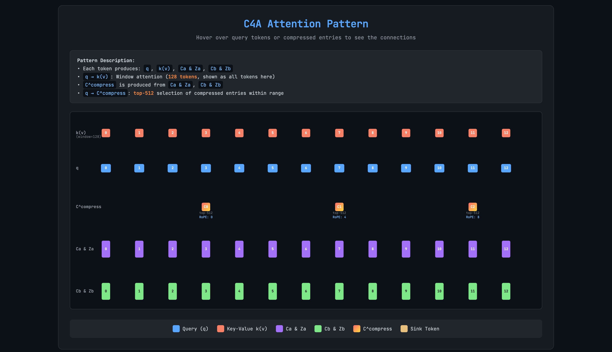

# DeepSeek-V4 端到端推理 Pipeline 走读：多流残差、MQA 压缩与哈希路由

> 2026-07-29 | 基于 HF `modeling_deepseek_v4.py` 与 `DeepseekV4Config` 源码分析

DeepSeek-V4 不是 V3 的增量升级。这是一次根本性的架构重构——几乎每个组件都换了：

| 维度              | DeepSeek-V3                   | DeepSeek-V4                                               |
| ----------------- | ----------------------------- | --------------------------------------------------------- |
| 隐藏维度          | 7168                          | **4096**（减半）                                          |
| 注意力机制        | MLA（128 头，低秩 KV 压缩）   | **MQA（1 个 KV 头，K==V 共享）+ CSA/HCA 时域压缩**        |
| 每头维度          | 192（128 nope + 64 rope）     | **512**（2.67×，nope 448 + rope 64）                      |
| 残差连接          | 标准 residual: `h = x + f(x)` | **mHC 多流残差**（4 条并行流，Sinkhorn-Knopp 双随机矩阵） |
| 层数              | 61                            | **43**                                                    |
| 前几层            | Dense MLP（前 3 层）          | **Hash-MoE**（前 3 层，冻结路由）                         |
| 每 token 激活专家 | 8/256 + 1 shared              | **6/256** + 1 shared                                      |
| 输出投影          | 标准 Linear                   | **Grouped Output Projection**（8 组低秩压缩）             |

V4 的设计方向很明确：**用一半的隐藏维度、更少的层数，通过更复杂的每层计算，在相同参数预算下获得更强的性能。** 本文以 V4-Flash（285B 参数）的标准配置为舞台，跟踪一个 decode token 穿越 43 层 V4 的完整旅程。注意 V4-Pro（1.6T 参数）有 61 层（30 CSA + 31 HCA），架构设计相同但层数和参数规模更大。已有文章（[DeepSeek 注意力架构进化](deepseek_attention_evolution_mla_to_csa_hca.md)）附录中的 61 层配置是针对 V4-Pro 的。

> 已有专文覆盖 DeepSeek 注意力从 MLA 到 CSA/HCA 的演进（[DeepSeek 注意力架构进化](deepseek_attention_evolution_mla_to_csa_hca.md)）。本文聚焦于 **forward pipeline 的完整数据流**——各组件以什么顺序被调用、什么形状的 tensor 在传递、数据依赖关系如何——不重复展开注意力机制的数学推导。

---

## 一、舞台设定：DeepSeek-V4 的模型拓扑

单个 decode token 穿越 43 层 V4 的完整路径：

```text
token_id: (1,)
  │
  ▼
Embedding: nn.Embedding(129280, 4096)      → hidden_states: (1, 4096)
  │
  ▼
  ┌─ 扩展为 hc_mult=4 条并行残差流 ────────────────────────┐
  │  hidden_states: (1, 4, 4096)                            │
  └─────────────────────────────────────────────────────────┘
  │
  ▼
┌─ Layer 0 (Hash-MoE + HCA, compress_rate=128) ──────────────┐
│  attn_hc → Attention(sliding 128 + HCA compressor) → mix   │
│  ffn_hc  → HashMoE(frozen routing)               → mix     │
└───────────────────────────────────────────────────────────┘
  │
  ▼
  ... Layers 1–2 (Hash-MoE + HCA) ...
  │
  ▼
┌─ Layer 3 (MoE + CSA, compress_rate=4) ─────────────────────┐
│  attn_hc → Attention(sliding 128 + CSA compressor+Indexer)│
│  ffn_hc  → MoE(top-6 from 256)                            │
└───────────────────────────────────────────────────────────┘
  │
  ▼
  ... Layers 4–42 (CSA/HCA interleaved, MoE) ...
  │
  ▼
  ┌─ 折叠 hc_mult 条流 → 1 条流 ────────────────────────────┐
  │  hidden_states = hyper_head(hidden_states) → (1, 4096)   │
  └─────────────────────────────────────────────────────────┘
  │
  ▼
Final RMSNorm                                 → hidden_states: (1, 4096)
  │
  ▼
LM Head: nn.Linear(4096, 129280)             → logits: (1, 129280)
  │
  ▼
Sampler                                       → next_token_id: (1,)
```

以上是整个模型的宏观流水线。下面是一层 CSA（c4a）decode 的微观视角——vLLM 官方博客的算子图展示了一次 attention forward 中所有算子的调用顺序、融合边界（彩色轮廓）和 CUDA 多流分区（蓝色=默认流，琥珀色=索引器流）：

<p align="center">

<br>
<em>c4a decode 路径：算子图与算子融合及多流分区（来源：<a href="https://vllm.ai/blog/deepseek-v4">vLLM 博客</a>）</em>
</p>

关键配置（来自 `DeepseekV4Config`）：

| 参数                       | 值             | 含义                                                     |
| -------------------------- | -------------- | -------------------------------------------------------- |
| `hidden_size`              | 4096           | 隐藏维度                                                 |
| `head_dim`                 | 512            | 每头维度（远大于 V3 的 192）                             |
| `num_hidden_layers`        | 43             | 总层数                                                   |
| `num_attention_heads`      | 64             | Q 头数                                                   |
| `num_key_value_heads`      | 1              | KV 头数（MQA：所有 Q 头共享 1 个 KV 头）                 |
| `q_lora_rank`              | 1024           | Q 低秩投影维度                                           |
| `sliding_window`           | 128            | 滑动窗口大小                                             |
| `hc_mult`                  | 4              | mHC 并行残差流数量                                       |
| `hc_sinkhorn_iters`        | 20             | Sinkhorn-Knopp 迭代次数                                  |
| `o_groups` / `o_lora_rank` | 8 / 1024       | 分组输出投影：8 组 × 1024 维                             |
| `n_routed_experts`         | 256            | 路由专家总数                                             |
| `n_shared_experts`         | 1              | 共享专家数                                               |
| `num_experts_per_tok`      | 6              | 每 token 激活的专家数                                    |
| `routed_scaling_factor`    | 1.5            | 路由权重缩放因子                                         |
| `moe_intermediate_size`    | 2048           | 每个专家的 FFN 中间维度                                  |
| `compress_rates`           | CSA=4, HCA=128 | 压缩率：CSA 每 4 token 压 1 条，HCA 每 128 token 压 1 条 |
| `index_n_heads`            | 64             | Lightning Indexer 头数（CSA 专用）                       |
| `index_head_dim`           | 128            | Indexer 每头维度                                         |
| `index_topk`               | 512            | Indexer 每 query 保留的 top-k 压缩条目数                 |
| `max_position_embeddings`  | 1048576        | 最大上下文长度 1M                                        |
| `num_nextn_predict_layers` | 1              | MTP 头数量                                               |

---

## 二、第一阶段：Embedding — 从 token ID 到 4096 维向量

把 token ID 想象成图书馆的索书号。Embedding 层是一张 129280 行的对照表，每个索书号对应一个 4096 维向量。V4 的隐藏维度是 V3 的一半（4096 vs 7168）——这不是"省钱"，而是"用更紧凑的空间表达更丰富的语义"。配合 mHC 的 4 条并行残差流，有效残差容量反而扩展到了 `4 × 4096 = 16384` 维。

```python
# modeling_deepseek_v4.py
# Embedding: 129280 × 4096
self.embed_tokens = nn.Embedding(config.vocab_size, config.hidden_size)
hidden_states = self.embed_tokens(input_ids)  # → (1, 4096)
```

TP>1 时，embedding 按词表维度切分——129280 词表在 TP=8 下每个 rank 持有 16160 行——查表后通过 all-reduce 还原。

---

## 三、第二阶段：Hyper-Connection — 用 Sinkhorn 矩阵替代标准残差

这不是标准 Transformer 的残差连接。V4 的每一层不接收一个 `(1, 4096)` 的向量，而是接收 **4 条并行的残差流** `(1, 4, 4096)`。进入第一层之前，embedding 输出被扩展为 4 条完全相同的流——它们从此分道扬镳，在 43 层旅程中被 mHC 持续混合、重组。

mHC 的直觉：标准残差 `y = x + f(x)` 中，所有前置层的贡献权重都是 1——无论那一层对当前任务有没有用。mHC 让每层学习一个 **4×4 的双随机矩阵**（行和=1，列和=1），决定第 j 条残差流中的信息有多少流入第 i 条流——类似于把残差连接变成了一个可学习的路由器。

### 3.1 mHC 的三输出：pre、post、comb

`DeepseekV4HyperConnection.forward()` 接收 4 条流 `[B, S, 4, 4096]`，返回三个量（实际签名为 `→ (post, comb, collapsed)`）：

| 输出         | 形状           | 作用                                                        |
| ------------ | -------------- | ----------------------------------------------------------- |
| `post`       | `[B, S, 4]`    | 将子层输出分配到 4 条流（权重范围 [0, 2]）                  |
| `comb`       | `[B, S, 4, 4]` | 4×4 混合矩阵（Sinkhorn-Knopp 投影到双随机流形）             |
| `collapsed`  | `[B, S, 4096]` | `pre` 加权折叠 4 条流 → 1 条，供子层使用（pre 是内部变量） |

```python
# modeling_deepseek_v4.py, DeepseekV4HyperConnection.forward() (simplified)
hc = self.hc_mult  # = 4
flat = self.input_norm(hidden_streams.flatten(start_dim=2).float())
pre_w, post_w, comb_w = F.linear(flat, self.fn).split([hc, hc, hc*hc], dim=-1)
pre_b, post_b, comb_b = self.base.split([hc, hc, hc*hc])
pre_scale, post_scale, comb_scale = self.scale.unbind(0)

pre = torch.sigmoid(pre_w * pre_scale + pre_b) + self.hc_eps
post = 2 * torch.sigmoid(post_w * post_scale + post_b)
comb_logits = comb_w.view(*comb_w.shape[:-1], hc, hc) * comb_scale + comb_b.view(hc, hc)
comb = torch.softmax(comb_logits, dim=-1) + self.hc_eps
comb = comb / (comb.sum(dim=-2, keepdim=True) + self.hc_eps)  # 初始列归一化
for _ in range(self.hc_sinkhorn_iters - 1):   # 共 20 步（含初始列归一 + 19 轮）
    comb = comb / (comb.sum(dim=-1, keepdim=True) + self.hc_eps)
    comb = comb / (comb.sum(dim=-2, keepdim=True) + self.hc_eps)

collapsed = (pre.unsqueeze(-1) * hidden_streams).sum(dim=2).to(hidden_streams.dtype)
return post, comb, collapsed
```

### 3.2 mHC 如何嵌入每一层

每一层有**两次** mHC 调用——attention 之前（`attn_hc`）和 FFN 之前（`ffn_hc`）——各自有独立的可学习参数。以 attention 为例（`DeepseekV4DecoderLayer.forward()`）：

```python
# 步骤 1：mHC 折叠 → attention → mHC 展开
post, comb, collapsed = self.attn_hc(hidden_states)        # 4流→1流
attn_output = self.self_attn(self.input_layernorm(collapsed))
hidden_states = post * attn_output + comb.T @ hidden_states # 1流→4流

# 步骤 2：mHC 折叠 → FFN → mHC 展开（同上结构）
post, comb, collapsed = self.ffn_hc(hidden_states)
mlp_output = self.mlp(self.post_attention_layernorm(collapsed))
return post * mlp_output + comb.T @ hidden_states
```

对比标准残差 `h = h + attn(norm(h))`，mHC 的版本是 `h = post ⊙ attn(norm(collapse(h))) + comb.T @ h`。`post`、`comb` 和 `collapsed` 的权重不是固定的——它们是 hidden_states 的可微函数。**mHC 本身是一个微型神经网络，每层学习如何路由和混合信息。** 参数开销：单个 HC 的 `fn` 矩阵为 `(2+hc_mult)×hc_mult × hc_mult×hidden` = `24 × 16384 ≈ 393K params`（~768 KB BF16），每层 `attn_hc` + `ffn_hc` 共约 ~1.5 MB——43 层合计约 65 MB，不到 V4-Flash 总参数量的 0.01%。

---

## 四、第三阶段：Attention — MQA + 双支路（滑动窗口 + 压缩）

V4 的注意力彻底告别了 MLA。它回到 MQA（Multi-Query Attention，1 个 KV 头，64 个 Q 头共享），但用一个全新的压缩机制解决 KV cache 问题。每层 attention 包含两条并行支路：

- **滑动窗口支路**：保留最近 128 个 token 的完整 KV（标准 MQA，不做压缩）
- **压缩支路**：将更早的 token 按固定间隔压缩为紧凑的"摘要条目"

两条支路的 KV 拼接起来构成完整的 attention 上下文——当前 token 既能精确关注邻居，又能通过压缩摘要高效回顾历史。

### 4.1 Q 的低秩投影

V4 的 Q 仍然使用低秩投影——这点继承了 V3/MLA 的思路，但实现不同。`q_lora_rank=1024`，`head_dim=512`：

```python
# DeepseekV4Attention.__init__()
q_residual = self.q_a_norm(self.q_a_proj(hidden_states))      # 4096 → 1024
q = self.q_b_proj(q_residual)                                 # 1024 → 64×512=32768
q = q.view(1, 64, 512)                                        # 64 heads, 512 dim each
q = self.q_b_norm(q)
q = apply_rotary_pos_emb(q, cos, sin)
```

对比 V3：V3 的 Q 低秩维度是 1536，每头 192 维（128 nope + 64 rope），V4 是 1024 → 每头 512 维（448 nope + 64 rope，仅 rope 部分参与 RoPE）。V4 的每头维度大得多——这是 V4 降低头数（128→64）但扩大每头维度（192→512）的设计选择。

### 4.2 KV 的 MQA 投影

与 V3/MLA 最大的不同：**V4 没有 kv_lora_rank、没有 kv_b_proj、没有 kv_c 压缩态。** 它直接用标准 MQA：

```python
# 单次投影，共享 K 和 V：4096 → 512（唯一 KV 头）
self.kv_proj = nn.Linear(config.hidden_size, self.head_dim, bias=False)
```

因为只有 1 个 KV 头且 **K==V 共享同一个张量**（源码 `modeling_deepseek_v4.py:824` 注释："sliding where K==V"），KV cache per token 就是 `512 × 2 bytes = ~1 KB`。对于滑动窗口（128 token），精确 KV 部分只占用 ~128 KB——极小的固定开销。长程信息交给压缩支路处理。

### 4.3 滑动窗口支路

每层 attention 始终保留最近 `sliding_window=128` 个 token 的完整 KV。当前 token 在 `(1, 64, 512)` 的 Q 与窗口内的 K `(128, 1, 512)`（MQA，1 个 KV 头）做标准 attention。窗口内的注意力是**精确的、密集的**——不损失任何信息。

```python
# 滑动窗口：Q 关注窗口内所有 token
# 窗口内 KV: (128, num_kv_heads=1, head_dim=512)
# Q: (1, 64, 512), K: (128, 1, 512) → broadcast to 64 Q heads
# score: (64, 1, 128)
```

### 4.4 压缩支路：CSA 与 HCA

每层有 3 种 attention 类型之一（由 `config.layer_types` 逐层指定，43 个元素的列表）。注意命名约定的对应：论文中的 **CSA** = vLLM 源码中的 **c4a**，**HCA** = **c128a**，本文使用论文命名但标注了压缩率以消除歧义：

| 类型                | 压缩率 | 索引器            | 默认使用情况                       |
| ------------------- | ------ | ----------------- | ---------------------------------- |
| `sliding_attention` | 无压缩 | 无                | 可选，但默认配置中不使用           |
| HCA                 | 128:1  | 无                | 默认配置的前 2 层，后续与 CSA 交替 |
| CSA                 | 4:1    | Lightning Indexer | 默认配置中与 HCA 交替              |

滑动窗口（128 token）是**所有类型的公共基础**——即使是 HCA/CSA 层也保留窗口内的完整 KV。HCA/CSA 在窗口之上增加了压缩支路：HCA 每 128 token 压 1 条摘要，CSA 每 4 token 压 1 条并用 Indexer 做稀疏检索。默认配置中前 3 层为 HCA（前 2 层 bootstrap + 交替以 HCA 起始），后续 CSA 与 HCA 交替排列。

以下动画演示了 CSA（c4a）注意力处理 13 个 token 的过程——压缩 token（彩色方块）如何覆盖滑动窗口外的历史，Indexer 如何选出最相关的几条参与注意力计算：

<p align="center">

<br>
<em>c4a 注意力动画：压缩 token（彩色方块）与滑动窗口（灰色方块）的协作（来源：<a href="https://vllm.ai/blog/deepseek-v4">vLLM 博客</a>）</em>
</p>

**HCA（heavily_compressed_attention，compress_rate=128）**：

```text
每 128 个 token → Compressor(kv_proj + gate_proj)
  → 1 条压缩摘要 (head_dim=512 的 K 和 V)
  → 追加到 compressed_kv buffer
  → sliding window (128) + compressed buffer (seq_len/128 条) → attention
```

HCA 的压缩率极高——1M 上下文下压缩条目仅 ~8000 条（vs 1M 条原始 token）——内存节省 99.2%，同时保留了全局视野。

**CSA（compressed_sparse_attention，compress_rate=4）**：
CSA 在 HCA 基础上增加了 Lightning Indexer——这是一个辅助注意力模块，负责从全部压缩条目中找出与当前 query 最相关的 top-512 条，实现稀疏检索：

```text
每 4 个 token → Compressor 产 1 条压缩摘要 + indexer KV
Indexer: 64 头 × 128 维，对全部压缩条目做注意力
  → 选 top-512 条最相关的压缩条目
  → 滑动窗口 (128) + 选中的 512 条压缩摘要 → attention
```

CSA 的压缩率适中（4:1），配合 Indexer 的精准检索，在精度和效率之间取得平衡。在默认配置中 CSA 与 HCA 交替排列，两者数量相当。

### 4.5 分组输出投影

Attention 输出 `(1, 64×512=32768)` 不是直接投影回 4096，而是先按 8 组做分组低秩投影：

```python
# 8 groups，每组 64/8=8 heads
# 每组内：8×512=4096 → o_a_proj → 1024 → o_b_proj → 4096
# o_a_proj (per-group): 4096 → 1024, total 8×4096×1024 params
# o_b_proj: 8×1024=8192 → 4096
grouped = attn_output.view(1, 8, -1)      # (1, 8 groups, 4096 per group)
grouped = self.o_a_proj(grouped).flatten(2) # (1, 8192)
output = self.o_b_proj(grouped)             # (1, 4096)
```

分组输出投影的核心假设：不同组的注意力头在输出空间中是近似解耦的——组内 heads 共享一个低秩瓶颈，组间独立。这比 V3 的全局 O 投影参数量更少（8×4096×1024 + 8192×4096 ≈ 67M vs 32768×4096 ≈ 134M），参数量减半。

### 4.6 KV Cache：V3 与 V4 的对比

V3 用低秩压缩（每 token ~1.15 KB），V4 用 MQA + 时域压缩：

```text
V3: kv_c (512) + k_rope (64) = 576 dim/token → ~1.15 KB/token
    → 61 层 × 1M token = ~70 GB（1M 上下文）

V4: MQA K==V 共享，每 token 512 dim → ~1 KB/token
    滑动窗口 128 token = ~128 KB 精确 KV
    + HCA 压缩条目 (1M/128 ≈ 8000 条 × 512 dim × 2 bytes) ≈ 8 MB 压缩 KV
    → 43 层 × (~128 KB + ~8 MB) ≈ 350 MB（1M 上下文）
```

V4 的 KV cache 不再是每 token 独立存储——在长序列下，压缩摘要主导了存储。上述计算采用纯 HCA 层的简化估算（43 层约 350 MB）；若计入 CSA 层（c4a indexer + 4:1 压缩主 KV，1M 上下文下每层约 320 MB），实际总量在 GB 级别。完整数据见 vLLM 博客附录：V4-Pro（61 层混合配置）1M 上下文下 BF16 KV cache 约 9.62 GiB。生产部署中对滑动窗口使用 FP8（~584B/token）并对索引器使用 FP4，可进一步缩减。

> **Prefill 的差异**：输入形状从 `(1, 4096)` 变为 `(N, 4096)`。滑动窗口支路逐 token 追加 KV（同标准 MQA）；压缩支路每 `compress_rate` 个 token 触发一次 compressor forward，产出一条压缩摘要。CSA 的 Indexer 在 prefill 末尾对整个压缩库做一次全局 top-512 检索，建立首 token 的稀疏注意力索引。

---

## 五、第四阶段：从 Hash-MoE 到 MoE

V4 的 FFN 有两种类型，由 `config.mlp_layer_types` 逐层指定：前 3 层 `hash_moe`，后续 40 层 `moe`。

### 5.1 Hash-MoE：冻结的哈希路由

Hash-MoE 的路由不依赖 hidden_states——它直接查表：

```python
# 根据 input_ids 查哈希表得到专家 ID
# tid2eid: [vocab_size] → expert_id（从 checkpoint 加载，冻结）
expert_id = self.tid2eid[input_ids]  # 每个 token → 1 个专家
```

**为什么前 3 层用 Hash-MoE？** 浅层 hidden_states 语义分化不够，标准 MoE 的路由信号不可靠（和 V3 的前 3 层 dense 同样的问题）。但 V4 的解决方案不是退回到 dense MLP，而是用 Hash-MoE——将路由决策绑定到 token 本身而非 hidden_states。同一个 token（如"巴黎"）在所有上下文中始终路由到同一个专家——这让专家学到的是"token 级知识"（词法、常见搭配），而非"语义级知识"（需要上下文判断）。后 40 层标准 MoE 专注于后者。

Hash-MoE 的专家计算与标准 MoE 完全相同（gate_proj → up_proj → SiLU → down_proj），只是路由方式不同。

### 5.2 标准 MoE：6/256 路由

后续 40 层的路由是经典的 top-k MoE：

```text
hidden_states (1, 4096) → gate → router_logits (1, 256)
  → 直接 top-6（scoring_func="sqrtsoftplus"，无分组路由）
    → 6 个专家各自 gate_up → SiLU → down（每专家中间维度 2048）
      → 路由权重乘以 routed_scaling_factor=1.5
        → 加权和 + shared_expert(hidden)
```

与 V3 的关键差异：V4 激活 6 个专家（而非 8 个），`routed_scaling_factor=1.5`（而非 2.5），每专家计算量相同（中间维度 2048）。总激活计算量约 `6 × 2048 + 2048 ≈ 14336`，略低于 V3 的 `8 × 2048 + 2048 ≈ 18432`——这与 V4 隐藏维度减半（7168→4096）的设计一致：更小的模型、更少的每层计算、但 256 倍的参数容量不变。

---

## 六、第五阶段：Hyper-Head 折叠 → LM Head

### 6.1 Hyper-Head：4 流 → 1 流

经过全部 43 层后，hidden_states 仍是 4 条并行流 `(1, 4, 4096)`。进入 final norm 和 lm_head 之前，需要折叠为 1 条流。这由 `DeepseekV4HyperHead` 完成——一个专门的 mHC 模块，负责终局融合：

```python
# 最后一个 mHC，将 4 流融为 1 流
hidden_states = self.hc_head(hidden_states)  # (1, 4, 4096) → (1, 4096)
```

### 6.2 Final Norm + LM Head

折叠后的 hidden_states 经过最后一次 RMSNorm，然后进入标准 LM Head：

```python
hidden_states = self.norm(hidden_states)          # (1, 4096)
logits = self.lm_head(hidden_states)              # (1, 129280)
```

采样出的 `next_token_id` 成为下一轮 decode 的输入——**同时也是下一轮 Hash-MoE 层的路由输入**（前 3 层用 input_ids 做哈希路由）。

---

## 七、第六阶段：MTP — Self-Speculation

MTP 的原理已有专文（[MTP 多 Token 预测](../../model_optimization/mtp-multi-token-prediction.md)），这里简化为它在 V4 forward pipeline 中的位置。

DeepSeek-V4 配置 `num_nextn_predict_layers=1`（1 个 MTP 模块）。MTP forward 发生在主模型 forward 之后、采样之前，读取多个中间层的 hidden states 来预测后续 token：

```text
Step T:   主 forward → sampled token t_{T+1}
          → MTP forward → 一批 draft token 候选 d1...dk

Step T+1: 输入 [..., t_T, t_{T+1}, d1...dk]（draft tokens 拼接进输入）
          主 forward → 并行验证 d1...dk，同时产生 t_{T+2}
```

MTP 在 V4 中的作用与 V3 相同——通过 self-speculation 在低熵场景下实现约 1.5× 的吞吐提升。V4 的 MTP 模块需要适配 mHC 多流架构和 CSA/HCA 压缩 cache 的状态管理，但其核心 speculative decoding 流程与 V3 一致。

---

## 八、完整时间线：一个 token 的延迟拆解

以下基于 H100 单卡的近似 profile（受 batch size、序列长度、EP 通信等因素影响）：

```text
一个 decode token 的完整旅程（~8ms，H100, TP=1）:

  Embedding:           ~0.05ms  ▏
  mHC (attn+ffn, ×2):  ~0.02ms  ▏ (每层各 2 次 Sinkhorn)
  Layer 0-2 (Hash-MoE+HCA/CSA):  ~0.12ms × 3 ≈ 0.36ms   ▌
  Layer 3-42 (MoE+CSA/HCA):     ~0.18ms × 40 ≈ 7.2ms   ▌▌▌▌▌▌▌▌▌▌▌▌▌▌▌▌▌▌
  Hyper-Head:          ~0.02ms  ▏
  Final Norm + LM:     ~0.1ms   ▌
  Sampling:            ~0.1ms   ▌
  ─────────────────────────
  总计 ~7.9ms
```

每层内部延迟分配（以 CSA 层为例）：

```text
  attn_hc (Sinkhorn 20 iters):  ~10μs   ▏
  Q 投影 (q_a + q_b):           ~10μs   ▏
  KV 投影 (MQA K==V, 1 head):     ~2μs   ▏  ← V3 的 MLA 投影 ~25μs
  Sliding window attention:     ~15μs   ▌
  CSA compressor + indexer:     ~25μs   ▌▌  ← V4 独有的压缩开销
  Grouped output projection:    ~10μs   ▏
  ffn_hc (Sinkhorn):            ~10μs   ▏
  MoE FFN (6 experts):         ~110μs   ▌▌▌▌▌▌▌▌▌
  ─────────────────────────
  总计 ~190μs / CSA layer
```

延迟热点仍然是 MoE FFN（~58%），但 V4 增加了两个新的显著开销：CSA compressor/indexer（~13%）和 mHC Sinkhorn 迭代（~10% 合计）。这反映了 V4 的设计权衡——用更多每层计算换取更少的层数（43 vs 61）。

---

## 九、总结

回顾一个 token 穿越 43 层 V4 的旅程：

- **Embedding**：token ID → 4096 维，扩展为 4 条并行残差流
- **mHC（每层 2 次）**：学习 4×4 双随机矩阵 → 折叠 4 流为 1 → attention/FFN → 展开回 4 流。**这是 V4 区别于所有 Transformer 变体的核心创新——残差连接不再是 `x + f(x)`，而是一个可学习的多流路由器。**
- **Attention（MQA K==V + 双支路）**：Q 低秩投影（4096→1024→64×512），K 和 V 共用同一个 512 维 MQA 头。滑动窗口（128 token）提供精确注意力，压缩支路（CSA 4:1 + Indexer top-512，HCA 128:1）覆盖全部历史。
- **Hash-MoE（前 3 层）→ MoE（后 40 层）**：哈希路由绑定 token→专家（token 级知识），标准 top-6 路由依赖 hidden_states（语义级知识）。
- **Hyper-Head + LM Head + MTP**：4 流折叠为 1 流 → final norm → 129280 logits → 采样。MTP 在主 forward 后预测 draft tokens。

V4 的设计哲学是 **"少即是多"**。隐藏维度减半（4096）、层数减少（43）——但通过三个机制将容量和表达能力补回来：mHC 的 4 条并行残差流（有效残差容量 ×4），MQA + 时域压缩的 KV cache 管理（1M 上下文 ~350 MB），以及 Hash-MoE 的 token 级知识专业化。与 V3 的 MLA 解决"KV cache 存储"问题不同，V4 的 CSA/HCA 解决的是"KV cache 检索"问题——历史 token 太多，无法全部精确查找，但可以通过压缩摘要 + 稀疏索引找到最有价值的那一小部分。

---

## 延伸阅读

- [DeepseekV4Config 源码](https://huggingface.co/deepseek-ai/DeepSeek-V4-Flash-Base/blob/main/configuration_deepseek_v4.py)
- [vLLM DeepseekV4Config](https://github.com/vllm-project/vllm/blob/main/vllm/transformers_utils/configs/deepseek_v4.py)
- [SGLang `deepseek_v4.py` 源码](https://github.com/sgl-project/sglang/blob/main/python/sglang/srt/models/deepseek_v4.py)
- [DeepSeek 注意力架构进化：从 MLA 到 CSA/HCA](deepseek_attention_evolution_mla_to_csa_hca.md) — CSA/HCA 的详细数学推导与设计权衡
- [DeepSeek-V3 端到端推理 Pipeline 走读](deepseek_v3_inference_pipeline.md) — V3 架构的对照参考
- [MTP 多 Token 预测：训练、推理与 Self-Speculation](../../model_optimization/mtp-multi-token-prediction.md)
- [专家并行（EP）深度解析](../../parallelism/expert_parallelism_deep_dive.md)
