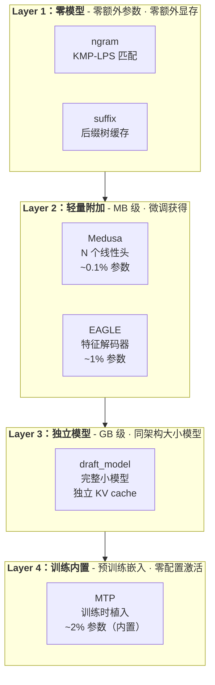
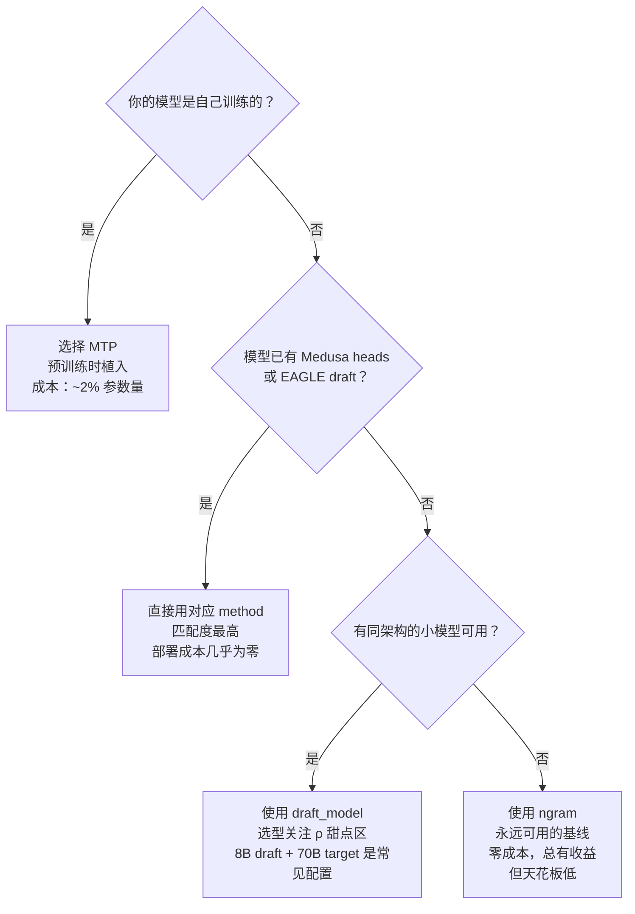

# vLLM 投机解码方法全景：六种草拟方法的工程选择

> vLLM V1 支持六种投机解码方法——ngram、suffix、Medusa、EAGLE、draft_model、MTP。它们共享同一个 Proposer 抽象框架，但草拟信号的来源、模型依赖、接入成本和收益边界完全不同。本文从 vLLM 的工程视角出发，构建六种方法的分类地图，提供选型决策框架，并追踪 roadmap 中的演进趋势。

---

## 一、投机解码的"最后一公里"

投机解码的理论图景已经清晰：[图解投机解码](../../model_optimization/illustrated-speculative-decoding.md) 详细拆解了草拟-验证状态机和接受率 $\alpha$ 与耗时比 $\rho$ 的性能模型。但从理论到工程落地，有一个被低估的问题：**草拟信号从哪来？**

### 1.1 同一个问题，六种答案

无论哪种投机解码，核心循环都是相同的：提议 K 个候选 → 大模型批量验证 → 接受/回退。vLLM V1 将这个循环抽象为 **Proposer 接口**——一个统一的草拟-验证调度框架。Proposer 只做一件事：给定当前请求的状态（已生成 token 序列、KV cache 位置），输出 K 个候选 token。

但 Proposer **如何生成**这 K 个候选，却有六种完全不同的实现路径：

- 从 prompt 文本中匹配 ngram 片段
- 从历史响应中匹配后缀模式推测候选 token
- 从主模型最后一层 hidden state 上附加的 Medusa heads 预测
- 从主模型中间层抽取特征，用 EAGLE 轻量 decoder 解码
- 加载一个独立的小模型做完整 forward
- 使用主模型训练时植入的 MTP 头做内置预测

六种方法在 vLLM 中共享同一套验证-回退管线，但草拟信号的来源跨度为零参数到完整模型。**理解这六种方法在工程实现上的差异，就是理解"投机解码最后一公里"的全部内容。**

### 1.2 本文与已有文章的分工

已有文章覆盖了投机解码的算法原理和 MTP 的训练-推理机制。本文聚焦于一个不同维度：在 vLLM 工程实践中，六种方法各自如何接入 Proposer 框架？同样的硬件和模型，选哪个收益最高？roadmap 中的演进趋势如何影响今日的选型决策？

---

## 二、分类框架：草拟信号从何而来？

六种方法共享相似的名称和表面效果，但底层机制截然不同。Medusa 和 MTP 都叫"多头预测"，EAGLE 和 draft_model 都涉及"独立 draft"——需要一个分类框架来消除混淆。

按草拟信号的来源和模型依赖度，将六种方法分为四个层级：



每一层到下一层，都是接入成本的数量级跃升。Layer 1 不碰模型文件，Layer 2 要加载 MB 级的草拟结构，Layer 3 要加载 GB 级的独立模型，Layer 4 要在预训练阶段就做决定。

这个分层不是优劣评判，而是**接入成本**的递增。关键约束在于：你的模型是否已经发布？

- **已发布模型**（LLaMA、Qwen 等）：只能选 Layer 1–3。Layer 4（MTP）是训练时架构决策，无法事后追加。
- **自己训练的模型**：Layer 4 是最彻底的方案——训练时的一次性成本，所有部署场景永久受益。

---

## 三、逐层拆解：六种方法的 vLLM 实现路径

### 3.1 零模型层：ngram 与 suffix

ngram 和 suffix 是投机解码最轻量的两种实现——不需要任何额外模型，草拟信号全部来自已有的 prompt 文本。它们同属 Layer 1，但底层机制完全不同。

**ngram 的 Proposer 实现位于 `ngram_proposer.py`**，核心算法使用 **KMP-style LPS（Longest Prefix Suffix）数组**在反转 token 序列上进行匹配：

1. 将 token 序列反转——此时"找最长后缀匹配"等价于"找最长前缀匹配"
2. 增量构建 LPS 数组（长度上限为 `prompt_lookup_max`），记录每个位置的最长可匹配前缀
3. 找到最长匹配后，将位置翻回原始坐标，提取匹配段之后的 token 作为候选

配置只需要两个参数：

```bash
--speculative-config='{"method": "ngram", "prompt_lookup_max": 5, "num_speculative_tokens": 3}'
```

因为草拟不涉及任何模型 forward，Proposer 的 wall-clock 开销接近零。Numba JIT 编译的匹配函数在 CPU 上执行，`num_tokens` 超过 8192 阈值时启用多线程并行。但接受率完全取决于 prompt 文本与当前输出的模式重复度——代码补全和翻译场景效果良好；开放对话中 ngram 匹配几乎等同于随机猜测。

**suffix** 的实现位于 `suffix_decoding.py`，与 ngram 的机制完全不同。它基于 Arctic Inference 库为每个 prompt 构建一棵**后缀树（suffix tree）**，初始化为 prompt token 序列，并随着 decode 逐步追加生成的响应 token。每次 decode 时，用最近生成 token（最多 `max_tree_depth` 个）在后缀树中查找匹配，从历史序列中提取下一个 token 作为草拟候选。关键差异：

- **跨请求复用**：同一 prompt 的多次请求共享一个后缀树缓存，历史越长，草拟质量越高
- **可变步长**：推测 token 数自适应变化，而非固定 K 个
- **需要 Arctic Inference 依赖**，不是纯 vLLM 内置

**工程取舍**：ngram 零成本、零依赖、覆盖所有模型，是永远可用的基线——如果 ngram 能提供 10–20% 的加速（代码场景很常见），这几乎是零代价的收益。suffix 在同 prompt 重复请求的高频场景（如固定 prompt 的批量生成）中远优于 ngram，但需要额外的库依赖和缓存管理。

### 3.2 轻量附加层：Medusa 与 EAGLE

当 prompt 文本的模式不足以支撑高接受率时，需要从模型内部提取更强的草拟信号。Medusa 和 EAGLE 都在主模型之上附加轻量预测结构，但附加的位置和方式完全不同——这决定了它们的接受率天花板和适用范围。

#### 3.2.1 Medusa：附加在输出层之上

Medusa 在模型微调阶段，在主模型的最后一层 hidden state 上增加 N 个独立的预测头（Medusa heads）。每个 head 是一个轻量模块：线性投影 + 残差连接，直接为不同 offset 的 token 输出概率分布。

vLLM 通过检查 draft model 的 HuggingFace config 中 `model_type == "medusa"` 自动识别 Medusa 模型，内部使用 `set_model_tag("medusa_head")` 标记编译范围。配置方式：

```bash
--speculative-config='{"method": "medusa", "num_speculative_tokens": 3}'
```

Medusa heads 在主模型 forward 完成后才执行——它们消费已经计算好的 hidden state，不修改主模型的 attention 或 FFN 前向。这一设计意味着 Medusa 的草拟开销极低（几个线性层的矩阵乘），但草拟质量受限于"最后一层 hidden state 中是否有足够的未来 token 信息"。

#### 3.2.2 EAGLE / EAGLE-3：从特征层提取信号

EAGLE 的洞察在于：与其用 token 级别的草拟（每个候选 token 都需要一次独立的解码），不如从主模型的**倒数第二层**（near-output layer）抽取 hidden state 作为特征，经过一个轻量 transformer decoder 直接在特征空间做自回归草拟——这就是特征级（feature-level）投机：草拟循环跑在低维特征空间而非完整的 token 空间，大幅降低了每步草拟的成本。EAGLE-3 进一步压缩了特征维度。

vLLM 通过 draft model 名称自动检测 EAGLE（包含 `"eagle-"` 或 `"eagle3"`）。EAGLE 需要一个独立的 draft model 文件（通常百 MB 级，取决于目标模型的 hidden size），但它不是完整模型——只包含特征投影层 + 轻量 decoder（通常 1 层），embedding 层和 lm_head 可能与目标模型共享以减少显存开销。

在 vLLM 中，EAGLE Proposer（`EagleProposer`）继承自 `SpecDecodeBaseProposer`，在初始化时将 `pass_hidden_states_to_model=True` 传递给父类——这是 EAGLE 的核心设计：draft model 不独立处理 token embedding，而是消费 base model 产出的 hidden state。

**Medusa vs EAGLE 的核心差异**：

| 维度         | Medusa                | EAGLE                              |
| ------------ | --------------------- | ---------------------------------- |
| 信号来源     | 最后一层 hidden state | 中间层 hidden state（特征级）      |
| 预测结构     | N 个独立线性头        | 轻量 transformer decoder + lm_head |
| Draft 参数量 | ~0.1% 主模型          | ~1% 主模型                         |
| 接受率       | 中–高                 | 高（通常优于等配置 Medusa）        |
| 微调成本     | 低（只训 heads）      | 中（需要训练 decoder）             |

**工程取舍**：轻量——draft 参数量通常 < 主模型的 1%，额外显存开销在 MB 到百 MB 级（Medusa 更轻，EAGLE 因含 decoder 和 lm_head 偏大）。但两者都需要专门的微调/训练过程来获得预测结构——对未专门调优的已有模型不可用。MMLU 或 GSM8K 等学术基准上表现优异的 Medusa/EAGLE 模型未必覆盖你的业务数据分布，使用前需要在自己的数据上验证接受率。

### 3.3 独立模型层：draft_model

当已有现成的小模型与主模型同架构时，最直接的投机方案：把它作为独立 draft model 加载。词表不同时 vLLM 自动构建 `VocabMapping` 做交集约束，保证拒绝采样不损失精度。

```bash
--speculative-model <draft_model_name> --num-speculative-tokens 3
```

vLLM 中，draft model 通过 `get_model()` 加载为独立的 `nn.Module` 实例（`set_model_tag("draft_model")`），draft forward 和 target forward 通过调度器串行编排。因为草拟和验证是两个独立模型，两份 KV cache 同时驻留显存——这是 draft_model 方法最容易被低估的成本。

**两个显存池**。draft model 产生独立的 KV cache。在高并发场景下，draft model 的 KV cache 显存开销不可忽视——虽然单 token 的 KV 尺寸因层数更少而小于 target，但高并发下两者的并发请求数相同，额外的 KV 池仍占用可观显存。这是 draft_model 方法最容易被低估的成本：显存压力不只来自模型参数，更来自两份 KV cache 同时驻留。

**$\rho$ 的甜点区**。draft model 越接近 target model，接受率 $\alpha$ 越高。但 $\rho$（draft 单步耗时 / target 单步耗时）也越高。当 $\rho \to 1$ 时投机收益归零。LLaMA 70B + 8B 是常见配置——8B 的 forward 耗时约为 70B 的 10–12%（$\rho \approx 0.11$），接受率在代码和翻译场景可达 80%+。如果把 draft model 加到 30B，$\rho$ 可能升到 0.4，但接受率不会同比提升 4 倍。

**工程取舍**：最灵活——任何同架构大小模型组合都可配置。但也是六种方法中显存开销最高的一种。适合显存充裕、追求最简配置且模型尚未做专用草拟优化的场景。

### 3.4 训练内置层：MTP

MTP 在预训练阶段就将草拟能力嵌入模型内部——推理时不需要加载任何额外模型或 head。vLLM 当前通过 `deepseek_mtp` 方法接入（roadmap 中正在统一为 `mtp` 通用方法）：

```bash
--speculative-config='{"method": "deepseek_mtp", "num_speculative_tokens": 1}'
```

MTP 在 vLLM 中走 self-speculation 执行路径：draft 和 target 共用同一个 base model 的 hidden state，不产生独立的 KV cache。target model 通过 `get_mtp_target_hidden_states()` 向 MTP 模块提供 pre-head 残差流；MTP 模块（`DeepSeekV4MTP`）基于此残差流和已生成的 token embedding，通过级联 transformer block 预测未来 token。

**工程上的零成本感**。从运维视角看，MTP 是最省心的投机方案——不需要选 draft model、不需要管理第二个 KV cache pool、不需要担心 $\rho$ 的取值。模型文件加载后，投机能力自然可用。但这份便利的代价在训练时已支付——模型发布者必须从预训练阶段就决定加入 MTP。

**与 EAGLE 的路径相似但本质不同**。两者在 vLLM 中都走 self-speculation 模式（draft 消费 target 的 hidden state），但 MTP 的草拟结构是预训练产物，EAGLE 的草拟结构是微调/训练产物——前者的草拟质量来自海量预训练数据的优化，后者来自针对性微调的对齐。

关于 MTP 的训练架构（级联模块、loss 设计、14B 参数代价）、推理机制（self-speculation 流程、接受率影响因素）、以及与投机解码的深层对比，参见 [MTP 深度解析：把投机能力训进模型里](../../model_optimization/mtp-multi-token-prediction.md)。

---

## 四、横向对比与选型

### 4.1 六维工程对比

| 维度               |  ngram   |     suffix     |      Medusa      |       EAGLE        |      draft_model       |         MTP          |
| ------------------ | :------: | :------------: | :--------------: | :----------------: | :--------------------: | :------------------: |
| 额外参数量         |    0     |       0        |      ~0.1%       |        ~1%         |        完整模型        |     ~2%（内置）      |
| 额外显存           |    0     |       0        |      MB 级       |      百 MB 级      |   GB 级（参数 + KV）   |       参数自带       |
| 需要专用训练？     |    否    |       否       |       微调       |     微调/训练      |           否           |      预训练阶段      |
| 需要独立模型文件？ |    否    |       否       | 否（heads 内嵌） |         是         |           是           |          否          |
| Draft 前向开销     |    0     |       0        |  极低（线性头）  | 低（轻量 decoder） | 高（完整模型 forward） |     极低（内置）     |
| 接受率             |  低–中   |     低–中      |      中–高       |         高         |         中–高          |          高          |
| 适用范围           | 全部模型 |    全部模型    |   特定微调模型   |    特定训练模型    |     同架构大小模型     |   内置 MTP 的模型    |
| vLLM method 值     | `ngram`  |    `suffix`    |     `medusa`     |  `eagle`/`eagle3`  |     `draft_model`      | `deepseek_mtp`→`mtp` |
| 配置复杂度         |   最低   | 低（需额外库） |        低        |         中         |           中           |   最低（模型自带）   |

### 4.2 选型决策路径

选型的核心约束只有一个：你有权修改模型的训练流程吗？



### 4.3 当前生态中的实际分布

- **DeepSeek V3/V4 用户**：MTP 已经内置。配置 `method=deepseek_mtp`（未来改为 `mtp`）即可，不需要任何额外 draft model。
- **LLaMA/Qwen 用户（已有 Medusa/EAGLE 模型）**：直接用对应的 method。部署成本几乎为零，接受率经过专门优化。
- **LLaMA/Qwen 用户（无专用 draft）**：draft_model 是主流选择（LLaMA 3 70B + 8B），ngram 是低成本的补充——两者可以同时配置吗？当前 vLLM 不支持多个 Proposer 并行，但 roadmap 中的 Proposer 接口统一可能使混合草拟（ngram 兜底 + 模型草拟）成为可能。
- **训练新模型的团队**：MTP 是最具长期价值的选择——训练时的一次性投入，所有下游用户无需任何投机配置即可享受加速。

---

## 五、Roadmap 中的演进趋势

当前六种方法并存是历史演进的快照。vLLM roadmap 中有明确的演进方向，理解这些方向有助于正确的今日选型——选择正在收敛的方向，而非即将被替代的过渡方案。

### 5.1 `deepseek_mtp` → `mtp`：从专属到通用

当前 `deepseek_mtp` 是 DeepSeek 专属的配置方法名。Roadmap 将其统一为 `mtp` 通用方法——任何内置 MTP heads 的模型（Gemma 4 等已有投机解码支持，更多模型正在跟进）都通过同一个 `mtp` 方法接入。对今天配置 `deepseek_mtp` 的用户来说，这只是配置名的一次重命名，不涉及模型文件或执行路径的变化。

### 5.2 Proposer 接口标准化

六种 Proposer 实现当前有各自独立的配置参数和验证回退路径。RFC [#36219](https://github.com/vllm-project/vllm/issues/36219) 提出了 Proposer 接口统一方案——所有方法共享相同的草拟-验证-回退管线，只在不同环节替换草拟信号来源。统一后的预期效果：草拟-验证-回退逻辑完全复用，配置接口统一，大幅降低为新模型接入任意 Proposer 的开发工作量。

### 5.3 Spec decode + CUDA Graph + torch.compile

当前 spec decode 的性能瓶颈正在从"草拟质量"转向"草拟开销"。即使 draft model 的 forward 比 target model 快很多，框架层 kernel launch 和调度开销在高并发下叠加后，在 step 时间中的占比不可忽视。Roadmap 中的 full-graph capture（将整个 speculate-verify 循环捕获为单一 CUDA Graph）配合 torch.compile for draft model，将大幅压缩这部分的框架开销。对使用 draft_model 方法的用户，这意味着 ρ 的值将下降，加速比进一步提升。

### 5.4 下一代：稀疏注意力自投机

`sparse_attn` self-speculation 是 roadmap 中最值得关注的下一代草拟方法（RFC [#47351](https://github.com/vllm-project/vllm/issues/47351)）。它的核心思路是：让主模型在一个**稀疏的 KV cache 子集**上做轻量 forward，用这个 forward 的输出来草拟候选 token。

- **StreamingLLM 变体**：KV cache 只保留最近的 W 个 token + 开头的 attention sink token，其余全部丢弃。草拟质量依赖于"最近的上下文已经足够推测接下来几个 token"。
- **Vegas 变体**：动态选择 KV cache 中 attention score 最高的 token 子集，而非固定窗口。

在 Qwen3-8B 上的实测：StreamingLLM（4 spec tokens）达到 ~1,600 tokens/s，Vegas（6 spec tokens）达到 ~1,850 tokens/s，相对不开投机的基准（~1,000 tokens/s），吞吐提升了 60–85%。

`sparse_attn` 在接入成本维度属于 Layer 1（无需加载额外模型文件），但需注意它与 ngram/suffix 不同——仍需跑一次 target model 的稀疏 forward，计算开销并非零；接受率则接近 Layer 3。如果这一方法成熟并进入 vLLM 主分支，它将是 ngram 的强力替代——同样的零成本接入，但接受率从"依赖文本匹配"跨越到"依赖模型自身能力的稀疏推理"。某种意义上，它是 MTP 之外的另一种 self-speculation 路径——同样不需要独立 draft model，但它不需要修改训练流程。

---

## 六、一句话总结

vLLM 的六种投机解码方法覆盖了从"零成本模式匹配"到"训练时植入"的完整频谱。选型的本质是确认你处于哪个接入成本层级：ngram 永远是可用的基线，EAGLE 是多数已发布模型的最优折中，MTP 是训练能力的终极兑现。Roadmap 正在将它们统一为更简洁的 Proposer 框架——今天的选择，正收敛向明天的标准接口。

---

## 相关阅读

- [图解投机解码](../../model_optimization/illustrated-speculative-decoding.md) — 投机解码的完整原理、算法家族与性能模型
- [MTP 深度解析：把投机能力训进模型里](../../model_optimization/mtp-multi-token-prediction.md) — MTP 的训练架构、推理机制与投机解码的深层对比
- [投机解码与 KV Cache 交互](../../kv_cache/01_concepts/scheduling/02_vllm_spec_decode.md) — Placeholder、回滚、草稿 KV 的工程实现细节
