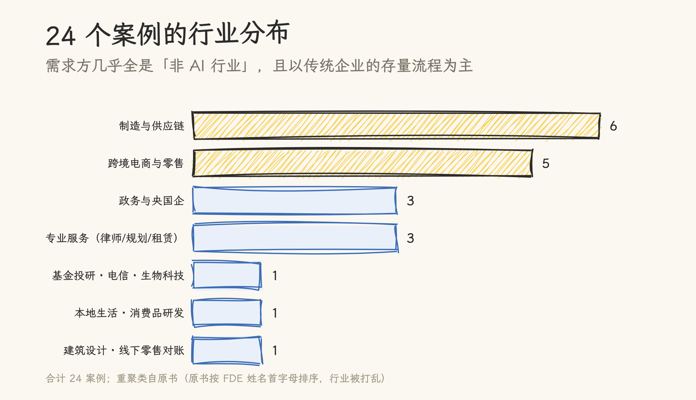
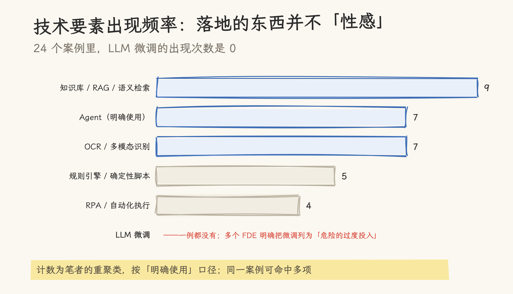

# 24 个企业 AI 落地案例解读：FDE 最难的不是模型

> 2026-09-27 | FDE 系列实证篇。素材：Datawhale《FDE 案例 100》（2026-09-06 发布，PDF 246 页，[官方站点](https://fde100.datawhale.cn/)）。24 个案例全部为访谈体实录，本文逐案例精读后做交叉分析；所有案例细节引自原书（标注案例编号），效果数字均为受访者自述口径，未经独立验证——这一限制原文同样声明（「有些仍处于验证和迭代之中。它们并不完美，也未必能够被直接复制」）。

本站此前写 FDE，靠的是行业观察：《模型不稀缺了，稀缺的是把模型塞进业务的人》用腾讯研究院的 80/95/99 规律和三道成本门槛，论证了「模型不稀缺、稀缺的是把模型塞进业务的人」；《FDE：AI落地实战指南》的导读拆了樊中恺给出的方法骨架。两篇的局限也写在各自开头——论点有报告背书，缺中国一线实践的逐例证据。

Datawhale 9 月发布的这本《FDE 案例 100》恰好补上了这一环。24 个访谈体案例，客户从德国零部件厂到浙江车管所，从央国企财务到澳洲乳企，团队从十几人的跨境电商到年流水十亿的头部电商。本文把它当作前两篇论断的检验样本：书里的实践，能不能支撑「模型不稀缺」「80/95/99」「FDE 不是售前不是外包」这些判断？检验之外，还有哪些此前没人讲过的发现？

先交代样本。「FDE 案例 100」是项目名——Datawhale 的长期计划目标是记录 100 个案例，本期（首期）实际收录 24 个。行业分布比想象中分散：制造与供应链 6 个（零部件、工业采购、非标制造、汽配、消防维保、跨境物流装载）、跨境电商与零售 5 个（TikTok 达人、鞋服、外贸礼品、东南亚服饰、跨境快消）、政务与央国企 3 个（车管所、央企财务、省属国企）、专业服务 3 个（诉讼律师、规划设计院、工程租赁）；其余 7 个行业各 1 个——基金投研、电信运营商、生物科技、本地生活代运营、消费品研发、建筑设计、线下零售对账。

**图 1**｜24 个案例的行业分布（行业为笔者重聚类——原书按 FDE 姓名首字母排序）。需求方几乎全是「非 AI 行业」，且以传统企业的存量流程为主。

**图 2**｜技术要素出现频率（按「明确使用」口径，同一案例可命中多项）。知识库/RAG 以 9 例居首，Agent 与多模态识别各 7 例；LLM 微调一例都没有。

技术要素的分布先放结论：**知识库/RAG/语义检索 9 例、Agent 7 例、OCR 与多模态识别 7 例、规则引擎与确定性脚本 5 例、RPA 4 例、LLM 微调 0 例**。微调的缺席是共识的产物：多个 FDE 不约而同反对一上来就重投入（案例 7 反对先买一体机和微调，案例 9 反对先花两三百万买算力一体机）。

## 一、论点一检验：「最难的不是模型」

《模型不稀缺了》的核心判断是：企业 AI 落地的瓶颈不在模型能力，在模型之外。这本案例集给出的证据，比当时的行业报告具体得多。

困难清单在 24 个案例里反复出现：数据治理与口径（案例 18「数据延迟 1 个月以上是常态」、案例 20 的 4980 个扳手因数量不齐无法入库、案例 24 的手写发票与口径混乱）、旧系统与 API 开放度（案例 22「有 API 和 API 能不能用完全是两回事」、案例 13 政府监管软件不开放接口）、组织信任与激励（案例 14 员工怕被替代不愿交出知识、案例 18 销售团队恐惧裁员导致「拿到的需求可能是假的」）、效果归因（案例 22 交付后拿不到数据）。

两个 FDE 给出了几乎相同的量化判断。案例 9：「一个项目如果单纯从技术上已经能够落地，其实已经成功了 80%。真正容易让项目死掉的，是业务、人和组织。」案例 24：「难点不在技术层，技术大概只占 20%。」

对应的解法一致地指向「AI 之前先补信息化」：案例 18 的判断是「AI 转型的第一步，往往发生在 AI 之前」——提成说不清的本质是信息化缺课，先补 CRM 和数仓；案例 13 先做流程数字化再找 AI 介入点；案例 14 的教训是「有 ERP 和数据中台 ≠ AI-ready，数据并没有我们想象中那么完整」。

**论点一成立**，且案例集补出了一层此前没被讲透的内容：障碍不只是「难」，多数是确定性的工程活（数据清洗、接口打通、口径对齐），没有捷径，但可列举、可排期。

## 二、论点二检验：「FDE 做的是从 80% 到 99% 的活」

旧文引用腾讯研究院的 80/95/99 规律：0→80% 靠通用模型加简单 Prompt；80→95% 靠规则补充、数据标注与测试集构建；95→99% 是合规与责任的最后一公里。当时的表述停留在框架层面，24 个案例把三段爬坡填上了具体内容。

**0→80%，一天的原型不是新闻。**多个案例提到通用模型加 Prompt 就能搭出「挺好用」的演示：案例 22 的客户自己搭过「你现在是一个数据分析师」式的 Agent，「能跑起来」；案例 16 的客户也自己搭过。正因为这段太容易，两个 FDE 强调「能跑起来」和「可以生产使用」完全是两回事。

**80→95%，是案例里最重的投入所在。**案例 2 用约半年补真实样本，把识别率从七成磨到 98%；案例 17 的人工校准「来回甚至十几次」，把老师傅报价逻辑挖成数据资产；案例 15 把优秀运营的写作经验拆成业务字段、提示词、Skill 和校验 Loop；案例 14 引入「知识萃取师」让业务人员自己讲出工作过程。隐性知识的结构化程度，直接决定项目上限。

**95→99%，守的是合规与责任，靠的是人。**案例 21 拒绝「一键生成完整施工图」，因为设计人员对合规安全负责，不能接受「大概对」；案例 24 的每个 AI 风险标记必须附依据，数字要点得开、可溯源到原始数据行——「有些问题模型本来可以答得更漂亮，但溯不回去，我们就不让它答」；案例 14 的 AI 法务助手识别风险后由法务确认签字；案例 9 的报销单最终由财务承担。责任在哪，人工否决权就在哪——这一条不因模型变强而松动。

配套的分工架构也高度一致：**确定性、重复、规则化的工作交 AI；判断、责任、最终决策留给人**。案例 16 从系统角度补了一层：模型有随机性是事实，但「模型本身具有随机性，不代表我们做出来的业务系统就必须是不稳定的」——「就像汽油本身不稳定，但汽车工程的意义，就是让汽油可以安全、稳定地驱动车辆」。

**论点二成立**，且案例集补足了一个旧文没展开的数据点：99% 这个上限的工程含义。案例 21 明确 AI 不做超出规则的「创造性判断」；案例 24 用溯源约束把 AI 按在「辅助标记」的位置上。从 99% 再往上推的边际成本指数级增长——旧文的这个判断，在这批案例里表现为各团队不约而同的收手。

## 三、样本带来的新发现

检验之外，有三组发现超出了此前两篇文章的覆盖。

### 3.1 技术选型的克制是显性方法论，不是保守

落地的东西普遍「不性感」：数据清洗加语义检索（案例 8 的 FDE 自己点破「这不就是 RAG 或者智能搜索吗」）、OCR 加自动化工作流（案例 10 自述「并没有什么特别『炫』的技术」）、Spec 文档规范（案例 7）、文件整理加任务包（案例 11）。克制背后有三次明确的「否定」：

- **否定多智能体**。案例 4（规划设计院）先后尝试「一句话出报告」和「多智能体博弈」，都被否——多 Agent 间上下文传递「带来歧义、丢失和污染，结果反而不够收敛」，最终改为单核心 Agent 调度封装成工具的专业能力；
- **否定端到端**。案例 17 最初让模型直接出报价，「出来的数字经常对不上真实成本」，改为模型只管结构化、规则库匹配、人工校准兜底；
- **否定 Agent 万能**。案例 22 的原则是「确定性强、规则死的任务用脚本和定时任务，而不是 Agent」；案例 23 的方案「一部分是模型和 Prompt，一部分是传统的业务规则，还有一部分甚至是运筹学」。

案例 4 的表述是这组克制的注脚：「硬编码能解决，就可以硬编码；若当前任务固定工作流合适，就用工作流……若当前任务需颗粒度小，传统算法比大模型精准，就用传统算法。」

### 3.2 效果账：量化稀缺且被主动克制，否定性收益是新类别

24 个案例里，给出明确量化数字的只有 11 个，且全部集中在重复环节的时间压缩：

| 案例         | 场景           | 前后对比                                                          |
| ------------ | -------------- | ----------------------------------------------------------------- |
| 2 车管所     | 材料审核       | 单件 15 分钟 → 3–5 分钟；日办件 ~700 → ~1,100；识别率 ~70% → ~98% |
| 4 规划设计院 | 跨部门报告     | 3–5 天 → 10–20 分钟                                               |
| 6 跨境物流   | 装车           | ~5 小时 → ~2 小时；装载 95–98 方 → 稳定 ~99 方                    |
| 9 央企财务   | 报销流程       | 半个月–1 个月 → 1–2 天；落地 10 个场景                            |
| 10 零售对账  | 门店对账       | 人天 → 小时；差异 1–3 个百分点浮出                                |
| 16 电信      | 网络分析       | 按天 → 分钟到小时级                                               |
| 17 非标制造  | 售前链路       | 相关工作量减少 50% 以上                                           |
| 18 生物科技  | 培训与招聘     | 新人培训 ~2 个月 → ~3 周；筛简历省 3–4 人天/月                    |
| 21 建筑图纸  | 消防施工图初稿 | 数天 → ~30 分钟                                                   |
| 22 跨境电商  | 物流照片处理   | 每人每天 4–5 小时 → 1 小时内                                      |
| 24 澳洲乳企  | 市场费用审核   | 问题发现比例 ~10% → ~30%                                          |

其余 13 个案例为定性描述或明确「未提及」。更值得注意的是两组反常态度：案例 20 上线时间短，「不能为了证明 AI 有效，就把刚上线的项目包装成已经产生巨大经营收益」；案例 23 项目只做了一个多月，只给定性。案例 22 交付后拿不到效果数据，FDE 反思最大遗憾是没设计「效果基线」——应把交付、使用、反馈、迭代、效果归因做成服务闭环。

还有一类容易被忽略的**否定性收益**：案例 13 的 FDE 帮企业叫停了一笔约 10 万元、上线后无法使用的无效系统采购；案例 10 让过去因成本太高而放弃的差异核对重新可行——「AI 的价值有时候在于，让企业终于有能力把过去因为成本太高而放弃的事情重新做起来。」

### 3.3 组织前置与一号位，从口号变成了操作项

案例 14 的落地路径从 IT 牵头改为**人事部门牵头**，引入「知识萃取师」让业务人员自己讲出工作过程；案例 17 说「企业 AI 转型必须是一把手工程」；案例 23 把「一号位是否愿意采用」当作项目判断标准；案例 18 请董事长拿出 20 个编制建企业自有 AI 团队——「外部 FDE 不应该永远作为企业外部的拐杖」。案例 11 还示范了反传统外包的交付形态：数据不出企业，把框架、规范和任务包送进客户侧的 Codex 里跑，「FDE 不能把自己理解成一个『AI 外包』」。

### 3.4 工具箱比想象中杂：能屈能伸才算 FDE

案例 11 的 FDE 第一天在修 4 台路由器、2 台光猫、1 台交换机——「你可能要修网络，要处理 Windows 环境，要梳理文件命名，要解决权限，要等老板开会回来，要催员工测试」；案例 6 为拿到车厢真实内尺寸，选了约 8500 元的 iPad Pro LiDAR 方案而非专业扫描设备，又把三维方案降维成一张工人能照着做的纸质装车指导图——「算得出最优解，不代表现场能够执行」。FDE 的技能清单里有 AI，也有网络、硬件、Excel 和等待。

## 四、FDE 到底是什么角色

综合 24 个案例，FDE 的动作可以归纳为三层，与旧文「FDE 不是售前、不是驻场外包、不是咨询顾问、不是产品工程师」的四个否定互补——那篇说了 FDE 不是什么，这 24 个案例说的是 FDE 实际做什么。

**翻译器**。把「我们要拥抱 AI」「把老师傅经验沉淀下来」「ERP 不好用」这类业务语言，还原成可验证、可计算的问题。案例 8 的总结最完整：「FDE 真正的工作，是先深入业务，把一个模糊的抱怨还原成一个可以解决、可以验证、可以计算价值的问题，再决定 AI 应该出现在哪里。」

**划界师**。决定 AI 用在哪里、更重要的决定不用在哪里：大客户订单不交给 AI（案例 23）、高价值达人关系留给人（案例 5）、消防规范之外不做「创造性判断」（案例 21）。案例 18 的表述是「FDE 真正重要的能力，是知道哪里不应该使用 AI」。

**能力移交者**。所有长案例的终点都相同：企业自己长出能力。案例 14 的行政员工用 MCP 自己做出小 Agent、案例 15 的客户按 SOP 自续迭代、案例 18 协助企业建 20 个编制的自有团队、案例 4 的部门自发把流程沉淀成 Skill。案例 12 的说法是：「如果每做完一个 AI 项目，只有客户拿到了一个系统，而 FDE 自己什么都没有沉淀下来，那这个项目其实还没有真正结束。」

一位受访者的自我概括可能是最准的（案例 19）：「我把 FDE 的工作理解成『AI HRBP + AI 架构师』。」——一半是组织与人的工作，一半是架构与技术的工作。

## 五、必须说的局限

这本案例集有清晰的价值，也有同样清晰的边界：

- **幸存者偏差**。24 个案例没有一个是彻底失败的（有受挫与掉头，但最终都「落地」了）。真实世界中死掉的项目——需求消失、客户破产、预算砍掉——不会出现在案例集里。阅读时应把它当作「活下来项目的经验集」，而非成功率统计；
- **效果全部为受访者自述**。无独立验证、无对照组；案例 20 和 23 主动拒绝给出早期数字反而是全书可信度最高的时刻；
- **案例按 FDE 姓名首字母排序**，行业被打乱——本文第一节的分布是重聚类结果；
- 时间跨度短：多个项目上线仅一两个月（案例 20、22、23），长期效果与可持续性（例如案例 8 警告的「三个月之后效果消失」）仍有待观察。

## 六、写给谁

想做 FDE 的人：这本案例集给出的能力清单很明确——进现场的问题发现方法、把隐性经验结构化的萃取能力、「脚本优先、Agent 慎用」的克制、以及和组织打交道的一切。技术只是入场券，案例 11 的原话是「你可能要修网络，要处理 Windows 环境，要梳理文件命名，要解决权限，要等老板开会回来，要催员工测试」。

想雇 FDE 或自己下场做 AI 落地的企业：案例集反复验证的判断标准只有三条——一号位是否亲自采用、第一单是否选在「最快形成正反馈」的场景、效果基线是否在交付第一天就设计好。

正如编者在前言里写的：这里记录的「并不是 100 个所谓的 AI 落地标准答案。事实上，今天也不存在这样的标准答案」。这本 246 页的案例集最大的价值，是让 24 位一线从业者把探索的痕迹——包括弯路——原样留了下来。

---

## 案例索引

| NO. | 行业         | 场景                         | 关键数字                                   |
| --- | ------------ | ---------------------------- | ------------------------------------------ |
| 1   | 制造（德国） | 老师傅经验传承 → AI 辅助培训 | 文档解析 ~95%、召回 80%+ 验收线            |
| 2   | 政务         | 车管所网办材料审核           | 15 分钟→3–5 分钟/件；~700→~1,100 件/日     |
| 3   | 法律         | 诉讼案件处理                 | 材料整理效率 +70%；14 被告分析 2–3 天→一晚 |
| 4   | 城市规划     | 跨部门研判报告               | 3–5 天→10–20 分钟                          |
| 5   | 跨境电商     | TikTok 达人建联履约          | 履约周期 ~1 个月→~18 天                    |
| 6   | 跨境物流     | 装车规划                     | ~5 小时→~2 小时；稳定 ~99 方               |
| 7   | 金融         | 研发 Spec Coding 转型        | 旁证：写码时间 −1/3，文档 −一半+           |
| 8   | 工业         | ERP 物料检索治理             | 定性（问题可衡量化）                       |
| 9   | 央国企       | 财务报销                     | 半月–1 月→1–2 天；10 个场景                |
| 10  | 零售         | 门店对账                     | 人天→小时；差异 1–3 个百分点               |
| 11  | 外贸         | 资料资产化                   | 角尺问题 1–2 天预期→~10 分钟               |
| 12  | 鞋服电商     | 素材生产工作流               | 定性（POC 阶段）                           |
| 13  | 消防维保     | 流程数字化                   | 叫停 ~10 万元无效采购                      |
| 14  | 国企         | 电商多线流程                 | 节省 1 个法务编制（一人年）                |
| 15  | 本地生活     | 短视频文案量产               | 峰值 200–300 条/天（定性）                 |
| 16  | 电信         | 网络数据分析                 | 按天→分钟–小时级                           |
| 17  | 非标制造     | 售前报价链路                 | 相关工作量 −50%+                           |
| 18  | 生物科技     | 销售条线数智化               | 培训 2 个月→3 周；省 3–4 人天/月           |
| 19  | 消费品       | 包装审核前置                 | 定性（三层价值）                           |
| 20  | 汽配制造     | 经营透明                     | 拒绝包装（上线时间短）                     |
| 21  | 建筑设计     | 消防施工图                   | 数天→~30 分钟                              |
| 22  | 跨境电商     | 库存/补货/广告联动           | 4–5 小时→1 小时内（照片处理）              |
| 23  | 工程租赁     | 长尾获客报价                 | 定性（项目 1 个多月）                      |
| 24  | 跨境快消     | 海外数据口径                 | 费用问题发现 ~10%→~30%                     |

## 参考资料

- Datawhale，《FDE 案例 100》PDF（246 页，2026-09-08 导出），官方站点 [fde100.datawhale.cn](https://fde100.datawhale.cn/)——本文全部案例细节的出处
- Datawhale 公众号《Datawhale FDE 100案例集发布！245页下载》（2026-09-07）——发布信息线索
- 本站 [模型不稀缺了，稀缺的是把模型塞进业务的人](forward-deployed-engineer.md)——FDE 概念与 80/95/99 规律的出处文，本文的论点底座
- 本站 [《FDE：AI落地实战指南》导读](fde-ai-landing-guide.md)——方法论骨架的姊妹篇（樊中恺著，人民邮电出版社 2026-10）
- 本站 [一切皆插件：DeepSeek Harness 是怎么把 Agent 装起来的](../../08_agentic_system/agent_infra/docs/deepseek-harness-deep-dive.md)——FDE 工具箱的技术底座视角
- 本站 [驾驭工程：为什么你的 AI 编程助手总在失控？](../../98_llm_programming/Harness_Engineering.md)——Harness 工程方法论
