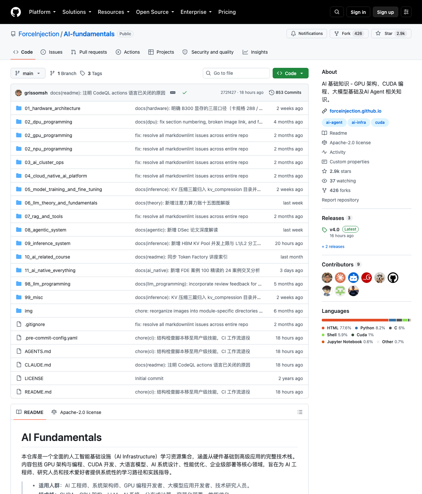
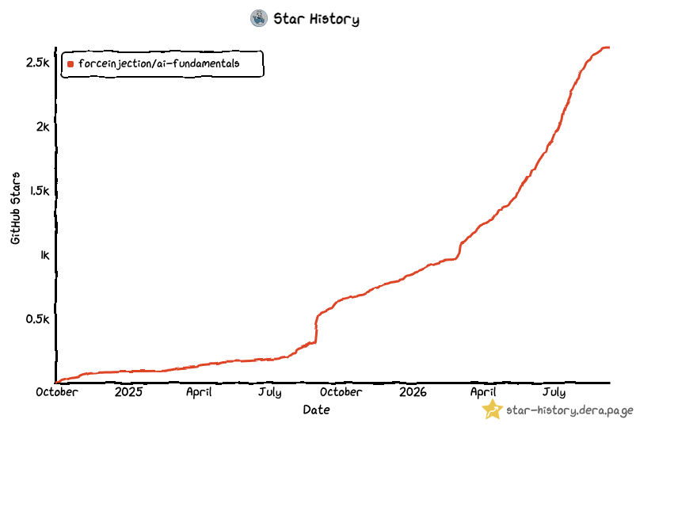

# 390 篇新增、517 篇总量：原力注入 AI Infra 知识库 4.0 版本发布了

八个月前发 v3.0 的时候，我在 release 里写了一句大实话：「内容逐步丰富，但是有点杂乱无章，接下来要做一个大的重构。」

今天交卷。v4.0 发布：重构落地，610 个提交，新增 390 篇文章，全仓现在 517 篇。这篇说说这个版本里有什么、值得从哪读起。

## 一、重构落地了什么

v3.0 时代的仓库，文章平铺，找一篇讲 KV Cache 的要靠搜索。这八个月把地基重铺了一遍：

- **编号目录体系**。十几个目录从 `01_hardware_architecture`（硬件架构）排到 `11_ai_native_everything`（AI Native 实践），外加两个附区，看目录名就知道里面是什么；
- **每目录一个 README 门户**。进入任何一条线，先看到导览：每篇文章一句话摘要，按学习顺序排列，文章之间相对路径互链，顺着「相关阅读」能一路读下去；
- **质量闸门**。提交前有 pre-commit 结构检查，围栏没闭合、章节序号断号这类「内容凭空消失」的问题过不了提交；全仓内链有链接校验器看着，光是顶层 README 就有 300 多条。

地基的回报后面这半年看得见：新增 390 篇，每一篇都有明确的落位和门户入口，「杂乱无章」四个字可以摘下来了。

## 二、数字面板

610 个提交，新增 390 篇，合并清理旧文 76 篇，总量 517。新增按线分布：

- 推理系统 115 篇——占了新增的近三分之一，这条线最厚；
- 智能体系统 44 篇；
- NPU 编程 38 篇、GPU 编程 34 篇、硬件架构 34 篇；
- 其余分布在课程（26）、LLM 理论（23）、集群运维（23）、RAG（9）、AI Native（7）等目录。

## 三、各线代表作，从哪读起

**推理系统**（最厚的一条线）。想啃源码，从《切请求，还是切序列——MoE 与百万上下文的 SGLang 并行答案》进，dp-attention 与 DCP 两条并行轴讲透；运维视角看《L2 还有大半空着，TTFT 为什么先崩了？》，SGLang/vLLM 双栈对照讲 KV Pool 的并发账与缓存账；考古兴趣看《PagedAttention 退役的技术原因》和《gpu-memory-utilization 的谢幕》，vLLM 两个老机制怎么退的场。还有 PD 分离 KV 传输三部曲、B300 部署最佳实践、图解投机解码。

**智能体系统**。主菜是 Agent Infra 系列：OpenHarness、Agent Sandbox、Kagent、Claude Code Sandbox、在 Elasticsearch 上实现虚拟文件系统——Agent 的「运行时」层逐个拆。记忆系统专题从理论综述到 MemoryOS、Mem0、Claude Code 的记忆机制案例分析。FDE 专题两篇回答一个问题：模型不稀缺了，稀缺的是把模型塞进业务的人。

**硬件与编程**。《HBF 是 HBM 的替代吗》算了一笔反直觉的账：单位存储便宜 8–16 倍，折成带宽单价反而贵 1.7 倍；NPU 编程系列 38 篇，昇腾从 Da Vinci 架构、CANN 工具链一路写到 Qwen2.5-7B 推理和 LoRA 微调实战；GPU 侧有 SIMT vs Tile-Based 编程模型对比和 TileLang 实战。

**成本与课程**。Token Factory：AI 推理的成本革命，24 页图文把「算力房东到产品制造商」的叙事讲完；AI Infra 入门讲座 90 分钟，一条主线：一切优化的最终目标都是降低每 token 成本；11 款 AI 编程工具的 Coding Plan 订阅对比，含隐藏条款。

## 四、怎么用这个仓库

三条路线，按需取用：

- **推理工程师**：01 硬件架构 → 03 集群运维 → 09 推理系统（KV Cache 体系最厚，够读两个月）；
- **Agent 开发者**：08 智能体系统（理论 → 工程组件 → 实战代码三层）→ 07 RAG；
- **入门转型**：12 课程体系的 AI Infra 入门讲座开胃，再按兴趣下钻。

仓库在 GitHub：`ForceInjection/AI-fundamentals`，目前 2.9k star。这个版本还有一层变化：贡献者列表不再是一个名字——YangooSen、AaronYang238、3em0、Dessalines39394、ningg、octo-patch，谢谢你们。

v5.0 不立 flag。先把 517 篇里该修的修、该连的连，更新随写随发，公众号同步。下篇见。
